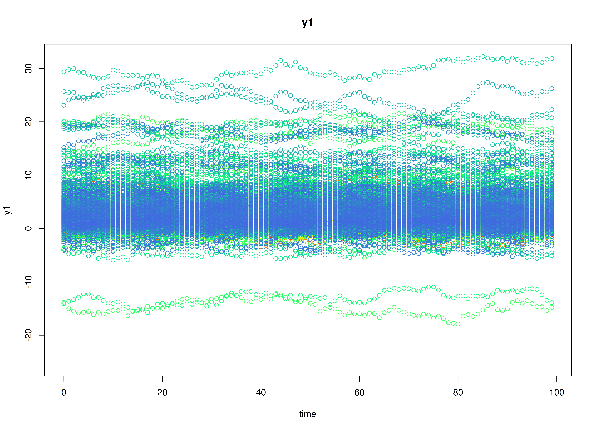
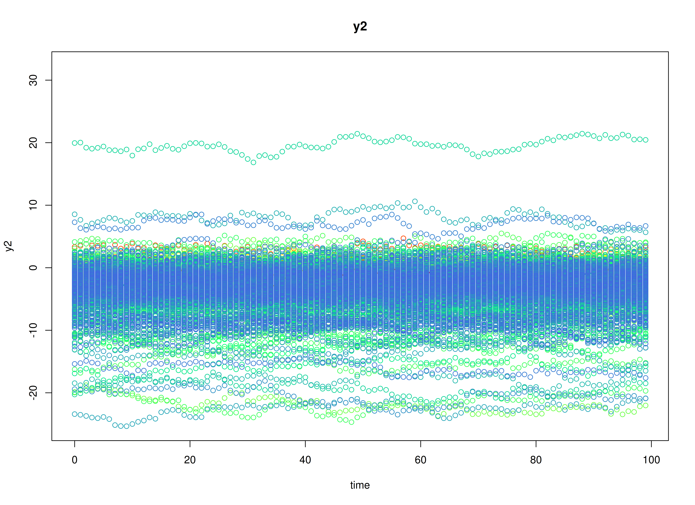

# Meta-Regression with Distal Outcome

## Dynamics Description

The *Stable Persistence with Baseline-Moderated Autoregression* process
represents a bivariate dynamic system in which two latent psychological
constructs (e.g., positive and negative affect) exhibit within-construct
persistence over time through autoregressive dynamics. The transition
matrix is diagonal, implying that each construct evolves according to
its own self-regulatory process and there are no cross-lagged
(reciprocal) influences between the constructs in the systematic
dynamics.

Between-person heterogeneity in persistence is captured via a
time-invariant baseline covariate $`x_i \in \left\{ 0, 1 \right\}`$ with
one value per individual. The individual-specific transition matrix is
modeled as
``` math
\begin{equation}
  \mathrm{vec} \left( \boldsymbol{\beta}_i \right) = \mathrm{vec} \left( \boldsymbol{\beta} \left( x_i \right) \right) = \mathrm{vec} \left( \boldsymbol{\beta}_0 \right) + \mathrm{vec} \left( \boldsymbol{\beta}_1 \right) x_i,
\end{equation}
```
so that individuals with $`x_i = 0`$ follows $`\boldsymbol{\beta}_0`$,
whereas individuals with $`x_i = 1`$ follow
$`\boldsymbol{\beta}_0 + \boldsymbol{\beta}_1`$. Under the current
specification, $`\boldsymbol{\beta}_1`$ increases the diagonal
autoregressive parameters, implying that the $`x_i = 1`$ group exhibits
greater persistence—deviations from an individual’s equilibrium decay
more slowly—while remaining dynamically stable.

Between-person heterogeneity in baseline levels is also captured via the
same time-invariant covariate $`x_i \in \left\{ 0, 1 \right\}`$ through
the person-specific set-point vector
``` math
\begin{equation}
  \boldsymbol{\mu}_i = \boldsymbol{\mu} \left( x_i \right) = \boldsymbol{\mu}_{0} + \boldsymbol{\mu}_{1} x_i, 
\end{equation}
```
so that individuals with $`x_i = 0`$ follow $`\boldsymbol{\mu}_{0}`$,
whereas individuals with $`x_i = 1`$ follow
$`\boldsymbol{\mu}_{0} + \boldsymbol{\mu}_{1}`$.

In addition to explaining between-person differences in the DT-VAR
parameters via the baseline covariate $`x_i`$, we also include a distal
outcome $`z_i`$ measured once per individual. Conceptually, $`z_i`$ can
be interpreted as a later outcome (e.g., symptom severity, functioning,
or substance use) whose between-person differences are partly explained
by (a) each person’s estimated set-point and dynamic parameters and (b)
$`x_i`$.

The process noise covariance allows for small disturbances that may be
correlated across constructs, permitting coordinated innovations even
though the lagged dynamics are decoupled. Measurement errors are assumed
to be minimal and symmetric across indicators.

## Model

The measurement model is given by
``` math
\begin{equation}
  \mathbf{y}_{i, t} = \boldsymbol{\eta}_{i, t}
\end{equation}
```
where $`\mathbf{y}_{i, t}`$ and $`\boldsymbol{\eta}_{i, t}`$ are random
variables.

The dynamic structure is given by
``` math
\begin{equation}
  \boldsymbol{\eta}_{i, t} = \boldsymbol{\alpha}_{i} + \boldsymbol{\beta}_{i} \boldsymbol{\eta}_{i, t - 1} + \boldsymbol{\zeta}_{i, t}, \quad \mathrm{with} \quad \boldsymbol{\zeta}_{i, t} \sim \mathcal{N}   \left( \mathbf{0}, \boldsymbol{\Psi} \right)
\end{equation}
```
where $`\boldsymbol{\eta}_{i, t}`$, $`\boldsymbol{\eta}_{i, t - 1}`$,
and $`\boldsymbol{\zeta}_{i, t}`$ are random variables, and
$`\boldsymbol{\beta}_{i}`$, and $`\boldsymbol{\Psi}`$ are model
parameters. Here, $`\boldsymbol{\eta}_{i, t}`$ is a vector of latent
variables at time $`t`$ and individual $`i`$,
$`\boldsymbol{\eta}_{i, t - 1}`$ represents a vector of latent variables
at time $`t - 1`$ and individual $`i`$, and
$`\boldsymbol{\zeta}_{i, t}`$ represents a vector of dynamic noise at
time $`t`$ and individual $`i`$. $`\boldsymbol{\beta}_{i}`$ is a matrix
of autoregression and cross regression coefficients for individual
$`i`$, and $`\boldsymbol{\Psi}`$ the covariance matrix of
$`\boldsymbol{\zeta}_{i, t}`$ that is invariant across all individuals.
In this model, $`\boldsymbol{\Psi}`$ is a symmetric matrix.

### Alternative Parameterization

An alternative parameterization of the dynamic structure that directly
estimates the set-point vector $`\boldsymbol{\mu}_{i}`$ is given by
``` math
\begin{equation}
  \boldsymbol{\eta}_{i, t} = \boldsymbol{\mu}_{i} + \boldsymbol{\beta}_{i} \left( \boldsymbol{\eta}_{i, t - 1} - \boldsymbol{\mu}_{i} \right) + \boldsymbol{\zeta}_{i, t} .
\end{equation}
```

Algebraic manipulation of the equation results in the following
``` math
\begin{equation}
  \boldsymbol{\eta}_{i, t} = \boldsymbol{\mu}_{i} - \boldsymbol{\beta}_{i} \boldsymbol{\mu}_{i} + \boldsymbol{\beta}_{i} \boldsymbol{\eta}_{i, t - 1} + \boldsymbol{\zeta}_{i, t} ,
\end{equation}
```
where we can see that the intercept vector $`\boldsymbol{\alpha}_{i}`$
is implied by
$`\boldsymbol{\mu}_{i} - \boldsymbol{\beta}_{i} \boldsymbol{\mu}_{i}`$.

### Distal outcome model

Let $`z_i`$ denote a distal outcome observed once per individual $`i`$.
We model $`z_i`$ as a linear function of (a) the person-specific DT-VAR
parameters and (b) the baseline covariate $`x_i`$:
``` math
\begin{equation}
  z_i = \kappa + \boldsymbol{\phi}^{\prime} \mathbf{w}_i + \omega x_i + \xi_i, \quad \mathrm{with} \quad \xi_i \sim \mathcal{N}(0, \psi),
\end{equation}
```
where $`\kappa`$ is an intercept, $`\boldsymbol{\phi}`$ is a vector of
regression coefficients, $`\omega`$ is the direct effect of $`x_i`$ on
$`z_i`$, and $`\psi`$ is the residual variance of the distal outcome.
The predictor vector $`\mathbf{w}_i`$ stacks the person-specific DT-VAR
coefficients and intercepts used for prediction. In this vignette we use
``` math
\begin{equation}
  \mathbf{w}_i = \left[ \mathrm{vec}(\boldsymbol{\beta}_i)^{\prime}, \; \boldsymbol{\nu}_i^{\prime} \right]^{\prime},
\end{equation}
```
so $`\mathbf{w}_i`$ has length $`p^2 + p`$ (here $`4 + 2 = 6`$).

## Data Generation

### Notation

Let $`t = 100`$ be the number of time points and $`n = 1000`$ be the
number of individuals. We simulate a total of time \$= 1.01 &times;
10\<sup\>4\</sup\>\$ points per individual, discarding the first
$`10<sup>4</sup>`$ as burn-in. The analysis uses the final $`100`$
measurement occasions.

Let the initial condition $`\boldsymbol{\eta}_{0}`$ be given by
``` math
\begin{equation}
  \boldsymbol{\eta}_{0} \sim \mathcal{N} \left( \boldsymbol{\mu}_{\boldsymbol{\eta} \mid 0}, \boldsymbol{\Sigma}_{\boldsymbol{\eta} \mid 0} \right) .
\end{equation}
```
$`\boldsymbol{\mu}_{\boldsymbol{\eta} \mid 0}`$ and
$`\boldsymbol{\Sigma}_{\boldsymbol{\eta} \mid 0}`$ are functions of
$`\boldsymbol{\alpha}`$ and $`\boldsymbol{\beta}`$.

Let the intercept vector $`\boldsymbol{\alpha}`$ when $`X = 0`$ be
``` math
\begin{equation}
  \left(
    \begin{array}{c}
      0.5 \\
      -0.5 \\
    \end{array}
  \right) .
\end{equation}
```
Let the intercept vector $`\boldsymbol{\alpha}`$ when $`X = 1`$ be
``` math
\begin{equation}
\left(
\begin{array}{c}
  0.75 \\
  -0.75 \\
\end{array}
\right) .
\end{equation}
```
Let the covariance matrix be
``` math
\begin{equation}
  \left(
    \begin{array}{cc}
      0.1 & -0.05 \\
      -0.05 & 0.1 \\
    \end{array}
  \right) .
\end{equation}
```

Let the transition matrix $`\boldsymbol{\beta}`$ when $`X = 0`$ be
``` math
\begin{equation}
  \left(
    \begin{array}{cc}
      0.5 & 0 \\
      0 & 0.5 \\
    \end{array}
  \right) .
\end{equation}
```
Let the transition matrix $`\boldsymbol{\beta}`$ when $`X = 1`$ be
``` math
\begin{equation}
\left(
\begin{array}{cc}
  0.75 & 0 \\
  0 & 0.75 \\
\end{array}
\right) .
\end{equation}
```
Let the covariance matrix be and covariance matrix
``` math
\begin{equation}
  \left(
    \begin{array}{cccc}
      0.02 & 0.01 & 0 & 0 \\
      0.01 & 0.015 & 0 & 0 \\
      0 & 0 & 0.01 & 0.005 \\
      0 & 0 & 0.005 & 0.015 \\
    \end{array}
  \right) .
\end{equation}
```

The `SimAlphaN` and `SimBetaNCovariate` functions from the
`simStateSpace` package generate random intercept vectors and transition
matrices from the multivariate normal distribution. Note that the
`SimBetaNCovariate` function generates transition matrices that are
weakly stationary with an option to set lower and upper bounds. The
person-specific set-point vector $`\boldsymbol{\mu}_{i}`$ was derived
from the generated $`\boldsymbol{\alpha}_{i}`$ and
$`\boldsymbol{\beta}_{i}`$.

Let the dynamic process noise $`\boldsymbol{\Psi}`$ be given by
``` math
\begin{equation}
  \boldsymbol{\Psi}
  =
  \left(
    \begin{array}{cc}
      0.2 & -0.05 \\
      -0.05 & 0.18 \\
    \end{array}
  \right) .
\end{equation}
```

### R Function Arguments

``` r

n
#> [1] 1000
time
#> [1] 10100
burnin
#> [1] 10000
# first mu0 in the list of length n
mu0[[1]]
#> [1]  1.4001203 -0.4648662
# first sigma0 in the list of length n
sigma0[[1]]
#>            [,1]       [,2]
#> [1,]  0.2518659 -0.0466736
#> [2,] -0.0466736  0.2516021
# first sigma0_l in the list of length n
sigma0_l[[1]] # sigma0_l <- t(chol(sigma0))
#>             [,1]      [,2]
#> [1,]  0.50186241 0.0000000
#> [2,] -0.09300079 0.4929026
# first alpha in the list of length n
alpha[[1]]
#> [1]  0.7602558 -0.4388544
# first beta in the list of length n
beta[[1]]
#>           [,1]        [,2]
#> [1,] 0.4479308 -0.02733575
#> [2,] 0.1605012  0.53936547
# first psi in the list of length n
psi[[1]]
#>       [,1]  [,2]
#> [1,]  0.20 -0.05
#> [2,] -0.05  0.18
psi_l[[1]] # psi_l <- t(chol(psi))
#>            [,1]      [,2]
#> [1,]  0.4472136 0.0000000
#> [2,] -0.1118034 0.4092676
# first mu (set-point) in the list of length n
mu[[1]]
#> [1]  1.4001203 -0.4648662
# distal outcome parameters
kappa_z
#> [1] 10
phi_z
#>      [,1] [,2] [,3] [,4] [,5] [,6]
#> [1,]    5    5    5    5    5    5
omega_z
#> [1] 0.15
psi_z
#> [1] 0.45
```

### Visualizing the Dynamics Without Process Noise and Measurement Error (n = 5 with Different Initial Condition)

#### $`X = 0`$


#### $`X = 1`$


### Using the `SimSSMIVary` Function from the `simStateSpace` Package to Simulate Data

``` r

library(simStateSpace)
sim <- SimSSMVARIVary(
  n = n,
  time = time,
  mu0 = mu0,
  sigma0_l = sigma0_l,
  alpha = alpha,
  beta = beta,
  psi_l = psi_l
)
data <- as.data.frame(sim, burnin = burnin)
head(data)
#>   id time       y1          y2
#> 1  1    0 2.348797 -0.36133130
#> 2  1    1 2.203791 -0.06306478
#> 3  1    2 1.763803 -0.11966576
#> 4  1    3 1.608552 -0.88481869
#> 5  1    4 1.116157 -0.36118972
#> 6  1    5 2.254971 -0.37188289
plot(sim, burnin = burnin)
```



## Model Fitting

``` r

library(OpenMx)
library(fitVARMxID)
```

The `FitVARMxID` function fits a VAR model on each individual $`i`$.

### LDL’-parameterized covariance matrices

Covariances such as `psi` and `theta` are estimated using the LDL’
decomposition of a positive definite covariance matrix. The
decomposition expresses a covariance matrix $`\Sigma`$ as\
``` math
\begin{equation}
  \boldsymbol{\Sigma} = \left( \mathbf{L} + \mathbf{I} \right) \mathrm{diag} \left( \mathrm{Softplus} \left( \mathbf{d}_{uc} \right) \right) \left( \mathbf{L} + \mathbf{I} \right)^{\prime},
\end{equation}
```
where: - $`\mathbf{L}`$ is a strictly lower-triangular matrix of free
parameters (`l_mat_strict`),\
- $`\mathbf{I}`$ is the identity matrix,\
- $`\mathbf{d}_{uc}`$ is an unconstrained vector,\
-
$`\mathrm{Softplus} \left(\mathbf{d}_{uc} \right) = \log \left(1 + \exp \left( \mathbf{d}_{uc} \right) \right)`$
ensures strictly positive diagonal entries.

The
[`LDL()`](https://github.com/jeksterslab/fitVARMxID/reference/LDL.html)
function extracts this decomposition from a positive definite covariance
matrix. It returns:\
- `d_uc`: unconstrained diagonal parameters, equal to
`InvSoftplus(d_vec)`,\
- `d_vec`: diagonal entries, equal to `Softplus(d_uc)`,\
- `l_mat_strict`: the strictly lower-triangular factor.

``` r

sigma <- matrix(
  data = c(1.0, 0.5, 0.5, 1.0),
  nrow = 2,
  ncol = 2
)
ldl_sigma <- LDL(sigma)
d_uc <- ldl_sigma$d_uc
l_mat_strict <- ldl_sigma$l_mat_strict
I <- diag(2)
sigma_reconstructed <- (l_mat_strict + I) %*% diag(log1p(exp(d_uc)), 2) %*% t(l_mat_strict + I)
sigma_reconstructed
#>      [,1] [,2]
#> [1,]  1.0  0.5
#> [2,]  0.5  1.0
```

### `FitVARMxID`

``` r

fit <- FitVARMxID(
  data = data,
  observed = c("y1", "y2"),
  id = "id",
  center = TRUE,
  tries_explore = 1000,
  tries_local = 100,
  max_attempts = 100,
  ncores = parallel::detectCores()
)
```

#### Parameter estimates

``` r

head(summary(fit))
#>                             mu[1,1]    mu[2,1] beta[1,1]   beta[2,1]
#> FitVARMxID_VAR_ID2.Rds  1.407599105 -1.2262153 0.3426362 -0.07490765
#> FitVARMxID_VAR_ID3.Rds  1.161832741 -0.5943131 0.6944379  0.16943979
#> FitVARMxID_VAR_ID6.Rds -0.007943754 -0.4146876 0.6130186 -0.11631136
#> FitVARMxID_VAR_ID7.Rds  0.864125313 -1.3682443 0.4743549  0.12117985
#> FitVARMxID_VAR_ID8.Rds  0.852183715 -0.5435902 0.2504997  0.04589647
#> FitVARMxID_VAR_ID9.Rds  0.121285199 -1.0360446 0.2252233 -0.13774792
#>                           beta[1,2] beta[2,2]  psi[1,1]    psi[2,1]  psi[2,2]
#> FitVARMxID_VAR_ID2.Rds -0.196767193 0.1484852 0.1719178 -0.04113312 0.1634751
#> FitVARMxID_VAR_ID3.Rds -0.177433928 0.4524657 0.1661177 -0.02661664 0.1652608
#> FitVARMxID_VAR_ID6.Rds  0.138201917 0.4031971 0.2180944 -0.07445802 0.1747459
#> FitVARMxID_VAR_ID7.Rds -0.099089770 0.5860792 0.1705958 -0.03591918 0.1728006
#> FitVARMxID_VAR_ID8.Rds -0.276412398 0.5026694 0.1861992 -0.07785679 0.2023670
#> FitVARMxID_VAR_ID9.Rds  0.008944095 0.5838015 0.1380682 -0.04122232 0.1754657
```

#### Proportion of converged cases

``` r

converged(
  fit,
  prop = TRUE
)
#> [1] 0.501
```

## Mixed-Effects Meta-Analysis with Distal Outcome of Person-Specific Dynamics and Means

    #> Warning in mapply(FUN = function(x, y) {: longer argument not a multiple of
    #> length of shorter

We synthesize the person-specific estimates to recover population-level
effects, between-person variability, and systematic covariate-related
differences. We fit a mixed-effects meta-analytic model in which each
individual’s estimate is weighted by its within-person sampling
uncertainty, random effects capture residual heterogeneity across
individuals, and fixed effects quantify the association between
covariate $`X`$ and the person-specific dynamic parameters as well as
effects on a distal outcome.

``` r

library(metaDyn)
random <- MetaVARMx(
  fit,
  x = x,
  z = z,
  effects = TRUE,
  set_point = TRUE,
  robust_v = FALSE,
  robust = TRUE,
  lb = TRUE,
  ncores = parallel::detectCores()
)
```

``` r

summary(random)
#> Call:
#> MetaVARMx(object = fit, x = x, z = z, effects = TRUE, set_point = TRUE, 
#>     robust_v = FALSE, robust = TRUE, lb = TRUE, ncores = parallel::detectCores())
#> 
#> Status code = 0
#> 
#> CI type = "lb"
#>                   est     2.5%    97.5%
#> alpha[1,1]     1.0818   0.7067   1.4570
#> alpha[2,1]    -1.0558  -1.3767  -0.7351
#> alpha[3,1]     0.4750   0.4542   0.4955
#> alpha[4,1]     0.0103  -0.0101   0.0307
#> alpha[5,1]     0.0110  -0.0079   0.0298
#> alpha[6,1]     0.4795   0.4601   0.4988
#> gamma[1,1]     2.4741   1.9415   3.0063
#> gamma[2,1]    -2.3765  -2.8327  -1.9204
#> gamma[3,1]     0.1939   0.1652   0.2227
#> gamma[4,1]    -0.0268  -0.0552   0.0015
#> gamma[5,1]     0.0184  -0.0075   0.0444
#> gamma[6,1]     0.1889   0.1621   0.2157
#> kappa[1,1]     7.4447  -2.4622  17.3484
#> phi[1,1]      -0.6447  -1.3531   0.0632
#> phi[1,2]      -0.3938  -1.3157   0.5266
#> phi[1,3]      13.0693  -0.1037  26.2471
#> phi[1,4]      -2.3996 -16.6561  11.8625
#> phi[1,5]       1.5057 -10.5707  13.5627
#> phi[1,6]       4.8729  -9.0007  18.7368
#> omega[1,1]    -0.5046  -7.1296   6.1413
#> psi[1,1]     562.0242 497.7609 638.2382
#> tau_sqr[1,1]   9.0875   8.0299  10.3323
#> tau_sqr[2,1]   1.7432   1.0609   2.4800
#> tau_sqr[3,1]   0.0065  -0.0357   0.0487
#> tau_sqr[4,1]   0.1289   0.0900   0.1730
#> tau_sqr[5,1]   0.0313  -0.0123   0.0759
#> tau_sqr[6,1]  -0.0761  -0.1182  -0.0365
#> tau_sqr[2,2]   6.6441   5.8753   7.5515
#> tau_sqr[3,2]   0.0688   0.0327   0.1072
#> tau_sqr[4,2]   0.1860   0.1456   0.2316
#> tau_sqr[5,2]  -0.0425  -0.0736  -0.0119
#> tau_sqr[6,2]   0.0284  -0.0051   0.0628
#> tau_sqr[3,3]   0.0200   0.0170   0.0235
#> tau_sqr[4,3]   0.0067   0.0044   0.0091
#> tau_sqr[5,3]   0.0007  -0.0015   0.0028
#> tau_sqr[6,3]   0.0016  -0.0006   0.0038
#> tau_sqr[4,4]   0.0199   0.0168   0.0236
#> tau_sqr[5,4]  -0.0004  -0.0024   0.0016
#> tau_sqr[6,4]   0.0014  -0.0007   0.0037
#> tau_sqr[5,5]   0.0146   0.0119   0.0178
#> tau_sqr[6,5]   0.0007  -0.0013   0.0027
#> tau_sqr[6,6]   0.0168   0.0142   0.0199
#> i_sqr[1,1]     0.9992   0.9991   0.9993
#> i_sqr[2,1]     0.9991   0.9990   0.9992
#> i_sqr[3,1]     0.7924   0.7648   0.8178
#> i_sqr[4,1]     0.8411   0.8180   0.8619
#> i_sqr[5,1]     0.7894   0.7572   0.8181
#> i_sqr[6,1]     0.8044   0.7780   0.8285
#> de[1,1]       -0.5046  -7.1464   6.1261
#> ie[1,1]        2.8880  -2.3428   8.1545
#> te[1,1]        2.3834  -1.8312   6.6037
#> ie_x1_y1_z1   -1.5949  -3.4892   0.1742
#> ie_x1_y2_z1    0.9358  -1.2739   3.2069
#> ie_x1_y3_z1    2.5345  -0.0141   5.1905
#> ie_x1_y4_z1    0.0643  -0.0040   0.5999
#> ie_x1_y5_z1    0.0277  -0.0118   0.3743
#> ie_x1_y6_z1    0.9206  -1.6994   3.5803
```

### Normal Theory Confidence Intervals

``` r

confint(random, level = 0.95, lb = FALSE)
#>                      2.5 %        97.5 %
#> alpha[1,1]    9.700915e-01   1.193427585
#> alpha[2,1]   -1.163916e+00  -0.947668438
#> alpha[3,1]    4.546528e-01   0.495289704
#> alpha[4,1]   -7.927398e-03   0.028565775
#> alpha[5,1]   -5.960224e-03   0.027916217
#> alpha[6,1]    4.601321e-01   0.498908542
#> gamma[1,1]    1.939081e+00   3.009109762
#> gamma[2,1]   -2.832510e+00  -1.920585315
#> gamma[3,1]    1.654210e-01   0.222438060
#> gamma[4,1]   -5.558845e-02   0.002018128
#> gamma[5,1]   -9.588412e-03   0.046365754
#> gamma[6,1]    1.618797e-01   0.215975800
#> kappa[1,1]   -3.339640e+00  18.229121156
#> phi[1,1]     -1.234585e+00  -0.054720182
#> phi[1,2]     -1.238770e+00   0.451199635
#> phi[1,3]     -2.792959e+00  28.931614882
#> phi[1,4]     -1.840198e+01  13.602733477
#> phi[1,5]     -8.207718e+00  11.219113246
#> phi[1,6]     -7.207134e+00  16.952865423
#> omega[1,1]   -5.204542e+00   4.195366539
#> psi[1,1]      3.758772e+02 748.171309766
#> tau_sqr[1,1]  5.580831e+00  12.594071759
#> tau_sqr[2,1]  2.547561e-01   3.231616178
#> tau_sqr[3,1] -6.591038e-02   0.078850759
#> tau_sqr[4,1]  8.240730e-02   0.175365384
#> tau_sqr[5,1] -9.323166e-02   0.155793319
#> tau_sqr[6,1] -1.352432e-01  -0.016872503
#> tau_sqr[2,2]  4.278499e+00   9.009720886
#> tau_sqr[3,2]  2.624223e-02   0.111354780
#> tau_sqr[4,2]  9.426518e-02   0.277683354
#> tau_sqr[5,2] -7.778177e-02  -0.007188342
#> tau_sqr[6,2] -3.508641e-02   0.091968285
#> tau_sqr[3,3]  1.673409e-02   0.023274434
#> tau_sqr[4,3]  3.968255e-03   0.009390780
#> tau_sqr[5,3] -1.930455e-03   0.003240588
#> tau_sqr[6,3] -5.812971e-04   0.003750405
#> tau_sqr[4,4]  1.506734e-02   0.024810393
#> tau_sqr[5,4] -2.254637e-03   0.001438248
#> tau_sqr[6,4] -1.272134e-03   0.004125527
#> tau_sqr[5,5]  1.009784e-02   0.019116457
#> tau_sqr[6,5] -1.985538e-03   0.003455258
#> tau_sqr[6,6]  1.347765e-02   0.020110922
#> i_sqr[1,1]    9.988770e-01   0.999501977
#> i_sqr[2,1]    9.987995e-01   0.999424324
#> i_sqr[3,1]    7.624357e-01   0.822376461
#> i_sqr[4,1]    8.137347e-01   0.868510583
#> i_sqr[5,1]    7.163636e-01   0.862461533
#> i_sqr[6,1]    7.715696e-01   0.837202172
#> de[1,1]      -5.204542e+00   4.195366539
#> ie[1,1]      -2.190923e+00   7.966976786
#> te[1,1]      -1.465726e+00   6.232604376
#> ie_x1_y1_z1  -3.084049e+00  -0.105815148
#> ie_x1_y2_z1  -1.098139e+00   2.969836654
#> ie_x1_y3_z1  -5.834859e-01   5.652543368
#> ie_x1_y4_z1  -3.806942e-01   0.509242834
#> ie_x1_y5_z1  -1.563675e-01   0.211743089
#> ie_x1_y6_z1  -1.368764e+00   3.210002936
```

``` r

confint(random, level = 0.99, lb = FALSE)
#>                      0.5 %        99.5 %
#> alpha[1,1]     0.935002814   1.228516234
#> alpha[2,1]    -1.197890983  -0.913693480
#> alpha[3,1]     0.448268289   0.501674224
#> alpha[4,1]    -0.013660891   0.034299268
#> alpha[5,1]    -0.011282598   0.033238591
#> alpha[6,1]     0.454039900   0.505000760
#> gamma[1,1]     1.770967775   3.177223399
#> gamma[2,1]    -2.975783621  -1.777311581
#> gamma[3,1]     0.156462989   0.231396087
#> gamma[4,1]    -0.064639099   0.011068777
#> gamma[5,1]    -0.018379448   0.055156791
#> gamma[6,1]     0.153380599   0.224474911
#> kappa[1,1]    -6.728337697  21.617819093
#> phi[1,1]      -1.419955377   0.130650040
#> phi[1,2]      -1.504283148   0.716713064
#> phi[1,3]      -7.777250942  33.915906697
#> phi[1,4]     -23.430286711  18.631038636
#> phi[1,5]     -11.259893873  14.271289571
#> phi[1,6]     -11.002944581  20.748676376
#> omega[1,1]    -6.681375052   5.672199256
#> psi[1,1]     317.385537678 806.662956122
#> tau_sqr[1,1]   4.478970573  13.695931801
#> tau_sqr[2,1]  -0.212942553   3.699314798
#> tau_sqr[3,1]  -0.088654004   0.101594382
#> tau_sqr[4,1]   0.067802523   0.189970157
#> tau_sqr[5,1]  -0.132356320   0.194917979
#> tau_sqr[6,1]  -0.153840567   0.001724880
#> tau_sqr[2,2]   3.535170720   9.753049643
#> tau_sqr[3,2]   0.012870080   0.124726931
#> tau_sqr[4,2]   0.065448092   0.306500438
#> tau_sqr[5,2]  -0.088872796   0.003902689
#> tau_sqr[6,2]  -0.055048150   0.111930025
#> tau_sqr[3,3]   0.015706529   0.024301996
#> tau_sqr[4,3]   0.003116315   0.010242720
#> tau_sqr[5,3]  -0.002742885   0.004053017
#> tau_sqr[6,3]  -0.001261857   0.004430965
#> tau_sqr[4,4]   0.013536599   0.026341137
#> tau_sqr[5,4]  -0.002834832   0.002018442
#> tau_sqr[6,4]  -0.002120168   0.004973561
#> tau_sqr[5,5]   0.008680911   0.020533385
#> tau_sqr[6,5]  -0.002840349   0.004310069
#> tau_sqr[6,6]   0.012435484   0.021153085
#> i_sqr[1,1]     0.998778795   0.999600170
#> i_sqr[2,1]     0.998701296   0.999522496
#> i_sqr[3,1]     0.753018284   0.831793842
#> i_sqr[4,1]     0.805128754   0.877116503
#> i_sqr[5,1]     0.693409963   0.885415180
#> i_sqr[6,1]     0.761257973   0.847513796
#> de[1,1]       -6.681375052   5.672199256
#> ie[1,1]       -3.786844471   9.562898474
#> te[1,1]       -2.675221556   7.442099763
#> ie_x1_y1_z1   -3.551964024   0.362099380
#> ie_x1_y2_z1   -1.737264135   3.608961928
#> ie_x1_y3_z1   -1.563237151   6.632294580
#> ie_x1_y4_z1   -0.520513445   0.649062075
#> ie_x1_y5_z1   -0.214201892   0.269577458
#> ie_x1_y6_z1   -2.088140083   3.929379313
```

### Robust Confidence Intervals

``` r

confint(random, level = 0.95, lb = FALSE, robust = TRUE)
#>                      2.5 %        97.5 %
#> alpha[1,1]    9.700915e-01   1.193427585
#> alpha[2,1]   -1.163916e+00  -0.947668438
#> alpha[3,1]    4.546528e-01   0.495289704
#> alpha[4,1]   -7.927398e-03   0.028565775
#> alpha[5,1]   -5.960224e-03   0.027916217
#> alpha[6,1]    4.601321e-01   0.498908542
#> gamma[1,1]    1.939081e+00   3.009109762
#> gamma[2,1]   -2.832510e+00  -1.920585315
#> gamma[3,1]    1.654210e-01   0.222438060
#> gamma[4,1]   -5.558845e-02   0.002018128
#> gamma[5,1]   -9.588412e-03   0.046365754
#> gamma[6,1]    1.618797e-01   0.215975800
#> kappa[1,1]   -3.339640e+00  18.229121156
#> phi[1,1]     -1.234585e+00  -0.054720182
#> phi[1,2]     -1.238770e+00   0.451199635
#> phi[1,3]     -2.792959e+00  28.931614882
#> phi[1,4]     -1.840198e+01  13.602733477
#> phi[1,5]     -8.207718e+00  11.219113246
#> phi[1,6]     -7.207134e+00  16.952865423
#> omega[1,1]   -5.204542e+00   4.195366539
#> psi[1,1]      3.758772e+02 748.171309766
#> tau_sqr[1,1]  5.580831e+00  12.594071759
#> tau_sqr[2,1]  2.547561e-01   3.231616178
#> tau_sqr[3,1] -6.591038e-02   0.078850759
#> tau_sqr[4,1]  8.240730e-02   0.175365384
#> tau_sqr[5,1] -9.323166e-02   0.155793319
#> tau_sqr[6,1] -1.352432e-01  -0.016872503
#> tau_sqr[2,2]  4.278499e+00   9.009720886
#> tau_sqr[3,2]  2.624223e-02   0.111354780
#> tau_sqr[4,2]  9.426518e-02   0.277683354
#> tau_sqr[5,2] -7.778177e-02  -0.007188342
#> tau_sqr[6,2] -3.508641e-02   0.091968285
#> tau_sqr[3,3]  1.673409e-02   0.023274434
#> tau_sqr[4,3]  3.968255e-03   0.009390780
#> tau_sqr[5,3] -1.930455e-03   0.003240588
#> tau_sqr[6,3] -5.812971e-04   0.003750405
#> tau_sqr[4,4]  1.506734e-02   0.024810393
#> tau_sqr[5,4] -2.254637e-03   0.001438248
#> tau_sqr[6,4] -1.272134e-03   0.004125527
#> tau_sqr[5,5]  1.009784e-02   0.019116457
#> tau_sqr[6,5] -1.985538e-03   0.003455258
#> tau_sqr[6,6]  1.347765e-02   0.020110922
#> i_sqr[1,1]    9.988770e-01   0.999501977
#> i_sqr[2,1]    9.987995e-01   0.999424324
#> i_sqr[3,1]    7.624357e-01   0.822376461
#> i_sqr[4,1]    8.137347e-01   0.868510583
#> i_sqr[5,1]    7.163636e-01   0.862461533
#> i_sqr[6,1]    7.715696e-01   0.837202172
#> de[1,1]      -5.204542e+00   4.195366539
#> ie[1,1]      -2.190923e+00   7.966976786
#> te[1,1]      -1.465726e+00   6.232604376
#> ie_x1_y1_z1  -3.084049e+00  -0.105815148
#> ie_x1_y2_z1  -1.098139e+00   2.969836654
#> ie_x1_y3_z1  -5.834859e-01   5.652543368
#> ie_x1_y4_z1  -3.806942e-01   0.509242834
#> ie_x1_y5_z1  -1.563675e-01   0.211743089
#> ie_x1_y6_z1  -1.368764e+00   3.210002936
```

``` r

confint(random, level = 0.99, lb = FALSE, robust = TRUE)
#>                      0.5 %        99.5 %
#> alpha[1,1]     0.935002814   1.228516234
#> alpha[2,1]    -1.197890983  -0.913693480
#> alpha[3,1]     0.448268289   0.501674224
#> alpha[4,1]    -0.013660891   0.034299268
#> alpha[5,1]    -0.011282598   0.033238591
#> alpha[6,1]     0.454039900   0.505000760
#> gamma[1,1]     1.770967775   3.177223399
#> gamma[2,1]    -2.975783621  -1.777311581
#> gamma[3,1]     0.156462989   0.231396087
#> gamma[4,1]    -0.064639099   0.011068777
#> gamma[5,1]    -0.018379448   0.055156791
#> gamma[6,1]     0.153380599   0.224474911
#> kappa[1,1]    -6.728337697  21.617819093
#> phi[1,1]      -1.419955377   0.130650040
#> phi[1,2]      -1.504283148   0.716713064
#> phi[1,3]      -7.777250942  33.915906697
#> phi[1,4]     -23.430286711  18.631038636
#> phi[1,5]     -11.259893873  14.271289571
#> phi[1,6]     -11.002944581  20.748676376
#> omega[1,1]    -6.681375052   5.672199256
#> psi[1,1]     317.385537678 806.662956122
#> tau_sqr[1,1]   4.478970573  13.695931801
#> tau_sqr[2,1]  -0.212942553   3.699314798
#> tau_sqr[3,1]  -0.088654004   0.101594382
#> tau_sqr[4,1]   0.067802523   0.189970157
#> tau_sqr[5,1]  -0.132356320   0.194917979
#> tau_sqr[6,1]  -0.153840567   0.001724880
#> tau_sqr[2,2]   3.535170720   9.753049643
#> tau_sqr[3,2]   0.012870080   0.124726931
#> tau_sqr[4,2]   0.065448092   0.306500438
#> tau_sqr[5,2]  -0.088872796   0.003902689
#> tau_sqr[6,2]  -0.055048150   0.111930025
#> tau_sqr[3,3]   0.015706529   0.024301996
#> tau_sqr[4,3]   0.003116315   0.010242720
#> tau_sqr[5,3]  -0.002742885   0.004053017
#> tau_sqr[6,3]  -0.001261857   0.004430965
#> tau_sqr[4,4]   0.013536599   0.026341137
#> tau_sqr[5,4]  -0.002834832   0.002018442
#> tau_sqr[6,4]  -0.002120168   0.004973561
#> tau_sqr[5,5]   0.008680911   0.020533385
#> tau_sqr[6,5]  -0.002840349   0.004310069
#> tau_sqr[6,6]   0.012435484   0.021153085
#> i_sqr[1,1]     0.998778795   0.999600170
#> i_sqr[2,1]     0.998701296   0.999522496
#> i_sqr[3,1]     0.753018284   0.831793842
#> i_sqr[4,1]     0.805128754   0.877116503
#> i_sqr[5,1]     0.693409963   0.885415180
#> i_sqr[6,1]     0.761257973   0.847513796
#> de[1,1]       -6.681375052   5.672199256
#> ie[1,1]       -3.786844471   9.562898474
#> te[1,1]       -2.675221556   7.442099763
#> ie_x1_y1_z1   -3.551964024   0.362099380
#> ie_x1_y2_z1   -1.737264135   3.608961928
#> ie_x1_y3_z1   -1.563237151   6.632294580
#> ie_x1_y4_z1   -0.520513445   0.649062075
#> ie_x1_y5_z1   -0.214201892   0.269577458
#> ie_x1_y6_z1   -2.088140083   3.929379313
```

### Profile-Likelihood Confidence Intervals

``` r

confint(random, level = 0.95, lb = TRUE)
#>                        est         2.5 %        97.5 %
#> alpha[1,1]    1.081760e+00  7.066558e-01   1.456990821
#> alpha[2,1]   -1.055792e+00 -1.376730e+00  -0.735147058
#> alpha[3,1]    4.749713e-01  4.542274e-01   0.495547390
#> alpha[4,1]    1.031919e-02 -1.007115e-02   0.030689533
#> alpha[5,1]    1.097800e-02 -7.865030e-03   0.029764558
#> alpha[6,1]    4.795203e-01  4.601307e-01   0.498825496
#> gamma[1,1]    2.474096e+00  1.941540e+00   3.006307438
#> gamma[2,1]   -2.376548e+00 -2.832687e+00  -1.920436231
#> gamma[3,1]    1.939295e-01  1.651738e-01   0.222672512
#> gamma[4,1]   -2.678516e-02 -5.518713e-02   0.001472753
#> gamma[5,1]    1.838867e-02 -7.544510e-03   0.044412616
#> gamma[6,1]    1.889278e-01  1.621186e-01   0.215705224
#> kappa[1,1]    7.444741e+00 -2.462176e+00  17.348435605
#> phi[1,1]     -6.446527e-01 -1.353062e+00   0.063201181
#> phi[1,2]     -3.937850e-01 -1.315733e+00   0.526619917
#> phi[1,3]      1.306933e+01 -1.037073e-01  26.247137418
#> phi[1,4]     -2.399624e+00 -1.665607e+01  11.862510839
#> phi[1,5]      1.505698e+00 -1.057066e+01  13.562741632
#> phi[1,6]      4.872866e+00 -9.000693e+00  18.736815416
#> omega[1,1]   -5.045879e-01 -7.129622e+00   6.141337426
#> psi[1,1]      5.620242e+02  4.977609e+02 638.238236041
#> tau_sqr[1,1]  9.087451e+00  8.029903e+00  10.332251877
#> tau_sqr[2,1]  1.743186e+00  1.060880e+00   2.480032106
#> tau_sqr[3,1]  6.470189e-03 -3.571822e-02   0.048663151
#> tau_sqr[4,1]  1.288863e-01  9.004398e-02   0.172993163
#> tau_sqr[5,1]  3.128083e-02 -1.225096e-02   0.075912046
#> tau_sqr[6,1] -7.605784e-02 -1.182374e-01  -0.036518264
#> tau_sqr[2,2]  6.644110e+00  5.875310e+00   7.551526062
#> tau_sqr[3,2]  6.879851e-02  3.267941e-02   0.107157384
#> tau_sqr[4,2]  1.859743e-01  1.456025e-01   0.231562142
#> tau_sqr[5,2] -4.248505e-02 -7.359876e-02  -0.011858028
#> tau_sqr[6,2]  2.844094e-02 -5.119334e-03   0.062792195
#> tau_sqr[3,3]  2.000426e-02  1.702432e-02   0.023535987
#> tau_sqr[4,3]  6.679518e-03  4.407683e-03   0.009112409
#> tau_sqr[5,3]  6.550663e-04 -1.466960e-03   0.002849838
#> tau_sqr[6,3]  1.584554e-03 -6.177520e-04   0.003806763
#> tau_sqr[4,4]  1.993887e-02  1.684122e-02   0.023608406
#> tau_sqr[5,4] -4.081948e-04 -2.386302e-03   0.001551867
#> tau_sqr[6,4]  1.426696e-03 -7.057251e-04   0.003652012
#> tau_sqr[5,5]  1.460715e-02  1.192935e-02   0.017826639
#> tau_sqr[6,5]  7.348600e-04 -1.295963e-03   0.002711700
#> tau_sqr[6,6]  1.679428e-02  1.420256e-02   0.019852518
#> i_sqr[1,1]    9.991895e-01  9.990832e-01   0.999287285
#> i_sqr[2,1]    9.991119e-01  9.989972e-01   0.999174915
#> i_sqr[3,1]    7.924061e-01  7.648116e-01   0.817821001
#> i_sqr[4,1]    8.411226e-01  8.179531e-01   0.861930995
#> i_sqr[5,1]    7.894126e-01  7.572071e-01   0.818064523
#> i_sqr[6,1]    8.043859e-01  7.779651e-01   0.828511706
#> de[1,1]      -5.045879e-01 -7.146359e+00   6.126106689
#> ie[1,1]       2.888027e+00 -2.342768e+00   8.154487843
#> te[1,1]       2.383439e+00 -1.831159e+00   6.603681828
#> ie_x1_y1_z1  -1.594932e+00 -3.489236e+00   0.174193655
#> ie_x1_y2_z1   9.358489e-01 -1.273854e+00   3.206925768
#> ie_x1_y3_z1   2.534529e+00 -1.411206e-02   5.190507033
#> ie_x1_y4_z1   6.427432e-02 -4.011508e-03   0.599929860
#> ie_x1_y5_z1   2.768778e-02 -1.180243e-02   0.374320801
#> ie_x1_y6_z1   9.206196e-01 -1.699380e+00   3.580259563
```

``` r

confint(random, level = 0.99, lb = TRUE)
#>                        est         0.5 %        99.5 %
#> alpha[1,1]    1.081760e+00   0.589216175   1.574175540
#> alpha[2,1]   -1.055792e+00  -1.476899464  -0.634464458
#> alpha[3,1]    4.749713e-01   0.447654491   0.502050134
#> alpha[4,1]    1.031919e-02  -0.016507992   0.037038886
#> alpha[5,1]    1.097800e-02  -0.013761455   0.035645765
#> alpha[6,1]    4.795203e-01   0.454025468   0.504898420
#> gamma[1,1]    2.474096e+00   1.775479988   3.173354386
#> gamma[2,1]   -2.376548e+00  -2.975253242  -1.777910725
#> gamma[3,1]    1.939295e-01   0.156199367   0.231662907
#> gamma[4,1]   -2.678516e-02  -0.064132609   0.010416272
#> gamma[5,1]    1.838867e-02  -0.015757163   0.052672773
#> gamma[6,1]    1.889278e-01   0.153716991   0.224154566
#> kappa[1,1]    7.444741e+00  -5.541703147  20.423720807
#> phi[1,1]     -6.446527e-01  -1.571238919   0.283410074
#> phi[1,2]     -3.937850e-01  -1.605371737   0.817579671
#> phi[1,3]      1.306933e+01  -4.224315742  30.340555521
#> phi[1,4]     -2.399624e+00 -21.113555863  16.158321099
#> phi[1,5]      1.505698e+00 -14.336359636  17.347311483
#> phi[1,6]      4.872866e+00 -13.290707350  23.040957691
#> omega[1,1]   -5.045879e-01  -9.217522677   8.209891053
#> psi[1,1]      5.620242e+02 479.457870067 664.365168044
#> tau_sqr[1,1]  9.087451e+00   7.733625322  10.765403856
#> tau_sqr[2,1]  1.743186e+00   0.851910853   2.724349874
#> tau_sqr[3,1]  6.470189e-03  -0.048932122   0.062080537
#> tau_sqr[4,1]  1.288863e-01   0.076586587   0.188070518
#> tau_sqr[5,1]  3.128083e-02  -0.025973041   0.090528471
#> tau_sqr[6,1] -7.605784e-02  -0.128602436  -0.024172522
#> tau_sqr[2,2]  6.644110e+00   5.660160921   7.866604345
#> tau_sqr[3,2]  6.879851e-02   0.021209738   0.119919829
#> tau_sqr[4,2]  1.859743e-01   0.133832789   0.247143316
#> tau_sqr[5,2] -4.248505e-02  -0.085381806  -0.002377318
#> tau_sqr[6,2]  2.844094e-02  -0.015714707   0.074001602
#> tau_sqr[3,3]  2.000426e-02   0.016182528   0.024761379
#> tau_sqr[4,3]  6.679518e-03   0.003718460   0.009924995
#> tau_sqr[5,3]  6.550663e-04  -0.002128264   0.003572530
#> tau_sqr[6,3]  1.584554e-03  -0.001321754   0.004535081
#> tau_sqr[4,4]  1.993887e-02   0.015969002   0.024891901
#> tau_sqr[5,4] -4.081948e-04  -0.003031965   0.002177018
#> tau_sqr[6,4]  1.426696e-03  -0.001377099   0.004389726
#> tau_sqr[5,5]  1.460715e-02   0.011179708   0.018938211
#> tau_sqr[6,5]  7.348600e-04  -0.001968372   0.003337700
#> tau_sqr[6,6]  1.679428e-02   0.013476244   0.020939151
#> i_sqr[1,1]    9.991895e-01   0.999047837   0.999315706
#> i_sqr[2,1]    9.991119e-01   0.999034108   0.999194630
#> i_sqr[3,1]    7.924061e-01   0.755658908   0.825289425
#> i_sqr[4,1]    8.411226e-01   0.810154960   0.868117340
#> i_sqr[5,1]    7.894126e-01   0.746067884   0.826748597
#> i_sqr[6,1]    8.043859e-01   0.769326917   0.835552004
#> de[1,1]      -5.045879e-01  -9.223785194   8.207157450
#> ie[1,1]       2.888027e+00  -3.984532993   9.811202052
#> te[1,1]       2.383439e+00  -3.144734390   7.900562791
#> ie_x1_y1_z1  -1.594932e+00  -4.191722717   0.797546757
#> ie_x1_y2_z1   9.358489e-01  -1.986526505   3.963264217
#> ie_x1_y3_z1   2.534529e+00  -0.812201211   6.049394198
#> ie_x1_y4_z1   6.427432e-02  -0.072195936   0.838003161
#> ie_x1_y5_z1   2.768778e-02  -0.104582517   0.545666573
#> ie_x1_y6_z1   9.206196e-01  -2.520010960   4.439638154
```

- The fixed part of the random-effects model gives pooled means for the
  person-specific parameters (e.g.,
  $`\mathbb{E}[\mathrm{vec}(\boldsymbol{\beta}_i)]`$ and
  $`\mathbb{E}[\boldsymbol{\nu}_i]`$) and fixed effects for how $`X`$
  shifts these parameters.
- The random part yields between-person covariances
  ($`\boldsymbol{\tau}^2`$) quantifying residual heterogeneity in
  dynamics and intercepts beyond what is explained by $`X`$.
- The distal-outcome sub-model yields regression effects linking the the
  estimated person-specific parameters (via $`\boldsymbol{\phi}`$) to
  distal outcome $`z_i`$, a direct effect of $`X`$ on $`z_i`$ (via
  $`\omega`$), and the residual variance $`\psi`$.

``` r

means <- extract(random, what = "alpha")
means
#>          alpha
#> y1  1.08175952
#> y2 -1.05579223
#> y3  0.47497126
#> y4  0.01031919
#> y5  0.01097800
#> y6  0.47952033
covariances <- extract(random, what = "tau_sqr")
covariances
#>              y1          y2           y3            y4            y5
#> y1  9.087451187  1.74318612 0.0064701890  0.1288863403  0.0312808293
#> y2  1.743186123  6.64411018 0.0687985052  0.1859742649 -0.0424850535
#> y3  0.006470189  0.06879851 0.0200042627  0.0066795176  0.0006550663
#> y4  0.128886340  0.18597426 0.0066795176  0.0199388676 -0.0004081948
#> y5  0.031280829 -0.04248505 0.0006550663 -0.0004081948  0.0146071479
#> y6 -0.076057844  0.02844094 0.0015845541  0.0014266964  0.0007348600
#>              y6
#> y1 -0.076057844
#> y2  0.028440937
#> y3  0.001584554
#> y4  0.001426696
#> y5  0.000734860
#> y6  0.016794284
```

Finally, we compare the meta-analytic population estimates to the known
generating values.

``` r

pop_mean
#> [1]  2.225402237 -2.150926350  0.613120730 -0.008650001 -0.004652319
#> [6]  0.617315267
pop_cov
#>             [,1]        [,2]         [,3]          [,4]          [,5]
#> [1,]  8.14262645  0.86433780  0.267330532  0.0622197590 -0.0946237191
#> [2,]  0.86433780  9.23200499 -0.042748641  0.1354952004 -0.0377962010
#> [3,]  0.26733053 -0.04274864  0.030048825  0.0078692525 -0.0010470459
#> [4,]  0.06221976  0.13549520  0.007869252  0.0139002330 -0.0006657224
#> [5,] -0.09462372 -0.03779620 -0.001047046 -0.0006657224  0.0096798022
#> [6,]  0.08444775 -0.24227808  0.012450141 -0.0011007600  0.0037814441
#>              [,6]
#> [1,]  0.084447745
#> [2,] -0.242278079
#> [3,]  0.012450141
#> [4,] -0.001100760
#> [5,]  0.003781444
#> [6,]  0.026568250
```

## Summary

This vignette demonstrates a two-stage hierarchical estimation approach
for dynamic systems: 1. Individual-level DT-VAR estimation. 2.
Population-level meta-analysis of person-specific dynamics and means. 3.
Estimation and interpretation of covariate effects, where $`X`$ predicts
systematic between-person differences in dynamics and baseline levels.
4. A distal outcome model linking $`z_i`$ to person-specific
dynamic/mean features and to $`X`$.

## References

Hunter, M. D. (2017). State space modeling in an open source, modular,
structural equation modeling environment. *Structural Equation Modeling:
A Multidisciplinary Journal*, *25*(2), 307–324.
<https://doi.org/10.1080/10705511.2017.1369354>

Neale, M. C., Hunter, M. D., Pritikin, J. N., Zahery, M., Brick, T. R.,
Kirkpatrick, R. M., Estabrook, R., Bates, T. C., Maes, H. H., & Boker,
S. M. (2015). OpenMx 2.0: Extended structural equation and statistical
modeling. *Psychometrika*, *81*(2), 535–549.
<https://doi.org/10.1007/s11336-014-9435-8>

R Core Team. (2024). *R: A language and environment for statistical
computing*. R Foundation for Statistical Computing.
<https://www.R-project.org/>
