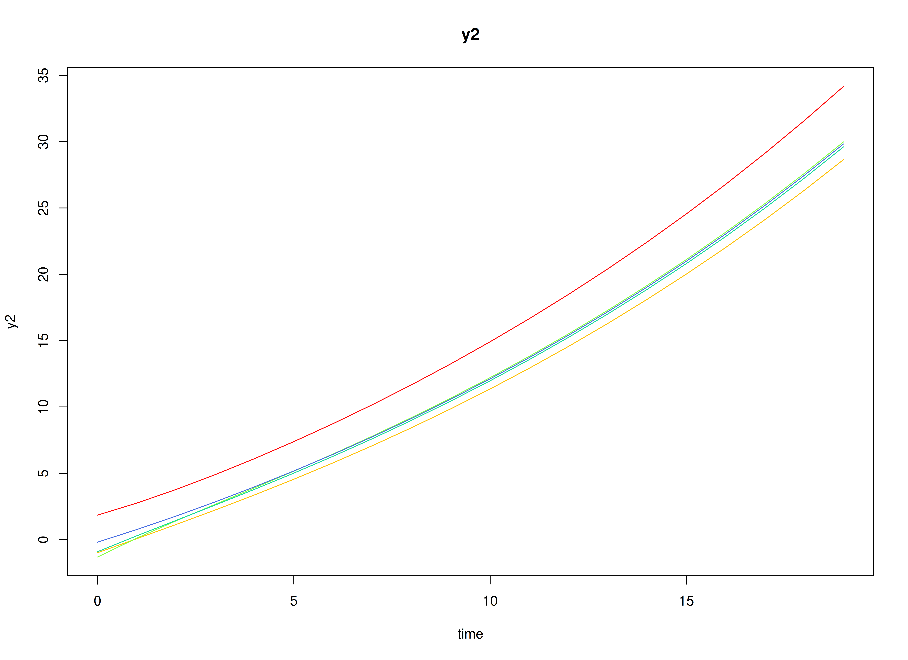

# Fit the Discrete-Time Vector Autoregressive Model By ID (Escalating Co-Activation)

## Dynamics Description

The *Escalating Co-Activation* process represents a bivariate dynamic
system in which two latent constructs—such as stress and
rumination—mutually reinforce each other over time. Both constructs
display strong autoregressive effects, indicating persistence, and
positive cross-effects, suggesting that increases in one tend to amplify
the other in subsequent time points.

At the population level, this pattern yields a slow return to
equilibrium and, in some cases, near-unstable trajectories that can
produce sustained co-activation or escalation. Between-person
variability in the transition parameters captures individual differences
in the strength of this self-reinforcing loop. The process noise
covariance is relatively large and positively correlated, representing
shared perturbations that drive both variables upward, while measurement
error variance is moderate, reflecting realistic self-report
imprecision.

This configuration models a *vicious cycle dynamic*—common in
maladaptive emotional or cognitive processes—where mutual amplification
between system components (e.g., stress and rumination) can sustain or
exacerbate dysregulation over time.

## Model

The measurement model is given by
``` math
\begin{equation}
  \mathbf{y}_{i, t} = \boldsymbol{\eta}_{i, t}
\end{equation}
```
where $`\mathbf{y}_{i, t}`$ and $`\boldsymbol{\eta}_{i, t}`$ are random
variables.

The dynamic structure is given by
``` math
\begin{equation}
  \boldsymbol{\eta}_{i, t} = \boldsymbol{\alpha}_{i} + \boldsymbol{\beta}_{i} \boldsymbol{\eta}_{i, t - 1} + \boldsymbol{\zeta}_{i, t}, \quad \mathrm{with} \quad \boldsymbol{\zeta}_{i, t} \sim \mathcal{N}   \left( \mathbf{0}, \boldsymbol{\Psi} \right)
\end{equation}
```
where $`\boldsymbol{\eta}_{i, t}`$, $`\boldsymbol{\eta}_{i, t - 1}`$,
and $`\boldsymbol{\zeta}_{i, t}`$ are random variables, and
$`\boldsymbol{\beta}_{i}`$, and $`\boldsymbol{\Psi}`$ are model
parameters. Here, $`\boldsymbol{\eta}_{i, t}`$ is a vector of latent
variables at time $`t`$ and individual $`i`$,
$`\boldsymbol{\eta}_{i, t - 1}`$ represents a vector of latent variables
at time $`t - 1`$ and individual $`i`$, and
$`\boldsymbol{\zeta}_{i, t}`$ represents a vector of dynamic noise at
time $`t`$ and individual $`i`$. $`\boldsymbol{\beta}_{i}`$ is a matrix
of autoregression and cross regression coefficients for individual
$`i`$, and $`\boldsymbol{\Psi}`$ the covariance matrix of
$`\boldsymbol{\zeta}_{i, t}`$ that is invariant across all individuals.
In this model, $`\boldsymbol{\Psi}`$ is a symmetric matrix.

### Alternative Parameterization

An alternative parameterization of the dynamic structure that directly
estimates the set-point vector $`\boldsymbol{\mu}_{i}`$ is given by
``` math
\begin{equation}
  \boldsymbol{\eta}_{i, t} = \boldsymbol{\mu}_{i} + \boldsymbol{\beta}_{i} \left( \boldsymbol{\eta}_{i, t - 1} - \boldsymbol{\mu}_{i} \right) + \boldsymbol{\zeta}_{i, t} .
\end{equation}
```

Algebraic manipulation of the equation results in the following
``` math
\begin{equation}
  \boldsymbol{\eta}_{i, t} = \boldsymbol{\mu}_{i} - \boldsymbol{\beta}_{i} \boldsymbol{\mu}_{i} + \boldsymbol{\beta}_{i} \boldsymbol{\eta}_{i, t - 1} + \boldsymbol{\zeta}_{i, t} ,
\end{equation}
```
where we can see that the intercept vector $`\boldsymbol{\alpha}_{i}`$
is implied by
$`\boldsymbol{\mu}_{i} - \boldsymbol{\beta}_{i} \boldsymbol{\mu}_{i}`$.

## Data Generation

### Notation

Let $`t = 100`$ be the number of time points and $`n = 1000`$ be the
number of individuals. We simulate a total of time $`= 10100`$ points
per individual, discarding the first $`10000`$ as burn-in. The analysis
uses the final $`100`$ measurement occasions.

Let the initial condition $`\boldsymbol{\eta}_{0}`$ be given by
``` math
\begin{equation}
  \boldsymbol{\eta}_{0} \sim \mathcal{N} \left( \boldsymbol{\mu}_{\boldsymbol{\eta} \mid 0}, \boldsymbol{\Sigma}_{\boldsymbol{\eta} \mid 0} \right) .
\end{equation}
```
$`\boldsymbol{\mu}_{\boldsymbol{\eta} \mid 0}`$ and
$`\boldsymbol{\Sigma}_{\boldsymbol{\eta} \mid 0}`$ are functions of
$`\boldsymbol{\alpha}`$ and $`\boldsymbol{\beta}`$.

Let the intercept vector $`\boldsymbol{\alpha}`$ be normally distributed
with the following means
``` math
\begin{equation}
  \left(
    \begin{array}{c}
      1 \\
      1 \\
    \end{array}
  \right)
\end{equation}
```
and covariance matrix
``` math
\begin{equation}
  \left(
    \begin{array}{cc}
      0.25 & 0.2 \\
      0.2 & 0.25 \\
    \end{array}
  \right) .
\end{equation}
```

Let the transition matrix $`\boldsymbol{\beta}`$ be normally distributed
with the following means
``` math
\begin{equation}
  \left(
    \begin{array}{cc}
      0.8 & 0.25 \\
      0.2 & 0.85 \\
    \end{array}
  \right)
\end{equation}
```
and covariance matrix
``` math
\begin{equation}
  \left(
    \begin{array}{cccc}
      0.04 & 0.02 & 0.015 & 0.01 \\
      0.02 & 0.03 & 0.01 & 0.015 \\
      0.015 & 0.01 & 0.03 & 0.02 \\
      0.01 & 0.015 & 0.02 & 0.04 \\
    \end{array}
  \right) .
\end{equation}
```

The `SimAlphaN` and `SimBetaN` functions from the `simStateSpace`
package generate random intercept vectors and transition matrices from
the multivariate normal distribution. Note that the `SimBetaN` function
generates transition matrices that are weakly stationary with an option
to set lower and upper bounds. The person-specific set-point vector
$`\boldsymbol{\mu}_{i}`$ was derived from the generated
$`\boldsymbol{\alpha}_{i}`$ and $`\boldsymbol{\beta}_{i}`$.

Let the dynamic process noise $`\boldsymbol{\Psi}`$ be given by
``` math
\begin{equation}
  \boldsymbol{\Psi}
  =
  \left(
    \begin{array}{cc}
      0.2 & -0.05 \\
      -0.05 & 0.18 \\
    \end{array}
  \right) .
\end{equation}
```

### R Function Arguments

``` r

n
#> [1] 1000
time
#> [1] 10100
burnin
#> [1] 10000
# first mu0 in the list of length n
mu0[[1]]
#> [1] 3.979101 5.261786
# first sigma0 in the list of length n
sigma0[[1]]
#>             [,1]        [,2]
#> [1,]  0.48290247 -0.02695157
#> [2,] -0.02695157  0.40742550
# first sigma0_l in the list of length n
sigma0_l[[1]] # sigma0_l <- t(chol(sigma0))
#>             [,1]      [,2]
#> [1,]  0.69491184 0.0000000
#> [2,] -0.03878416 0.6371195
# first alpha in the list of length n
alpha[[1]]
#> [1] 0.7342491 1.0337751
# first beta in the list of length n
beta[[1]]
#>            [,1]      [,2]
#> [1,] 0.76671137 0.0368753
#> [2,] 0.07383966 0.7476920
# first psi in the list of length n
psi[[1]]
#>       [,1]  [,2]
#> [1,]  0.20 -0.05
#> [2,] -0.05  0.18
psi_l[[1]] # psi_l <- t(chol(psi))
#>            [,1]      [,2]
#> [1,]  0.4472136 0.0000000
#> [2,] -0.1118034 0.4092676
# first mu (set-point) in the list of length n
mu[[1]]
#> [1] 3.979101 5.261786
```

### Visualizing the Dynamics Without Process Noise and Measurement Error (n = 5 with Different Initial Condition)



### Using the `SimSSMVARIVary` Function from the `simStateSpace` Package to Simulate Data

``` r

library(simStateSpace)
sim <- SimSSMVARIVary(
  n = n,
  time = time,
  mu0 = mu0,
  sigma0_l = sigma0_l,
  alpha = alpha,
  beta = beta,
  psi_l = psi_l
)
data <- as.data.frame(sim, burnin = burnin)
head(data)
#>   id time       y1       y2
#> 1  1    0 3.667029 5.556667
#> 2  1    1 3.670262 5.573278
#> 3  1    2 3.419001 5.461678
#> 4  1    3 3.925028 5.892973
#> 5  1    4 3.667664 6.224834
#> 6  1    5 4.155827 5.631088
plot(sim, burnin = burnin)
```


## Model Fitting

``` r

library(OpenMx)
library(fitVARMxID)
```

The `FitVARMxID` function fits a VAR model on each individual $`i`$.

### LDL’-parameterized covariance matrices

Covariances such as `psi` and `theta` are estimated using the LDL’
decomposition of a positive definite covariance matrix. The
decomposition expresses a covariance matrix $`\Sigma`$ as\
``` math
\begin{equation}
  \boldsymbol{\Sigma} = \left( \mathbf{L} + \mathbf{I} \right) \mathrm{diag} \left( \mathrm{Softplus} \left( \mathbf{d}_{uc} \right) \right) \left( \mathbf{L} + \mathbf{I} \right)^{\prime},
\end{equation}
```
where: - $`\mathbf{L}`$ is a strictly lower-triangular matrix of free
parameters (`l_mat_strict`),\
- $`\mathbf{I}`$ is the identity matrix,\
- $`\mathbf{d}_{uc}`$ is an unconstrained vector,\
-
$`\mathrm{Softplus} \left(\mathbf{d}_{uc} \right) = \log \left(1 + \exp \left( \mathbf{d}_{uc} \right) \right)`$
ensures strictly positive diagonal entries.

The
[`LDL()`](https://github.com/jeksterslab/fitVARMxID/reference/LDL.html)
function extracts this decomposition from a positive definite covariance
matrix. It returns:\
- `d_uc`: unconstrained diagonal parameters, equal to
`InvSoftplus(d_vec)`,\
- `d_vec`: diagonal entries, equal to `Softplus(d_uc)`,\
- `l_mat_strict`: the strictly lower-triangular factor.

``` r

sigma <- matrix(
  data = c(1.0, 0.5, 0.5, 1.0),
  nrow = 2,
  ncol = 2
)
ldl_sigma <- LDL(sigma)
d_uc <- ldl_sigma$d_uc
l_mat_strict <- ldl_sigma$l_mat_strict
I <- diag(2)
sigma_reconstructed <- (l_mat_strict + I) %*% diag(log1p(exp(d_uc)), 2) %*% t(l_mat_strict + I)
sigma_reconstructed
#>      [,1] [,2]
#> [1,]  1.0  0.5
#> [2,]  0.5  1.0
```

### `FitVARMxID`

``` r

fit <- FitVARMxID(
  data = data,
  observed = c("y1", "y2"),
  id = "id",
  center = TRUE,
  tries_explore = 1000,
  tries_local = 100,
  max_attempts = 100,
  ncores = parallel::detectCores()
)
```

#### Parameter estimates

``` r

head(summary(fit))
#>                          mu[1,1]   mu[2,1] beta[1,1]   beta[2,1]   beta[1,2]
#> FitVARMxID_VAR_ID1.Rds  4.069632  5.257517 0.7766154 -0.01231025  0.20562310
#> FitVARMxID_VAR_ID2.Rds  7.672821  6.094505 0.2223178 -0.30914569 -0.23843803
#> FitVARMxID_VAR_ID3.Rds 24.827945 11.528841 0.1101953 -0.20886863  0.33146719
#> FitVARMxID_VAR_ID4.Rds 16.400665 11.302763 0.2534439 -0.12971130 -0.26910588
#> FitVARMxID_VAR_ID5.Rds 14.558106 23.101649 0.1623998 -0.33939156  0.02788429
#> FitVARMxID_VAR_ID6.Rds  3.055194  1.761810 0.4038128 -0.11991150  0.13141247
#>                        beta[2,2]  psi[1,1]    psi[2,1]  psi[2,2]
#> FitVARMxID_VAR_ID1.Rds 0.5601123 0.1706596 -0.03935187 0.1674326
#> FitVARMxID_VAR_ID2.Rds 0.7579324 0.2378378 -0.01623838 0.1471512
#> FitVARMxID_VAR_ID3.Rds 0.8158781 0.9765994  0.27592708 0.2964318
#> FitVARMxID_VAR_ID4.Rds 0.1832713 0.3773208  0.06154313 0.2442620
#> FitVARMxID_VAR_ID5.Rds 0.4186573 0.4718741  0.41396161 0.9861358
#> FitVARMxID_VAR_ID6.Rds 0.6583966 0.2005669 -0.03980509 0.1539064
```

#### Proportion of converged cases

``` r

converged(
  fit,
  prop = TRUE
)
#> [1] 0.986
```

## Random-Effects Meta-Analysis of Person-Specific Dynamics and Means

We synthesize the person-specific estimates to recover population-level
effects and their between-person variability. We use a random-effects
model so the pooled mean reflects both within-person estimation
uncertainty and between-person heterogeneity.

``` r

library(metaDyn)
random <- MetaVARMx(
  fit,
  effects = TRUE,
  set_point = TRUE,
  robust_v = FALSE,
  robust = TRUE,
  lb = TRUE,
  ncores = parallel::detectCores()
)
#> Error in `[.data.frame`:
#> ! undefined columns selected
```

``` r

summary(random)
#> Error:
#> ! object 'random' not found
```

### Normal Theory Confidence Intervals

``` r

confint(random, level = 0.95, lb = FALSE)
#> Error:
#> ! object 'random' not found
```

``` r

confint(random, level = 0.99, lb = FALSE)
#> Error:
#> ! object 'random' not found
```

### Robust Confidence Intervals

``` r

confint(random, level = 0.95, lb = FALSE, robust = TRUE)
#> Error:
#> ! object 'random' not found
```

``` r

confint(random, level = 0.99, lb = FALSE, robust = TRUE)
#> Error:
#> ! object 'random' not found
```

### Profile-Likelihood Confidence Intervals

``` r

confint(random, level = 0.95, lb = TRUE)
#> Error:
#> ! object 'random' not found
```

``` r

confint(random, level = 0.99, lb = TRUE)
#> Error:
#> ! object 'random' not found
```

- The fixed part of the random-effects model gives pooled means
  $`\boldsymbol{\alpha} = \mathbb{E} \left[ \mathrm{Vec} \left( \boldsymbol{\mu}, \boldsymbol{\beta} \right)  \right]`$.
- The random part yields between-person covariances
  ($`\boldsymbol{\tau}^{2}`$) quantifying heterogeneity in set-point
  ($`\boldsymbol{\mu}`$) and dynamics ($`\boldsymbol{\beta}`$) across
  individuals.

``` r

means <- extract(random, what = "alpha")
#> Error:
#> ! object 'random' not found
means
#> Error:
#> ! object 'means' not found
covariances <- extract(random, what = "tau_sqr")
#> Error:
#> ! object 'random' not found
covariances
#> Error:
#> ! object 'covariances' not found
```

Finally, we compare the meta-analytic population estimates to the known
generating values.

``` r

pop_mean
#> [1] 6.28825913 5.98495580 0.65102637 0.06119726 0.11709416 0.69102888
pop_cov
#>            [,1]        [,2]         [,3]         [,4]         [,5]         [,6]
#> [1,] 45.5777745 22.45624703  0.435267659  0.102000623  0.416987471  0.166499263
#> [2,] 22.4562470 39.00449724  0.105053400  0.374443135  0.068369236  0.369552699
#> [3,]  0.4352677  0.10505340  0.022036851  0.006076962  0.002414367 -0.001588914
#> [4,]  0.1020006  0.37444314  0.006076962  0.018776010 -0.004104598  0.001061573
#> [5,]  0.4169875  0.06836924  0.002414367 -0.004104598  0.020922669  0.006573304
#> [6,]  0.1664993  0.36955270 -0.001588914  0.001061573  0.006573304  0.019815765
```

## Summary

This vignette demonstrates a two-stage hierarchical estimation approach
for dynamic systems: 1. individual-level DT-VAR estimation, and\
2. population-level meta-analysis of person-specific dynamics and means.

## References

Hunter, M. D. (2017). State space modeling in an open source, modular,
structural equation modeling environment. *Structural Equation Modeling:
A Multidisciplinary Journal*, *25*(2), 307–324.
<https://doi.org/10.1080/10705511.2017.1369354>

Neale, M. C., Hunter, M. D., Pritikin, J. N., Zahery, M., Brick, T. R.,
Kirkpatrick, R. M., Estabrook, R., Bates, T. C., Maes, H. H., & Boker,
S. M. (2015). OpenMx 2.0: Extended structural equation and statistical
modeling. *Psychometrika*, *81*(2), 535–549.
<https://doi.org/10.1007/s11336-014-9435-8>

R Core Team. (2024). *R: A language and environment for statistical
computing*. R Foundation for Statistical Computing.
<https://www.R-project.org/>
