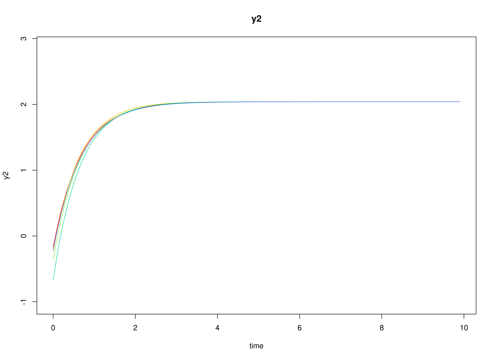
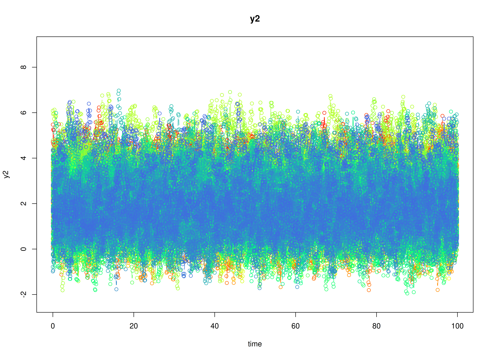

# Meta-Analysis of Continuous-Time Vector Autoregressive Model Estimates

## Dynamics Description

The *Stable Reciprocal Regulation* process is modeled as a
**continuous-time bivariate dynamic system** in which two latent
psychological constructs (e.g., negative and positive affect) mutually
influence each other through their instantaneous rates of change. The
dynamics are governed by the continuous-time **drift matrix** whose
**negative diagonal elements** indicate substantial self-regulation:
deviations from a person’s equilibrium are pulled back toward baseline
at a moderate-to-strong rate. The **negative off-diagonal elements**
reflect *reciprocal inhibition*: higher levels of one construct are
associated with an increased instantaneous tendency for the other
construct to decline. Because the cross-effects are modest relative to
the self-regulatory terms, the system exhibits **stable, non-oscillatory
relaxation** back toward person-specific equilibrium points.

Individuals are allowed to differ in both their self-regulatory rates
and the strength of these antagonistic couplings. Stochastic
disturbances enter through the **process-noise covariance**, permitting
small (potentially correlated) departures from the deterministic drift,
while measurement errors are assumed to be minimal and comparable across
indicators. Overall, this pattern captures a psychologically plausible
mechanism of *reciprocal inhibition* in which short-term perturbations
in one component (e.g., negative affect) are naturally counteracted by
compensatory adjustment in the other (e.g., positive affect), supporting
emotional homeostasis over time.

## Model

The measurement model is given by
``` math
\begin{equation}
  \mathbf{y}_{i, t} = \boldsymbol{\eta}_{i, t}
\end{equation}
```
where $`\mathbf{y}_{i, t}`$ and $`\boldsymbol{\eta}_{i, t}`$ are random
variables.

The dynamic structure is given by
``` math
\begin{equation}
  \mathrm{d} \boldsymbol{\eta}_{i, t} = \left( \boldsymbol{\alpha}_{i} + \boldsymbol{\beta}_{i} \boldsymbol{\eta}_{i, t} \right) \mathrm{d} t + \boldsymbol{\Psi}_{i}^{\frac{1}{2}} \mathrm{d} \mathbf{W}_{i, t}
\end{equation}
```
where $`\mathrm{d}\boldsymbol{W}`$ is a Wiener process or Brownian
motion, which represents random fluctuations,
$`\boldsymbol{\eta}_{i, t}`$ is a random variable, and
$`\boldsymbol{\beta}_{i}`$, and $`\boldsymbol{\Psi}`$ are model
parameters. Here, $`\boldsymbol{\eta}_{i, t}`$ is a vector of latent
variables at time $`t`$ and individual $`i`$. $`\boldsymbol{\beta}_{i}`$
is a matrix of auto and cross effect coefficients for individual $`i`$,
and $`\boldsymbol{\Psi}`$ the covariance matrix of the process noise.

### Alternative Parameterization

An alternative parameterization of the dynamic structure that directly
estimates the set-point vector $`\boldsymbol{\mu}_{i}`$ is given by
``` math
\begin{equation}
  \mathrm{d} \boldsymbol{\eta}_{i, t} = \boldsymbol{\beta}_{i} \left( \boldsymbol{\eta}_{i, t} - \boldsymbol{\mu}_{i} \right) \mathrm{d} t + \boldsymbol{\Psi}_{i}^{\frac{1}{2}} \mathrm{d} \mathbf{W}_{i, t} .
\end{equation}
```

Algebraic manipulation of the equation results in the following
``` math
\begin{equation}
  \mathrm{d} \boldsymbol{\eta}_{i, t} = \boldsymbol{\beta}_{i} \left( \boldsymbol{\eta}_{i, t} - \boldsymbol{\mu}_{i} \right) \mathrm{d} t + \boldsymbol{\Psi}_{i}^{\frac{1}{2}} \mathrm{d} \mathbf{W}_{i, t} ,
\end{equation}
```
where we can see that the intercept vector $`\boldsymbol{\alpha}_{i}`$
is implied by $`- \boldsymbol{\beta}_{i} \boldsymbol{\mu}_{i}`$.

## Data Generation

### Notation

Let $`t = 1000`$ be the number of time points and $`n = 100`$ be the
number of individuals. We simulate a total of time $`= 1000`$ points per
individual.

Let the initial condition $`\boldsymbol{\eta}_{0}`$ be given by
``` math
\begin{equation}
  \boldsymbol{\eta}_{0} \sim \mathcal{N} \left( \boldsymbol{\mu}_{\boldsymbol{\eta} \mid 0}, \boldsymbol{\Sigma}_{\boldsymbol{\eta} \mid 0} \right) .
\end{equation}
```
$`\boldsymbol{\mu}_{\boldsymbol{\eta} \mid 0}`$ and
$`\boldsymbol{\Sigma}_{\boldsymbol{\eta} \mid 0}`$ are functions of
$`\boldsymbol{\alpha}`$ and $`\boldsymbol{\beta}`$.

Let the set point vector $`\boldsymbol{\mu}`$ be normally distributed
with the following means
``` math
\begin{equation}
  \left(
    \begin{array}{c}
      2.87 \\
      2.04 \\
    \end{array}
  \right)
\end{equation}
```
and covariance matrix
``` math
\begin{equation}
  \left(
    \begin{array}{cc}
      1.2 & 0.46 \\
      0.46 & 1.1 \\
    \end{array}
  \right) .
\end{equation}
```

Let the transition matrix $`\boldsymbol{\beta}`$ be normally distributed
with the following means
``` math
\begin{equation}
  \left(
    \begin{array}{cc}
      -1.2843504 & -0.1792463 \\
      -0.1307004 & -1.3590363 \\
    \end{array}
  \right)
\end{equation}
```
and covariance matrix
``` math
\begin{equation}
  \left(
    \begin{array}{cccc}
      0.017 & 0.005 & 0.001 & 0.008 \\
      0.005 & 0.008 & 0.001 & 0.006 \\
      0.001 & 0.001 & 0.001 & 0.002 \\
      0.008 & 0.006 & 0.002 & 0.026 \\
    \end{array}
  \right) .
\end{equation}
```

The `SimMuN` and `SimPhiN` functions from the `simStateSpace` package
generate random set point vectors and transition matrices from the
multivariate normal distribution. Note that the `SimPhiN` function
generates drift matrices that are weakly stationary with an option to
set lower and upper bounds.

Let the dynamic process noise $`\boldsymbol{\Psi}`$ be given by
``` math
\begin{equation}
  \boldsymbol{\Psi}
  =
  \left(
    \begin{array}{cc}
      1.3 & 0.57 \\
      0.57 & 1.56 \\
    \end{array}
  \right) .
\end{equation}
```

### R Function Arguments

``` r

n
#> [1] 100
time
#> [1] 1000
# first mu0 in the list of length n
mu0[[1]]
#> [1] 2.287769 2.606098
# first sigma0 in the list of length n
sigma0[[1]]
#>           [,1]      [,2]
#> [1,] 0.5037766 0.1478276
#> [2,] 0.1478276 0.5694164
# first sigma0_l in the list of length n
sigma0_l[[1]] # sigma0_l <- t(chol(sigma0))
#>           [,1]      [,2]
#> [1,] 0.7097722 0.0000000
#> [2,] 0.2082747 0.7252848
# first alpha in the list of length n
alpha[[1]]
#> [1] 3.312112 3.842713
# first beta in the list of length n
beta[[1]]
#>           [,1]      [,2]
#> [1,] -1.235608 -0.186227
#> [2,] -0.169327 -1.325864
# first psi in the list of length n
psi[[1]]
#>      [,1] [,2]
#> [1,] 1.30 0.57
#> [2,] 0.57 1.56
psi_l[[1]] # psi_l <- t(chol(psi))
#>           [,1]     [,2]
#> [1,] 1.1401754 0.000000
#> [2,] 0.4999231 1.144586
# first mu (set-point) in the list of length n
mu[[1]]
#> [1] 2.287769 2.606098
```

### Visualizing the Dynamics Without Process Noise and Measurement Error (n = 5 with Different Initial Condition)



### Using the `SimSSMLinSDEFixed` Function from the `simStateSpace` Package to Simulate Data

> **Note:** The `SimSSMLinSDEFixed` function uses a different set of
> parameter names. See
> [`help(SimSSMLinSDEFixed)`](https://github.com/jeksterslab/simStateSpace/reference/SimSSMLinSDEFixed.html)
> for more details.

``` r

library(simStateSpace)
sim <- SimSSMLinSDEIVary(
  n = n,
  time = time,
  delta_t = 0.1,
  mu0 = mu0,
  sigma0_l = sigma0_l,
  iota = alpha,
  phi = beta,
  sigma_l = psi_l,
  nu = nu,
  lambda = lambda,
  theta_l = theta_l
)
data <- as.data.frame(sim)
head(data)
#>   id time       y1       y2
#> 1  1  0.0 2.523315 3.353060
#> 2  1  0.1 2.309397 3.020899
#> 3  1  0.2 2.600318 3.078564
#> 4  1  0.3 2.698363 2.929001
#> 5  1  0.4 2.444623 2.861375
#> 6  1  0.5 3.190602 2.891174
summary(data)
#>        id              time             y1               y2        
#>  Min.   :  1.00   Min.   : 0.00   Min.   :-2.335   Min.   :-1.951  
#>  1st Qu.: 25.75   1st Qu.:24.98   1st Qu.: 2.093   1st Qu.: 1.261  
#>  Median : 50.50   Median :49.95   Median : 2.990   Median : 2.187  
#>  Mean   : 50.50   Mean   :49.95   Mean   : 2.975   Mean   : 2.185  
#>  3rd Qu.: 75.25   3rd Qu.:74.92   3rd Qu.: 3.873   3rd Qu.: 3.081  
#>  Max.   :100.00   Max.   :99.90   Max.   : 8.893   Max.   : 6.970
plot(sim)
```



## Stage 1: Person-Specific VAR Model

``` r

library(OpenMx)
library(fitVARMxID)
```

The `FitVARMxID` function fits a VAR model on each individual $`i`$.

``` r

fit <- FitVARMxID(
  data = data,
  observed = c("y1", "y2"),
  id = "id",
  ct = TRUE,
  time = "time",
  center = TRUE
)
```

``` r

summary(
  fit,
  means = TRUE
)
#> Call:
#> FitVARMxID(data = data, observed = c("y1", "y2"), id = "id", 
#>     time = "time", ct = TRUE, center = TRUE)
#> 
#> Convergence:
#> 100.0%
#> 
#> Means of the estimated paramaters per individual.
#>   mu[1,1]   mu[2,1] beta[1,1] beta[2,1] beta[1,2] beta[2,2]  psi[1,1]  psi[2,1] 
#>    2.9743    2.1847   -1.3528   -0.1673   -0.1959   -1.4373    1.3040    0.5685 
#>  psi[2,2] 
#>    1.5566
```

## Stage 2: Random-Effects Meta-Analysis of Person-Specific Dynamics and Means

We synthesize the person-specific estimates to recover population-level
effects and their between-person variability. We use a random-effects
model so the pooled mean reflects both within-person estimation
uncertainty and between-person heterogeneity.

All available parameters are meta-analyzed by default. Setting
`cov_dyn = FALSE`, meta-analyzes only the set points and transition
matrix. Setting `tau_sqr_l_free`, such that covariances between `mu` and
`beta` are constained to zero, simplifies the random effects.

``` r

tau_sqr_l_free <- matrix(
  data = c(
    FALSE, FALSE, FALSE, FALSE, FALSE, FALSE,
    TRUE, FALSE, FALSE, FALSE, FALSE, FALSE,
    FALSE, FALSE, FALSE, FALSE, FALSE, FALSE,
    FALSE, FALSE, TRUE, FALSE, FALSE, FALSE,
    FALSE, FALSE, TRUE, TRUE, FALSE, FALSE,
    FALSE, FALSE, TRUE, TRUE, TRUE, FALSE
  ),
  byrow = TRUE,
  nrow = 6,
  ncol = 6
)
# FALSE values in tau_sqr_l_free will be treated as fixed values.
# TRUE values in tau_sqr_l_free will be treated as starting values.
tau_sqr_l_values <- matrix(
  data = 0,
  nrow = 6,
  ncol = 6
)
library(metaDyn)
metavar <- MetaVARMx(
  object = fit,
  cov_dyn = FALSE,
  tau_sqr_l_free = tau_sqr_l_free,
  tau_sqr_l_values = tau_sqr_l_values
)
```

``` r

summary(metavar)
#> Call:
#> MetaVARMx(object = fit, tau_sqr_l_free = tau_sqr_l_free, tau_sqr_l_values = tau_sqr_l_values, 
#>     cov_dyn = FALSE)
#> 
#> Status code:
#> 0
#> 
#> CI type:
#> "normal"
#> 
#>                  est     se         z      p    2.5%   97.5%
#> alpha[1,1]    2.9742 0.1120   26.5553 0.0000  2.7547  3.1937
#> alpha[2,1]    2.1845 0.1062   20.5782 0.0000  1.9765  2.3926
#> alpha[3,1]   -1.3129 0.0238  -55.2182 0.0000 -1.3595 -1.2663
#> alpha[4,1]   -0.1670 0.0225   -7.4232 0.0000 -0.2111 -0.1229
#> alpha[5,1]   -0.1943 0.0186  -10.4592 0.0000 -0.2307 -0.1579
#> alpha[6,1]   -1.3984 0.0251  -55.8089 0.0000 -1.4475 -1.3492
#> tau_sqr[1,1]  1.2471 0.1775    7.0245 0.0000  0.8991  1.5950
#> tau_sqr[2,1]  0.5434 0.1307    4.1583 0.0000  0.2873  0.7996
#> tau_sqr[2,2]  1.1190 0.1593    7.0229 0.0000  0.8067  1.4313
#> tau_sqr[3,3]  0.0209 0.0072    2.8955 0.0038  0.0068  0.0351
#> tau_sqr[4,3]  0.0013 0.0048    0.2596 0.7952 -0.0082  0.0108
#> tau_sqr[5,3]  0.0005 0.0041    0.1149 0.9085 -0.0075  0.0084
#> tau_sqr[6,3] -0.0046 0.0058   -0.7898 0.4297 -0.0159  0.0068
#> tau_sqr[4,4]  0.0088 0.0063    1.3974 0.1623 -0.0036  0.0212
#> tau_sqr[5,4]  0.0045 0.0032    1.4274 0.1535 -0.0017  0.0107
#> tau_sqr[6,4] -0.0038 0.0056   -0.6874 0.4918 -0.0147  0.0071
#> tau_sqr[5,5]  0.0035 0.0036    0.9683 0.3329 -0.0036  0.0106
#> tau_sqr[6,5]  0.0032 0.0042    0.7701 0.4412 -0.0050  0.0114
#> tau_sqr[6,6]  0.0251 0.0079    3.1574 0.0016  0.0095  0.0406
#> i_sqr[1,1]    0.9950 0.0007 1397.4905 0.0000  0.9936  0.9964
#> i_sqr[2,1]    0.9932 0.0010 1034.4683 0.0000  0.9913  0.9951
#> i_sqr[3,1]    0.3867 0.0819    4.7222 0.0000  0.2262  0.5471
#> i_sqr[4,1]    0.2611 0.1046    2.4954 0.0126  0.0560  0.4662
#> i_sqr[5,1]    0.1538 0.1049    1.4660 0.1427 -0.0518  0.3595
#> i_sqr[6,1]    0.4421 0.0735    6.0145 0.0000  0.2980  0.5862
```

### Normal Theory Confidence Intervals

``` r

confint(metavar, level = 0.95)
#>                     2.5 %       97.5 %
#> alpha[1,1]    2.754695565  3.193731198
#> alpha[2,1]    1.976476076  2.392608724
#> alpha[3,1]   -1.359484810 -1.266283416
#> alpha[4,1]   -0.211138203 -0.122932246
#> alpha[5,1]   -0.230700687 -0.157883598
#> alpha[6,1]   -1.447462409 -1.349244333
#> tau_sqr[1,1]  0.899125664  1.595047929
#> tau_sqr[2,1]  0.287297284  0.799596589
#> tau_sqr[2,2]  0.806730986  1.431328765
#> tau_sqr[3,3]  0.006755838  0.035061867
#> tau_sqr[4,3] -0.008243539  0.010760237
#> tau_sqr[5,3] -0.007505411  0.008440608
#> tau_sqr[6,3] -0.015893395  0.006763813
#> tau_sqr[4,4] -0.003552678  0.021204356
#> tau_sqr[5,4] -0.001690160  0.010749995
#> tau_sqr[6,4] -0.014728573  0.007079523
#> tau_sqr[5,5] -0.003584711  0.010585748
#> tau_sqr[6,5] -0.004986079  0.011440560
#> tau_sqr[6,6]  0.009510629  0.040645761
#> i_sqr[1,1]    0.993577972  0.996368849
#> i_sqr[2,1]    0.991336021  0.995099638
#> i_sqr[3,1]    0.226175043  0.547148154
#> i_sqr[4,1]    0.056033091  0.466243548
#> i_sqr[5,1]   -0.051834467  0.359471348
#> i_sqr[6,1]    0.298045337  0.586196324
```

``` r

confint(metavar, level = 0.99)
#>                     0.5 %      99.5 %
#> alpha[1,1]    2.685718068  3.26270870
#> alpha[2,1]    1.911096898  2.45798790
#> alpha[3,1]   -1.374127810 -1.25164042
#> alpha[4,1]   -0.224996363 -0.10907409
#> alpha[5,1]   -0.242141080 -0.14644320
#> alpha[6,1]   -1.462893587 -1.33381315
#> tau_sqr[1,1]  0.789788351  1.70438524
#> tau_sqr[2,1]  0.206809230  0.88008464
#> tau_sqr[2,2]  0.708599563  1.52946019
#> tau_sqr[3,3]  0.002308638  0.03950907
#> tau_sqr[4,3] -0.011229249  0.01374595
#> tau_sqr[5,3] -0.010010713  0.01094591
#> tau_sqr[6,3] -0.019453101  0.01032352
#> tau_sqr[4,4] -0.007442290  0.02509397
#> tau_sqr[5,4] -0.003644650  0.01270448
#> tau_sqr[6,4] -0.018154874  0.01050582
#> tau_sqr[5,5] -0.005811051  0.01281209
#> tau_sqr[6,5] -0.007566891  0.01402137
#> tau_sqr[6,6]  0.004618946  0.04553744
#> i_sqr[1,1]    0.993139494  0.99680733
#> i_sqr[2,1]    0.990744714  0.99569094
#> i_sqr[3,1]    0.175746512  0.59757668
#> i_sqr[4,1]   -0.008415643  0.53069228
#> i_sqr[5,1]   -0.116455294  0.42409218
#> i_sqr[6,1]    0.252773536  0.63146813
```

### Robust Confidence Intervals

``` r

confint(metavar, level = 0.95, robust = TRUE)
#>                     2.5 %       97.5 %
#> alpha[1,1]    2.753593256  3.194833508
#> alpha[2,1]    1.975423105  2.393661695
#> alpha[3,1]   -1.358290707 -1.267477518
#> alpha[4,1]   -0.211857056 -0.122213393
#> alpha[5,1]   -0.230848874 -0.157735411
#> alpha[6,1]   -1.445575878 -1.351130864
#> tau_sqr[1,1]  0.908503606  1.585669987
#> tau_sqr[2,1]  0.284662907  0.802230966
#> tau_sqr[2,2]  0.848731585  1.389328166
#> tau_sqr[3,3]  0.006110050  0.035707654
#> tau_sqr[4,3] -0.007480886  0.009997584
#> tau_sqr[5,3] -0.007535186  0.008470382
#> tau_sqr[6,3] -0.015346549  0.006216966
#> tau_sqr[4,4] -0.002291156  0.019942835
#> tau_sqr[5,4] -0.001045056  0.010104891
#> tau_sqr[6,4] -0.012830529  0.005181479
#> tau_sqr[5,5] -0.002932130  0.009933168
#> tau_sqr[6,5] -0.004283294  0.010737776
#> tau_sqr[6,6]  0.005253562  0.044902828
#> i_sqr[1,1]    0.993615581  0.996331241
#> i_sqr[2,1]    0.991608443  0.994827216
#> i_sqr[3,1]    0.218851771  0.554471425
#> i_sqr[4,1]    0.072680526  0.449596113
#> i_sqr[5,1]   -0.024306891  0.331943772
#> i_sqr[6,1]    0.226325857  0.657915804
```

``` r

confint(metavar, level = 0.99, robust = TRUE)
#>                     0.5 %       99.5 %
#> alpha[1,1]    2.684269388  3.264157376
#> alpha[2,1]    1.909713060  2.459371740
#> alpha[3,1]   -1.372558493 -1.253209732
#> alpha[4,1]   -0.225941096 -0.108129353
#> alpha[5,1]   -0.242335832 -0.146248453
#> alpha[6,1]   -1.460414265 -1.336292477
#> tau_sqr[1,1]  0.802113057  1.692060536
#> tau_sqr[2,1]  0.203347072  0.883546801
#> tau_sqr[2,2]  0.763797706  1.474262045
#> tau_sqr[3,3]  0.001459930  0.040357774
#> tau_sqr[4,3] -0.010226953  0.012743651
#> tau_sqr[5,3] -0.010049843  0.010985039
#> tau_sqr[6,3] -0.018734423  0.009604840
#> tau_sqr[4,4] -0.005784370  0.023436048
#> tau_sqr[5,4] -0.002796840  0.011856675
#> tau_sqr[6,4] -0.015660421  0.008011371
#> tau_sqr[5,5] -0.004953415  0.011954453
#> tau_sqr[6,5] -0.006643275  0.013097757
#> tau_sqr[6,6] -0.000975789  0.051132179
#> i_sqr[1,1]    0.993188920  0.996757902
#> i_sqr[2,1]    0.991102737  0.995332921
#> i_sqr[3,1]    0.166122102  0.607201095
#> i_sqr[4,1]    0.013462795  0.508813844
#> i_sqr[5,1]   -0.080277927  0.387914808
#> i_sqr[6,1]    0.158518162  0.725723499
```

- The fixed part of the random-effects model gives pooled means
  $`\boldsymbol{\alpha} = \mathbb{E} \left[ \mathrm{Vec} \left( \boldsymbol{\mu}, \boldsymbol{\beta} \right)  \right]`$.
- The random part yields between-person covariances
  ($`\boldsymbol{\tau}^{2}`$) quantifying heterogeneity in set-point
  ($`\boldsymbol{\mu}`$) and dynamics ($`\boldsymbol{\beta}`$) across
  individuals.

``` r

means <- extract(metavar, what = "alpha")
means
#>         alpha
#> y1  2.9742134
#> y2  2.1845424
#> y3 -1.3128841
#> y4 -0.1670352
#> y5 -0.1942921
#> y6 -1.3983534
covariances <- extract(metavar, what = "tau_sqr")
covariances
#>           y1        y2            y3           y4           y5           y6
#> y1 1.2470868 0.5434469  0.0000000000  0.000000000 0.0000000000  0.000000000
#> y2 0.5434469 1.1190299  0.0000000000  0.000000000 0.0000000000  0.000000000
#> y3 0.0000000 0.0000000  0.0209088522  0.001258349 0.0004675981 -0.004564791
#> y4 0.0000000 0.0000000  0.0012583489  0.008825839 0.0045299175 -0.003824525
#> y5 0.0000000 0.0000000  0.0004675981  0.004529918 0.0035005188  0.003227241
#> y6 0.0000000 0.0000000 -0.0045647913 -0.003824525 0.0032272408  0.025078195
```

## Summary

This vignette demonstrates a two-stage hierarchical estimation approach
for dynamic systems: 1. individual-level CT-VAR estimation, and\
2. population-level meta-analysis of person-specific dynamics and means.

## References

Hunter, M. D. (2017). State space modeling in an open source, modular,
structural equation modeling environment. *Structural Equation Modeling:
A Multidisciplinary Journal*, *25*(2), 307–324.
<https://doi.org/10.1080/10705511.2017.1369354>

Neale, M. C., Hunter, M. D., Pritikin, J. N., Zahery, M., Brick, T. R.,
Kirkpatrick, R. M., Estabrook, R., Bates, T. C., Maes, H. H., & Boker,
S. M. (2015). OpenMx 2.0: Extended structural equation and statistical
modeling. *Psychometrika*, *81*(2), 535–549.
<https://doi.org/10.1007/s11336-014-9435-8>

R Core Team. (2024). *R: A language and environment for statistical
computing*. R Foundation for Statistical Computing.
<https://www.R-project.org/>
