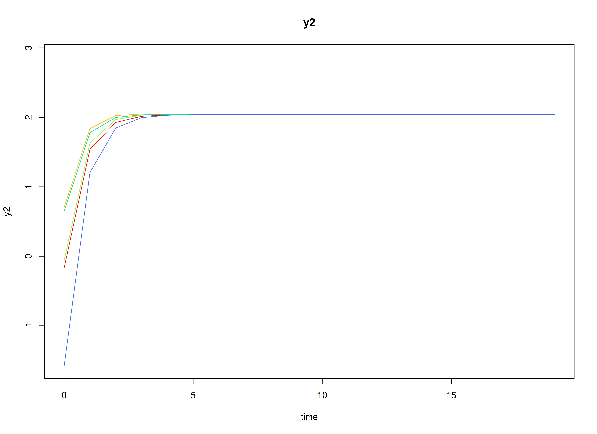
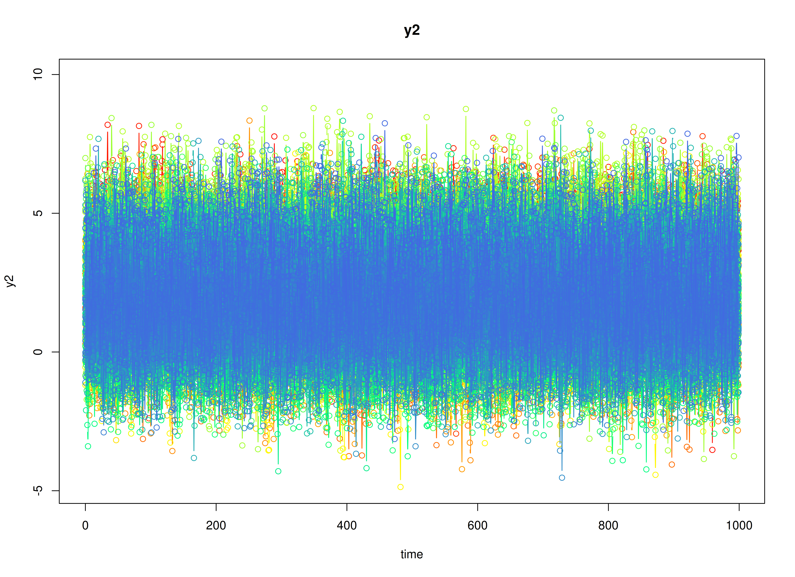

# Meta-Analysis of Discrete-Time Vector Autoregressive Model Estimates

## Dynamics Description

The *Stable Reciprocal Regulation* process represents a bivariate
dynamic system in which two latent psychological constructs—such as
negative and positive affect—mutually influence each other over time.
Each construct shows moderate self-regulation (autoregressive effects)
and mild opposing cross-effects, reflecting an equilibrium-seeking
mechanism characteristic of emotional balance.

Individuals vary in their self-regulatory tendencies and in the strength
of these antagonistic couplings. At the population level, the transition
matrix indicates that increases in one construct are followed by slight
decreases in the other, producing a stable, damped oscillatory pattern
around individual equilibrium points. The process noise covariance
allows for small correlated disturbances, while measurement errors are
assumed to be minimal and symmetric across indicators.

This dynamic pattern captures a psychologically plausible process of
*reciprocal inhibition*—where short-term fluctuations in one system
component (e.g., negative affect) are naturally counteracted by
adjustments in its counterpart (e.g., positive affect), leading to
emotional homeostasis over time.

## Model

The measurement model is given by
``` math
\begin{equation}
  \mathbf{y}_{i, t} = \boldsymbol{\eta}_{i, t}
\end{equation}
```
where $`\mathbf{y}_{i, t}`$ and $`\boldsymbol{\eta}_{i, t}`$ are random
variables.

The dynamic structure is given by
``` math
\begin{equation}
  \boldsymbol{\eta}_{i, t} = \boldsymbol{\alpha}_{i} + \boldsymbol{\beta}_{i} \boldsymbol{\eta}_{i, t - 1} + \boldsymbol{\zeta}_{i, t}, \quad \mathrm{with} \quad \boldsymbol{\zeta}_{i, t} \sim \mathcal{N}   \left( \mathbf{0}, \boldsymbol{\Psi} \right)
\end{equation}
```
where $`\boldsymbol{\eta}_{i, t}`$, $`\boldsymbol{\eta}_{i, t - 1}`$,
and $`\boldsymbol{\zeta}_{i, t}`$ are random variables, and
$`\boldsymbol{\beta}_{i}`$, and $`\boldsymbol{\Psi}`$ are model
parameters. Here, $`\boldsymbol{\eta}_{i, t}`$ is a vector of latent
variables at time $`t`$ and individual $`i`$,
$`\boldsymbol{\eta}_{i, t - 1}`$ represents a vector of latent variables
at time $`t - 1`$ and individual $`i`$, and
$`\boldsymbol{\zeta}_{i, t}`$ represents a vector of dynamic noise at
time $`t`$ and individual $`i`$. $`\boldsymbol{\beta}_{i}`$ is a matrix
of autoregression and cross regression coefficients for individual
$`i`$, and $`\boldsymbol{\Psi}`$ the covariance matrix of
$`\boldsymbol{\zeta}_{i, t}`$ that is invariant across all individuals.
In this model, $`\boldsymbol{\Psi}`$ is a symmetric matrix.

### Alternative Parameterization

An alternative parameterization of the dynamic structure that directly
estimates the set-point vector $`\boldsymbol{\mu}_{i}`$ is given by
``` math
\begin{equation}
  \boldsymbol{\eta}_{i, t} = \boldsymbol{\mu}_{i} + \boldsymbol{\beta}_{i} \left( \boldsymbol{\eta}_{i, t - 1} - \boldsymbol{\mu}_{i} \right) + \boldsymbol{\zeta}_{i, t} .
\end{equation}
```

Algebraic manipulation of the equation results in the following
``` math
\begin{equation}
  \boldsymbol{\eta}_{i, t} = \boldsymbol{\mu}_{i} - \boldsymbol{\beta}_{i} \boldsymbol{\mu}_{i} + \boldsymbol{\beta}_{i} \boldsymbol{\eta}_{i, t - 1} + \boldsymbol{\zeta}_{i, t} ,
\end{equation}
```
where we can see that the intercept vector $`\boldsymbol{\alpha}_{i}`$
is implied by
$`\boldsymbol{\mu}_{i} - \boldsymbol{\beta}_{i} \boldsymbol{\mu}_{i}`$.

## Data Generation

### Notation

Let $`t = 1000`$ be the number of time points and $`n = 100`$ be the
number of individuals. We simulate a total of time $`= 1000`$ points per
individual.

Let the initial condition $`\boldsymbol{\eta}_{0}`$ be given by
``` math
\begin{equation}
  \boldsymbol{\eta}_{0} \sim \mathcal{N} \left( \boldsymbol{\mu}_{\boldsymbol{\eta} \mid 0}, \boldsymbol{\Sigma}_{\boldsymbol{\eta} \mid 0} \right) .
\end{equation}
```
$`\boldsymbol{\mu}_{\boldsymbol{\eta} \mid 0}`$ and
$`\boldsymbol{\Sigma}_{\boldsymbol{\eta} \mid 0}`$ are functions of
$`\boldsymbol{\alpha}`$ and $`\boldsymbol{\beta}`$.

Let the set point vector $`\boldsymbol{\mu}`$ be normally distributed
with the following means
``` math
\begin{equation}
  \left(
    \begin{array}{c}
      2.87 \\
      2.04 \\
    \end{array}
  \right)
\end{equation}
```
and covariance matrix
``` math
\begin{equation}
  \left(
    \begin{array}{cc}
      1.2 & 0.46 \\
      0.46 & 1.1 \\
    \end{array}
  \right) .
\end{equation}
```

Let the transition matrix $`\boldsymbol{\beta}`$ be normally distributed
with the following means
``` math
\begin{equation}
  \left(
    \begin{array}{cc}
      0.28 & -0.048 \\
      -0.035 & 0.26 \\
    \end{array}
  \right)
\end{equation}
```
and covariance matrix
``` math
\begin{equation}
  \left(
    \begin{array}{cccc}
      0.017 & 0.005 & 0.001 & 0.008 \\
      0.005 & 0.008 & 0.001 & 0.006 \\
      0.001 & 0.001 & 0.001 & 0.002 \\
      0.008 & 0.006 & 0.002 & 0.026 \\
    \end{array}
  \right) .
\end{equation}
```

The `SimMuN` and `SimBetaN` functions from the `simStateSpace` package
generate random set point vectors and transition matrices from the
multivariate normal distribution. Note that the `SimBetaN` function
generates transition matrices that are weakly stationary with an option
to set lower and upper bounds. The person-specific set-point vector
$`\boldsymbol{\mu}_{i}`$ was derived from the generated
$`\boldsymbol{\alpha}_{i}`$ and $`\boldsymbol{\beta}_{i}`$.

Let the dynamic process noise $`\boldsymbol{\Psi}`$ be given by
``` math
\begin{equation}
  \boldsymbol{\Psi}
  =
  \left(
    \begin{array}{cc}
      1.3 & 0.57 \\
      0.57 & 1.56 \\
    \end{array}
  \right) .
\end{equation}
```

### R Function Arguments

``` r

n
#> [1] 100
time
#> [1] 1000
# first mu0 in the list of length n
mu0[[1]]
#> [1] 2.287769 2.606098
# first sigma0 in the list of length n
sigma0[[1]]
#>           [,1]      [,2]
#> [1,] 1.4403549 0.5646226
#> [2,] 0.5646226 1.6885649
# first sigma0_l in the list of length n
sigma0_l[[1]] # sigma0_l <- t(chol(sigma0))
#>           [,1]     [,2]
#> [1,] 1.2001479 0.000000
#> [2,] 0.4704608 1.211293
# first alpha in the list of length n
alpha[[1]]
#> [1] 1.678968 2.010503
# first beta in the list of length n
beta[[1]]
#>             [,1]        [,2]
#> [1,]  0.32874206 -0.05498069
#> [2,] -0.07362662  0.29317209
# first psi in the list of length n
psi[[1]]
#>      [,1] [,2]
#> [1,] 1.30 0.57
#> [2,] 0.57 1.56
psi_l[[1]] # psi_l <- t(chol(psi))
#>           [,1]     [,2]
#> [1,] 1.1401754 0.000000
#> [2,] 0.4999231 1.144586
# first mu (set-point) in the list of length n
mu[[1]]
#> [1] 2.287769 2.606098
```

### Visualizing the Dynamics Without Process Noise and Measurement Error (n = 5 with Different Initial Condition)



### Using the `SimSSMVARIVary` Function from the `simStateSpace` Package to Simulate Data

``` r

library(simStateSpace)
sim <- SimSSMVARIVary(
  n = n,
  time = time,
  mu0 = mu0,
  sigma0_l = sigma0_l,
  alpha = alpha,
  beta = beta,
  psi_l = psi_l
)
data <- as.data.frame(sim)
head(data)
#>   id time        y1       y2
#> 1  1    0 2.2494783 1.541912
#> 2  1    1 2.8646254 2.346091
#> 3  1    2 0.8218736 3.348071
#> 4  1    3 2.4900816 2.282659
#> 5  1    4 2.7074414 3.944741
#> 6  1    5 2.9755157 2.667683
plot(sim)
```



## Stage 1: Person-Specific VAR Model

``` r

library(OpenMx)
library(fitVARMxID)
```

The `FitVARMxID` function fits a VAR model on each individual $`i`$.

``` r

fit <- FitVARMxID(
  data = data,
  observed = c("y1", "y2"),
  id = "id",
  center = TRUE
)
```

``` r

summary(
  fit,
  means = TRUE
)
#> Call:
#> FitVARMxID(data = data, observed = c("y1", "y2"), id = "id", 
#>     center = TRUE)
#> 
#> Convergence:
#> 100.0%
#> 
#> Means of the estimated paramaters per individual.
#>   mu[1,1]   mu[2,1] beta[1,1] beta[2,1] beta[1,2] beta[2,2]  psi[1,1]  psi[2,1] 
#>    2.9733    2.1842    0.2711   -0.0659   -0.0543    0.2394    1.2932    0.5612 
#>  psi[2,2] 
#>    1.5390
```

## Stage 2: Random-Effects Meta-Analysis of Person-Specific Dynamics and Means

We synthesize the person-specific estimates to recover population-level
effects and their between-person variability. We use a random-effects
model so the pooled mean reflects both within-person estimation
uncertainty and between-person heterogeneity.

``` r

library(metaDyn)
metavar <- MetaVARMx(
  object = fit,
  effects = TRUE,
  set_point = TRUE
)
```

``` r

summary(metavar)
#> Call:
#> MetaVARMx(object = fit, effects = TRUE, set_point = TRUE)
#> 
#> Status code:
#> 0
#> 
#> CI type:
#> "normal"
#> 
#>                  est     se         z      p    2.5%   97.5%
#> alpha[1,1]    2.9733 0.1114   26.6809 0.0000  2.7549  3.1917
#> alpha[2,1]    2.1843 0.1052   20.7603 0.0000  1.9781  2.3905
#> alpha[3,1]    0.2720 0.0122   22.3108 0.0000  0.2481  0.2959
#> alpha[4,1]   -0.0659 0.0106   -6.2400 0.0000 -0.0866 -0.0452
#> alpha[5,1]   -0.0544 0.0047  -11.6287 0.0000 -0.0636 -0.0453
#> alpha[6,1]    0.2401 0.0150   16.0342 0.0000  0.2108  0.2695
#> alpha[7,1]    1.2871 0.0061  211.5423 0.0000  1.2752  1.2991
#> alpha[8,1]    0.5589 0.0051  109.7289 0.0000  0.5489  0.5689
#> alpha[9,1]    1.5319 0.0070  219.8037 0.0000  1.5183  1.5456
#> tau_sqr[1,1]  1.2395 0.1755    7.0621 0.0000  0.8955  1.5835
#> tau_sqr[2,1]  0.5389 0.1289    4.1791 0.0000  0.2862  0.7916
#> tau_sqr[3,1] -0.0004 0.0136   -0.0317 0.9747 -0.0271  0.0262
#> tau_sqr[4,1]  0.0029 0.0118    0.2435 0.8076 -0.0202  0.0259
#> tau_sqr[5,1]  0.0073 0.0053    1.3875 0.1653 -0.0030  0.0177
#> tau_sqr[6,1]  0.0242 0.0169    1.4315 0.1523 -0.0089  0.0572
#> tau_sqr[7,1] -0.0017 0.0068   -0.2490 0.8033 -0.0149  0.0116
#> tau_sqr[8,1] -0.0027 0.0057   -0.4695 0.6387 -0.0138  0.0085
#> tau_sqr[9,1]  0.0104 0.0078    1.3231 0.1858 -0.0050  0.0257
#> tau_sqr[2,2]  1.1040 0.1565    7.0563 0.0000  0.7973  1.4106
#> tau_sqr[3,2] -0.0099 0.0129   -0.7693 0.4417 -0.0351  0.0153
#> tau_sqr[4,2] -0.0093 0.0112   -0.8359 0.4032 -0.0312  0.0125
#> tau_sqr[5,2]  0.0018 0.0049    0.3728 0.7093 -0.0078  0.0115
#> tau_sqr[6,2]  0.0010 0.0158    0.0646 0.9485 -0.0299  0.0320
#> tau_sqr[7,2] -0.0069 0.0064   -1.0703 0.2845 -0.0194  0.0057
#> tau_sqr[8,2] -0.0106 0.0054   -1.9559 0.0505 -0.0213  0.0000
#> tau_sqr[9,2] -0.0005 0.0073   -0.0709 0.9435 -0.0148  0.0138
#> tau_sqr[3,3]  0.0138 0.0021    6.6039 0.0000  0.0097  0.0179
#> tau_sqr[4,3]  0.0021 0.0013    1.5785 0.1144 -0.0005  0.0046
#> tau_sqr[5,3]  0.0013 0.0006    2.3379 0.0194  0.0002  0.0025
#> tau_sqr[6,3]  0.0037 0.0019    2.0053 0.0449  0.0001  0.0074
#> tau_sqr[7,3]  0.0000 0.0007   -0.0007 0.9995 -0.0014  0.0014
#> tau_sqr[8,3] -0.0006 0.0006   -1.0345 0.3009 -0.0019  0.0006
#> tau_sqr[9,3] -0.0001 0.0008   -0.1394 0.8891 -0.0018  0.0015
#> tau_sqr[4,4]  0.0099 0.0016    6.2659 0.0000  0.0068  0.0130
#> tau_sqr[5,4]  0.0007 0.0005    1.4907 0.1361 -0.0002  0.0017
#> tau_sqr[6,4]  0.0053 0.0017    3.2189 0.0013  0.0021  0.0086
#> tau_sqr[7,4] -0.0013 0.0006   -2.0788 0.0376 -0.0026 -0.0001
#> tau_sqr[8,4] -0.0003 0.0005   -0.5565 0.5779 -0.0013  0.0007
#> tau_sqr[9,4]  0.0004 0.0007    0.6014 0.5476 -0.0010  0.0019
#> tau_sqr[5,5]  0.0013 0.0003    4.2278 0.0000  0.0007  0.0019
#> tau_sqr[6,5]  0.0023 0.0007    3.1495 0.0016  0.0009  0.0037
#> tau_sqr[7,5] -0.0002 0.0003   -0.7437 0.4571 -0.0007  0.0003
#> tau_sqr[8,5]  0.0001 0.0002    0.4166 0.6769 -0.0003  0.0005
#> tau_sqr[9,5]  0.0001 0.0003    0.2914 0.7708 -0.0005  0.0007
#> tau_sqr[6,6]  0.0214 0.0032    6.7780 0.0000  0.0152  0.0275
#> tau_sqr[7,6] -0.0021 0.0009   -2.3333 0.0196 -0.0039 -0.0003
#> tau_sqr[8,6] -0.0014 0.0008   -1.7773 0.0755 -0.0028  0.0001
#> tau_sqr[9,6] -0.0001 0.0010   -0.0615 0.9510 -0.0021  0.0020
#> tau_sqr[7,7]  0.0004 0.0002    1.6346 0.1021 -0.0001  0.0008
#> tau_sqr[8,7]  0.0002 0.0002    1.2778 0.2013 -0.0001  0.0005
#> tau_sqr[9,7]  0.0000 0.0002    0.0376 0.9700 -0.0003  0.0003
#> tau_sqr[8,8]  0.0003 0.0002    1.6564 0.0976 -0.0001  0.0007
#> tau_sqr[9,8]  0.0001 0.0002    0.4821 0.6297 -0.0002  0.0004
#> tau_sqr[9,9]  0.0001 0.0002    0.8649 0.3871 -0.0002  0.0005
#> i_sqr[1,1]    0.9982 0.0003 3989.7591 0.0000  0.9977  0.9987
#> i_sqr[2,1]    0.9975 0.0004 2846.0519 0.0000  0.9968  0.9982
#> i_sqr[3,1]    0.9295 0.0099   93.7486 0.0000  0.9101  0.9490
#> i_sqr[4,1]    0.9109 0.0126   72.1888 0.0000  0.8862  0.9356
#> i_sqr[5,1]    0.8302 0.0240   34.6152 0.0000  0.7832  0.8772
#> i_sqr[6,1]    0.9684 0.0045  217.5179 0.0000  0.9597  0.9772
#> i_sqr[7,1]    0.1017 0.0559    1.8191 0.0689 -0.0079  0.2113
#> i_sqr[8,1]    0.1019 0.0624    1.6337 0.1023 -0.0204  0.2242
#> i_sqr[9,1]    0.0555 0.0468    1.1870 0.2352 -0.0362  0.1472
```

### Normal Theory Confidence Intervals

``` r

confint(metavar, level = 0.95)
#>                      2.5 %        97.5 %
#> alpha[1,1]    2.754881e+00  3.191714e+00
#> alpha[2,1]    1.978097e+00  2.390536e+00
#> alpha[3,1]    2.480759e-01  2.958597e-01
#> alpha[4,1]   -8.661688e-02 -4.521029e-02
#> alpha[5,1]   -6.359914e-02 -4.525263e-02
#> alpha[6,1]    2.107716e-01  2.694755e-01
#> alpha[7,1]    1.275208e+00  1.299059e+00
#> alpha[8,1]    5.489163e-01  5.688823e-01
#> alpha[9,1]    1.518287e+00  1.545607e+00
#> tau_sqr[1,1]  8.954929e-01  1.583492e+00
#> tau_sqr[2,1]  2.861518e-01  7.916183e-01
#> tau_sqr[3,1] -2.706340e-02  2.620215e-02
#> tau_sqr[4,1] -2.020815e-02  2.594085e-02
#> tau_sqr[5,1] -3.026132e-03  1.769611e-02
#> tau_sqr[6,1] -8.916236e-03  5.722629e-02
#> tau_sqr[7,1] -1.494531e-02  1.157554e-02
#> tau_sqr[8,1] -1.380789e-02  8.470920e-03
#> tau_sqr[9,1] -4.984568e-03  2.569332e-02
#> tau_sqr[2,2]  7.973408e-01  1.410631e+00
#> tau_sqr[3,2] -3.512684e-02  1.532426e-02
#> tau_sqr[4,2] -3.118071e-02  1.253588e-02
#> tau_sqr[5,2] -7.806461e-03  1.147372e-02
#> tau_sqr[6,2] -2.993914e-02  3.198153e-02
#> tau_sqr[7,2] -1.940081e-02  5.696043e-03
#> tau_sqr[8,2] -2.129121e-02  2.209184e-05
#> tau_sqr[9,2] -1.483037e-02  1.379522e-02
#> tau_sqr[3,3]  9.703872e-03  1.789489e-02
#> tau_sqr[4,3] -4.980136e-04  4.619885e-03
#> tau_sqr[5,3]  2.169950e-04  2.467666e-03
#> tau_sqr[6,3]  8.418262e-05  7.361125e-03
#> tau_sqr[7,3] -1.440835e-03  1.439847e-03
#> tau_sqr[8,3] -1.856384e-03  5.737678e-04
#> tau_sqr[9,3] -1.766962e-03  1.532291e-03
#> tau_sqr[4,4]  6.799351e-03  1.298914e-02
#> tau_sqr[5,4] -2.324826e-04  1.709341e-03
#> tau_sqr[6,4]  2.082339e-03  8.566301e-03
#> tau_sqr[7,4] -2.608439e-03 -7.671952e-05
#> tau_sqr[8,4] -1.335660e-03  7.448991e-04
#> tau_sqr[9,4] -9.844314e-04  1.855892e-03
#> tau_sqr[5,5]  6.981148e-04  1.904778e-03
#> tau_sqr[6,5]  8.657747e-04  3.718694e-03
#> tau_sqr[7,5] -7.113900e-04  3.200278e-04
#> tau_sqr[8,5] -3.395598e-04  5.228952e-04
#> tau_sqr[9,5] -4.948492e-04  6.676769e-04
#> tau_sqr[6,6]  1.519070e-02  2.754985e-02
#> tau_sqr[7,6] -3.935278e-03 -3.421973e-04
#> tau_sqr[8,6] -2.842049e-03  1.389344e-04
#> tau_sqr[9,6] -2.085306e-03  1.958494e-03
#> tau_sqr[7,7] -7.489078e-05  8.273892e-04
#> tau_sqr[8,7] -1.127315e-04  5.350202e-04
#> tau_sqr[9,7] -2.965154e-04  3.081078e-04
#> tau_sqr[8,8] -5.509779e-05  6.564909e-04
#> tau_sqr[9,8] -2.226431e-04  3.679011e-04
#> tau_sqr[9,9] -1.865107e-04  4.811193e-04
#> i_sqr[1,1]    9.977395e-01  9.987203e-01
#> i_sqr[2,1]    9.968352e-01  9.982091e-01
#> i_sqr[3,1]    9.101148e-01  9.489822e-01
#> i_sqr[4,1]    8.861579e-01  9.356202e-01
#> i_sqr[5,1]    7.831845e-01  8.771977e-01
#> i_sqr[6,1]    9.596995e-01  9.771517e-01
#> i_sqr[7,1]   -7.876423e-03  2.113156e-01
#> i_sqr[8,1]   -2.035265e-02  2.241569e-01
#> i_sqr[9,1]   -3.616501e-02  1.472417e-01
```

``` r

confint(metavar, level = 0.99)
#>                      0.5 %        99.5 %
#> alpha[1,1]    2.6862491729  3.2603459871
#> alpha[2,1]    1.9132976136  2.4553350258
#> alpha[3,1]    0.2405685434  0.3033670937
#> alpha[4,1]   -0.0931223284 -0.0387048451
#> alpha[5,1]   -0.0664815858 -0.0423701876
#> alpha[6,1]    0.2015485899  0.2786985112
#> alpha[7,1]    1.2714610919  1.3028064694
#> alpha[8,1]    0.5457794512  0.5720192076
#> alpha[9,1]    1.5139946309  1.5498997122
#> tau_sqr[1,1]  0.7874004657  1.6915840493
#> tau_sqr[2,1]  0.2067372756  0.8710328595
#> tau_sqr[3,1] -0.0354320280  0.0345707780
#> tau_sqr[4,1] -0.0274586789  0.0331913796
#> tau_sqr[5,1] -0.0062818323  0.0209518094
#> tau_sqr[6,1] -0.0193079806  0.0676180384
#> tau_sqr[7,1] -0.0191120378  0.0157422721
#> tau_sqr[8,1] -0.0173081414  0.0119711746
#> tau_sqr[9,1] -0.0098044140  0.0305131680
#> tau_sqr[2,2]  0.7009858783  1.5069861353
#> tau_sqr[3,2] -0.0430532776  0.0232507065
#> tau_sqr[4,2] -0.0380490801  0.0194042516
#> tau_sqr[5,2] -0.0108355965  0.0145028515
#> tau_sqr[6,2] -0.0396675846  0.0417099682
#> tau_sqr[7,2] -0.0233438069  0.0096390441
#> tau_sqr[8,2] -0.0246397723  0.0033706542
#> tau_sqr[9,2] -0.0193277729  0.0182926248
#> tau_sqr[3,3]  0.0084169701  0.0191817930
#> tau_sqr[4,3] -0.0013020937  0.0054239654
#> tau_sqr[5,3] -0.0001366110  0.0028212718
#> tau_sqr[6,3] -0.0010591079  0.0085044155
#> tau_sqr[7,3] -0.0018934233  0.0018924353
#> tau_sqr[8,3] -0.0022381890  0.0009555724
#> tau_sqr[9,3] -0.0022853118  0.0020506408
#> tau_sqr[4,4]  0.0058268642  0.0139616298
#> tau_sqr[5,4] -0.0005375652  0.0020144234
#> tau_sqr[6,4]  0.0010636343  0.0095850058
#> tau_sqr[7,4] -0.0030062005  0.0003210424
#> tau_sqr[8,4] -0.0016625397  0.0010717787
#> tau_sqr[9,4] -0.0014306786  0.0023021394
#> tau_sqr[5,5]  0.0005085342  0.0020943589
#> tau_sqr[6,5]  0.0004175487  0.0041669196
#> tau_sqr[7,5] -0.0008734375  0.0004820753
#> tau_sqr[8,5] -0.0004750614  0.0006583968
#> tau_sqr[9,5] -0.0006774953  0.0008503230
#> tau_sqr[6,6]  0.0132489366  0.0294916083
#> tau_sqr[7,6] -0.0044997913  0.0002223165
#> tau_sqr[8,6] -0.0033103957  0.0006072809
#> tau_sqr[9,6] -0.0027206328  0.0025938212
#> tau_sqr[7,7] -0.0002166492  0.0009691477
#> tau_sqr[8,7] -0.0002145006  0.0006367893
#> tau_sqr[9,7] -0.0003915086  0.0004031009
#> tau_sqr[8,8] -0.0001668965  0.0007682895
#> tau_sqr[9,8] -0.0003154243  0.0004606823
#> tau_sqr[9,9] -0.0002914030  0.0005860116
#> i_sqr[1,1]    0.9975854404  0.9988743753
#> i_sqr[2,1]    0.9966193708  0.9984249927
#> i_sqr[3,1]    0.9040083058  0.9550887332
#> i_sqr[4,1]    0.8783868680  0.9433912310
#> i_sqr[5,1]    0.7684139663  0.8919682145
#> i_sqr[6,1]    0.9569575802  0.9798936190
#> i_sqr[7,1]   -0.0423139849  0.2457531566
#> i_sqr[8,1]   -0.0587678797  0.2625721198
#> i_sqr[9,1]   -0.0649802892  0.1760569627
```

### Robust Confidence Intervals

``` r

confint(metavar, level = 0.95, robust = TRUE)
#>                      2.5 %        97.5 %
#> alpha[1,1]    2.753789e+00  3.1928066051
#> alpha[2,1]    1.977055e+00  2.3915779166
#> alpha[3,1]    2.480251e-01  0.2959104976
#> alpha[4,1]   -8.674421e-02 -0.0450829597
#> alpha[5,1]   -6.361365e-02 -0.0452381223
#> alpha[6,1]    2.106309e-01  0.2696162216
#> alpha[7,1]    1.276332e+00  1.2979359980
#> alpha[8,1]    5.498906e-01  0.5679080685
#> alpha[9,1]    1.520328e+00  1.5435667186
#> tau_sqr[1,1]  9.018691e-01  1.5771154276
#> tau_sqr[2,1]  2.797815e-01  0.7979886434
#> tau_sqr[3,1] -2.811380e-02  0.0272525467
#> tau_sqr[4,1] -1.915816e-02  0.0248908585
#> tau_sqr[5,1] -2.004669e-03  0.0166746461
#> tau_sqr[6,1] -3.136221e-04  0.0486236799
#> tau_sqr[7,1] -1.574280e-02  0.0123730341
#> tau_sqr[8,1] -1.171495e-02  0.0063779827
#> tau_sqr[9,1] -2.151304e-03  0.0228600580
#> tau_sqr[2,2]  8.282589e-01  1.3797131071
#> tau_sqr[3,2] -3.589047e-02  0.0160879024
#> tau_sqr[4,2] -2.898810e-02  0.0103432719
#> tau_sqr[5,2] -6.496963e-03  0.0101642181
#> tau_sqr[6,2] -2.748897e-02  0.0295313536
#> tau_sqr[7,2] -1.837679e-02  0.0046720320
#> tau_sqr[8,2] -1.936310e-02 -0.0019060165
#> tau_sqr[9,2] -1.343191e-02  0.0123967657
#> tau_sqr[3,3]  9.116801e-03  0.0184819624
#> tau_sqr[4,3] -2.399562e-04  0.0043618278
#> tau_sqr[5,3]  3.119594e-04  0.0023727014
#> tau_sqr[6,3] -5.914495e-04  0.0080367571
#> tau_sqr[7,3] -1.633733e-03  0.0016327455
#> tau_sqr[8,3] -1.662328e-03  0.0003797112
#> tau_sqr[9,3] -1.294343e-03  0.0010596720
#> tau_sqr[4,4]  7.263159e-03  0.0125253350
#> tau_sqr[5,4] -1.963425e-04  0.0016732008
#> tau_sqr[6,4]  2.340320e-03  0.0083083199
#> tau_sqr[7,4] -2.357450e-03 -0.0003277084
#> tau_sqr[8,4] -1.167358e-03  0.0005765972
#> tau_sqr[9,4] -7.490905e-04  0.0016205513
#> tau_sqr[5,5]  7.295764e-04  0.0018733168
#> tau_sqr[6,5]  1.129142e-03  0.0034553265
#> tau_sqr[7,5] -6.593376e-04  0.0002679753
#> tau_sqr[8,5] -3.107407e-04  0.0004940761
#> tau_sqr[9,5] -3.726193e-04  0.0005454470
#> tau_sqr[6,6]  1.349868e-02  0.0292418607
#> tau_sqr[7,6] -3.873786e-03 -0.0004036889
#> tau_sqr[8,6] -2.920799e-03  0.0002176846
#> tau_sqr[9,6] -1.654145e-03  0.0015273338
#> tau_sqr[7,7]  5.179196e-06  0.0007473192
#> tau_sqr[8,7] -8.960934e-05  0.0005118981
#> tau_sqr[9,7] -2.631336e-04  0.0002747260
#> tau_sqr[8,8] -3.526102e-05  0.0006366541
#> tau_sqr[9,8] -1.810618e-04  0.0003263197
#> tau_sqr[9,9] -1.207086e-04  0.0004153172
#> i_sqr[1,1]    9.977486e-01  0.9987111975
#> i_sqr[2,1]    9.969095e-01  0.9981348337
#> i_sqr[3,1]    9.073256e-01  0.9517714307
#> i_sqr[4,1]    8.884515e-01  0.9333265915
#> i_sqr[5,1]    7.849212e-01  0.8754609439
#> i_sqr[6,1]    9.585496e-01  0.9783016454
#> i_sqr[7,1]    1.166877e-02  0.1917703993
#> i_sqr[8,1]   -2.007577e-03  0.2058118170
#> i_sqr[9,1]   -2.900661e-02  0.1400832832
```

``` r

confint(metavar, level = 0.99, robust = TRUE)
#>                      0.5 %        99.5 %
#> alpha[1,1]    2.684814e+00  3.261781e+00
#> alpha[2,1]    1.911928e+00  2.456704e+00
#> alpha[3,1]    2.405018e-01  3.034338e-01
#> alpha[4,1]   -9.328967e-02 -3.853750e-02
#> alpha[5,1]   -6.650066e-02 -4.235112e-02
#> alpha[6,1]    2.013636e-01  2.788835e-01
#> alpha[7,1]    1.272937e+00  1.301330e+00
#> alpha[8,1]    5.470598e-01  5.707388e-01
#> alpha[9,1]    1.516676e+00  1.547218e+00
#> tau_sqr[1,1]  7.957802e-01  1.683204e+00
#> tau_sqr[2,1]  1.983652e-01  8.794049e-01
#> tau_sqr[3,1] -3.681248e-02  3.595123e-02
#> tau_sqr[4,1] -2.607876e-02  3.181146e-02
#> tau_sqr[5,1] -4.939402e-03  1.960938e-02
#> tau_sqr[6,1] -8.002229e-03  5.631229e-02
#> tau_sqr[7,1] -2.016012e-02  1.679035e-02
#> tau_sqr[8,1] -1.455756e-02  9.220588e-03
#> tau_sqr[9,1] -6.080874e-03  2.678963e-02
#> tau_sqr[2,2]  7.416192e-01  1.466353e+00
#> tau_sqr[3,2] -4.405687e-02  2.425430e-02
#> tau_sqr[4,2] -3.516751e-02  1.652268e-02
#> tau_sqr[5,2] -9.114624e-03  1.278188e-02
#> tau_sqr[6,2] -3.644751e-02  3.848990e-02
#> tau_sqr[7,2] -2.199803e-02  8.293265e-03
#> tau_sqr[8,2] -2.210581e-02  8.366904e-04
#> tau_sqr[9,2] -1.748989e-02  1.645475e-02
#> tau_sqr[3,3]  7.645427e-03  1.995334e-02
#> tau_sqr[4,3] -9.629488e-04  5.084821e-03
#> tau_sqr[5,3] -1.180664e-05  2.696467e-03
#> tau_sqr[6,3] -1.947039e-03  9.392347e-03
#> tau_sqr[7,3] -2.146935e-03  2.145947e-03
#> tau_sqr[8,3] -1.983155e-03  7.005388e-04
#> tau_sqr[9,3] -1.664186e-03  1.429515e-03
#> tau_sqr[4,4]  6.436411e-03  1.335208e-02
#> tau_sqr[5,4] -4.900690e-04  1.966927e-03
#> tau_sqr[6,4]  1.402680e-03  9.245961e-03
#> tau_sqr[7,4] -2.676345e-03 -8.812891e-06
#> tau_sqr[8,4] -1.441354e-03  8.505925e-04
#> tau_sqr[9,4] -1.121388e-03  1.992849e-03
#> tau_sqr[5,5]  5.498817e-04  2.053011e-03
#> tau_sqr[6,5]  7.636717e-04  3.820797e-03
#> tau_sqr[7,5] -8.050290e-04  4.136667e-04
#> tau_sqr[8,5] -4.371866e-04  6.205220e-04
#> tau_sqr[9,5] -5.168580e-04  6.896856e-04
#> tau_sqr[6,6]  1.102525e-02  3.171529e-02
#> tau_sqr[7,6] -4.418978e-03  1.415029e-04
#> tau_sqr[8,6] -3.413891e-03  7.107761e-04
#> tau_sqr[9,6] -2.153992e-03  2.027180e-03
#> tau_sqr[7,7] -1.114195e-04  8.639179e-04
#> tau_sqr[8,7] -1.841130e-04  6.064017e-04
#> tau_sqr[9,7] -3.476375e-04  3.592299e-04
#> tau_sqr[8,8] -1.408265e-04  7.422196e-04
#> tau_sqr[9,8] -2.607772e-04  4.060351e-04
#> tau_sqr[9,9] -2.049244e-04  4.995329e-04
#> i_sqr[1,1]    9.975974e-01  9.988624e-01
#> i_sqr[2,1]    9.967170e-01  9.983273e-01
#> i_sqr[3,1]    9.003427e-01  9.587544e-01
#> i_sqr[4,1]    8.814011e-01  9.403770e-01
#> i_sqr[5,1]    7.706964e-01  8.896858e-01
#> i_sqr[6,1]    9.554463e-01  9.814049e-01
#> i_sqr[7,1]   -1.662724e-02  2.200664e-01
#> i_sqr[8,1]   -3.465837e-02  2.384626e-01
#> i_sqr[9,1]   -5.557256e-02  1.666492e-01
```

- The fixed part of the random-effects model gives pooled means
  $`\boldsymbol{\alpha} = \mathbb{E} \left[ \mathrm{Vec} \left( \boldsymbol{\mu}, \boldsymbol{\beta} \right)  \right]`$.
- The random part yields between-person covariances
  ($`\boldsymbol{\tau}^{2}`$) quantifying heterogeneity in set-point
  ($`\boldsymbol{\mu}`$) and dynamics ($`\boldsymbol{\beta}`$) across
  individuals.

``` r

means <- extract(metavar, what = "alpha")
means
#>          alpha
#> y1  2.97329758
#> y2  2.18431632
#> y3  0.27196782
#> y4 -0.06591359
#> y5 -0.05442589
#> y6  0.24012355
#> y7  1.28713378
#> y8  0.55889933
#> y9  1.53194717
covariances <- extract(metavar, what = "tau_sqr")
covariances
#>              y1           y2            y3            y4            y5
#> y1  1.239492257  0.538885068 -4.306250e-04  0.0028663504  7.334989e-03
#> y2  0.538885068  1.103986007 -9.901286e-03 -0.0093224142  1.833627e-03
#> y3 -0.000430625 -0.009901286  1.379938e-02  0.0020609358  1.342330e-03
#> y4  0.002866350 -0.009322414  2.060936e-03  0.0098942470  7.384291e-04
#> y5  0.007334989  0.001833627  1.342330e-03  0.0007384291  1.301447e-03
#> y6  0.024155029  0.001021192  3.722654e-03  0.0053243201  2.292234e-03
#> y7 -0.001684883 -0.006852381 -4.939963e-07 -0.0013425791 -1.956811e-04
#> y8 -0.002668483 -0.010634559 -6.413083e-04 -0.0002953805  9.166770e-05
#> y9  0.010354377 -0.000517574 -1.173355e-04  0.0004357304  8.641384e-05
#>               y6            y7            y8            y9
#> y1  2.415503e-02 -1.684883e-03 -2.668483e-03  1.035438e-02
#> y2  1.021192e-03 -6.852381e-03 -1.063456e-02 -5.175740e-04
#> y3  3.722654e-03 -4.939963e-07 -6.413083e-04 -1.173355e-04
#> y4  5.324320e-03 -1.342579e-03 -2.953805e-04  4.357304e-04
#> y5  2.292234e-03 -1.956811e-04  9.166770e-05  8.641384e-05
#> y6  2.137027e-02 -2.138737e-03 -1.351557e-03 -6.340578e-05
#> y7 -2.138737e-03  3.762492e-04  2.111444e-04  5.796194e-06
#> y8 -1.351557e-03  2.111444e-04  3.006965e-04  7.262897e-05
#> y9 -6.340578e-05  5.796194e-06  7.262897e-05  1.473043e-04
```

## Summary

This vignette demonstrates a two-stage hierarchical estimation approach
for dynamic systems: 1. individual-level DT-VAR estimation, and\
2. population-level meta-analysis of person-specific dynamics and means.

## References

Hunter, M. D. (2017). State space modeling in an open source, modular,
structural equation modeling environment. *Structural Equation Modeling:
A Multidisciplinary Journal*, *25*(2), 307–324.
<https://doi.org/10.1080/10705511.2017.1369354>

Neale, M. C., Hunter, M. D., Pritikin, J. N., Zahery, M., Brick, T. R.,
Kirkpatrick, R. M., Estabrook, R., Bates, T. C., Maes, H. H., & Boker,
S. M. (2015). OpenMx 2.0: Extended structural equation and statistical
modeling. *Psychometrika*, *81*(2), 535–549.
<https://doi.org/10.1007/s11336-014-9435-8>

R Core Team. (2024). *R: A language and environment for statistical
computing*. R Foundation for Statistical Computing.
<https://www.R-project.org/>
