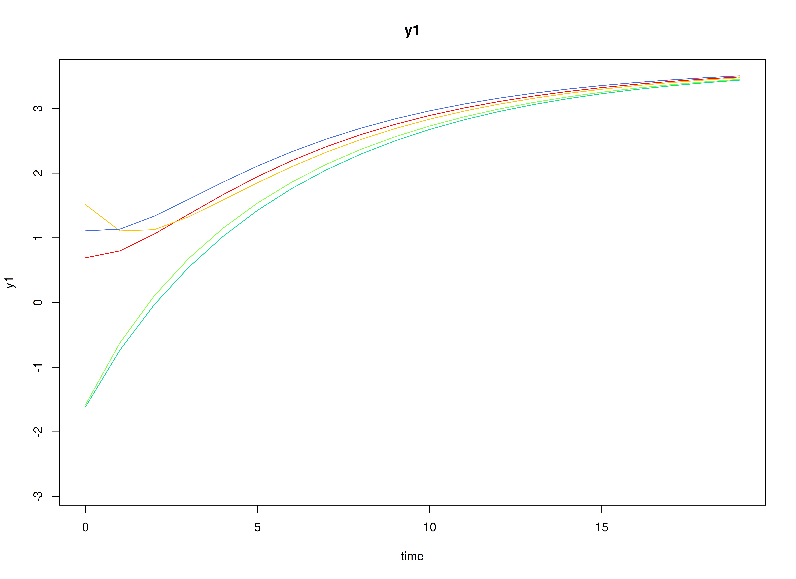
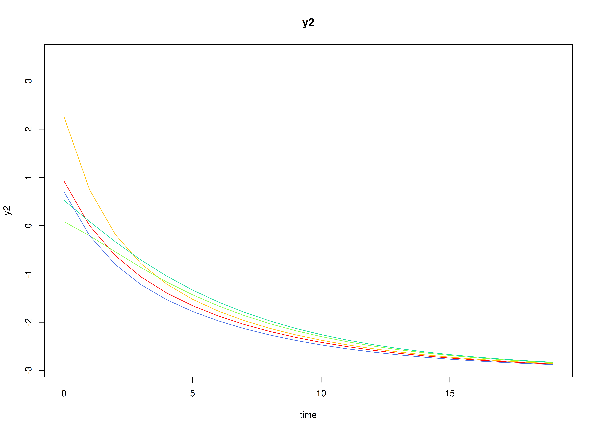
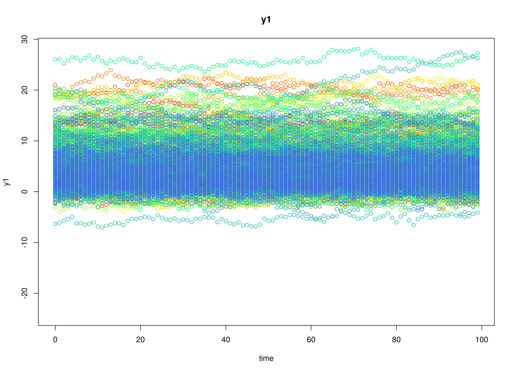
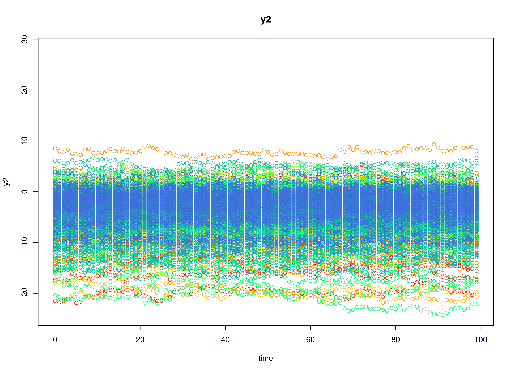

# Fit the Discrete-Time Vector Autoregressive Model By ID (Stable Reciprocal Regulation)

## Dynamics Description

The *Stable Reciprocal Regulation* process represents a bivariate
dynamic system in which two latent psychological constructs—such as
positive and negative affect—mutually influence each other over time.
Each construct shows moderate self-regulation (autoregressive effects)
and mild opposing cross-effects, reflecting an equilibrium-seeking
mechanism characteristic of emotional balance.

Individuals vary in their self-regulatory tendencies and in the strength
of these antagonistic couplings. At the population level, the transition
matrix indicates that increases in one construct are followed by slight
decreases in the other, producing a stable, damped oscillatory pattern
around individual equilibrium points. The process noise covariance
allows for small correlated disturbances, while measurement errors are
assumed to be minimal and symmetric across indicators.

This dynamic pattern captures a psychologically plausible process of
*reciprocal inhibition*—where short-term fluctuations in one system
component (e.g., positive affect) are naturally counteracted by
adjustments in its counterpart (e.g., negative affect), leading to
emotional homeostasis over time.

## Model

The measurement model is given by
``` math
\begin{equation}
  \mathbf{y}_{i, t} = \boldsymbol{\eta}_{i, t}
\end{equation}
```
where $`\mathbf{y}_{i, t}`$ and $`\boldsymbol{\eta}_{i, t}`$ are random
variables.

The dynamic structure is given by
``` math
\begin{equation}
  \boldsymbol{\eta}_{i, t} = \boldsymbol{\alpha}_{i} + \boldsymbol{\beta}_{i} \boldsymbol{\eta}_{i, t - 1} + \boldsymbol{\zeta}_{i, t}, \quad \mathrm{with} \quad \boldsymbol{\zeta}_{i, t} \sim \mathcal{N}   \left( \mathbf{0}, \boldsymbol{\Psi} \right)
\end{equation}
```
where $`\boldsymbol{\eta}_{i, t}`$, $`\boldsymbol{\eta}_{i, t - 1}`$,
and $`\boldsymbol{\zeta}_{i, t}`$ are random variables, and
$`\boldsymbol{\beta}_{i}`$, and $`\boldsymbol{\Psi}`$ are model
parameters. Here, $`\boldsymbol{\eta}_{i, t}`$ is a vector of latent
variables at time $`t`$ and individual $`i`$,
$`\boldsymbol{\eta}_{i, t - 1}`$ represents a vector of latent variables
at time $`t - 1`$ and individual $`i`$, and
$`\boldsymbol{\zeta}_{i, t}`$ represents a vector of dynamic noise at
time $`t`$ and individual $`i`$. $`\boldsymbol{\beta}_{i}`$ is a matrix
of autoregression and cross regression coefficients for individual
$`i`$, and $`\boldsymbol{\Psi}`$ the covariance matrix of
$`\boldsymbol{\zeta}_{i, t}`$ that is invariant across all individuals.
In this model, $`\boldsymbol{\Psi}`$ is a symmetric matrix.

### Alternative Parameterization

An alternative parameterization of the dynamic structure that directly
estimates the set-point vector $`\boldsymbol{\mu}_{i}`$ is given by
``` math
\begin{equation}
  \boldsymbol{\eta}_{i, t} = \boldsymbol{\mu}_{i} + \boldsymbol{\beta}_{i} \left( \boldsymbol{\eta}_{i, t - 1} - \boldsymbol{\mu}_{i} \right) + \boldsymbol{\zeta}_{i, t} .
\end{equation}
```

Algebraic manipulation of the equation results in the following
``` math
\begin{equation}
  \boldsymbol{\eta}_{i, t} = \boldsymbol{\mu}_{i} - \boldsymbol{\beta}_{i} \boldsymbol{\mu}_{i} + \boldsymbol{\beta}_{i} \boldsymbol{\eta}_{i, t - 1} + \boldsymbol{\zeta}_{i, t} ,
\end{equation}
```
where we can see that the intercept vector $`\boldsymbol{\alpha}_{i}`$
is implied by
$`\boldsymbol{\mu}_{i} - \boldsymbol{\beta}_{i} \boldsymbol{\mu}_{i}`$.

## Data Generation

### Notation

Let $`t = 100`$ be the number of time points and $`n = 1000`$ be the
number of individuals. We simulate a total of time $`= 10100`$ points
per individual, discarding the first $`10000`$ as burn-in. The analysis
uses the final $`100`$ measurement occasions.

Let the initial condition $`\boldsymbol{\eta}_{0}`$ be given by
``` math
\begin{equation}
  \boldsymbol{\eta}_{0} \sim \mathcal{N} \left( \boldsymbol{\mu}_{\boldsymbol{\eta} \mid 0}, \boldsymbol{\Sigma}_{\boldsymbol{\eta} \mid 0} \right) .
\end{equation}
```
$`\boldsymbol{\mu}_{\boldsymbol{\eta} \mid 0}`$ and
$`\boldsymbol{\Sigma}_{\boldsymbol{\eta} \mid 0}`$ are functions of
$`\boldsymbol{\alpha}`$ and $`\boldsymbol{\beta}`$.

Let the intercept vector $`\boldsymbol{\alpha}`$ be normally distributed
with the following means
``` math
\begin{equation}
  \left(
    \begin{array}{c}
      0.5 \\
      -0.5 \\
    \end{array}
  \right)
\end{equation}
```
and covariance matrix
``` math
\begin{equation}
  \left(
    \begin{array}{cc}
      0.1 & -0.05 \\
      -0.05 & 0.1 \\
    \end{array}
  \right) .
\end{equation}
```

Let the transition matrix $`\boldsymbol{\beta}`$ be normally distributed
with the following means
``` math
\begin{equation}
  \left(
    \begin{array}{cc}
      0.7 & -0.2 \\
      -0.15 & 0.65 \\
    \end{array}
  \right)
\end{equation}
```
and covariance matrix
``` math
\begin{equation}
  \left(
    \begin{array}{cccc}
      0.02 & 0.01 & 0 & 0 \\
      0.01 & 0.015 & 0 & 0 \\
      0 & 0 & 0.01 & 0.005 \\
      0 & 0 & 0.005 & 0.015 \\
    \end{array}
  \right) .
\end{equation}
```

The `SimAlphaN` and `SimBetaN` functions from the `simStateSpace`
package generate random intercept vectors and transition matrices from
the multivariate normal distribution. Note that the `SimBetaN` function
generates transition matrices that are weakly stationary with an option
to set lower and upper bounds. The person-specific set-point vector
$`\boldsymbol{\mu}_{i}`$ was derived from the generated
$`\boldsymbol{\alpha}_{i}`$ and $`\boldsymbol{\beta}_{i}`$.

Let the dynamic process noise $`\boldsymbol{\Psi}`$ be given by
``` math
\begin{equation}
  \boldsymbol{\Psi}
  =
  \left(
    \begin{array}{cc}
      0.2 & -0.05 \\
      -0.05 & 0.18 \\
    \end{array}
  \right) .
\end{equation}
```

### R Function Arguments

``` r

n
#> [1] 1000
time
#> [1] 10100
burnin
#> [1] 10000
# first mu0 in the list of length n
mu0[[1]]
#> [1]  4.738353 -3.747395
# first sigma0 in the list of length n
sigma0[[1]]
#>            [,1]       [,2]
#> [1,]  1.2855139 -0.9267996
#> [2,] -0.9267996  0.9282909
# first sigma0_l in the list of length n
sigma0_l[[1]] # sigma0_l <- t(chol(sigma0))
#>            [,1]      [,2]
#> [1,]  1.1338050 0.0000000
#> [2,] -0.8174241 0.5100085
# first alpha in the list of length n
alpha[[1]]
#> [1]  0.3319244 -0.1910529
# first beta in the list of length n
beta[[1]]
#>            [,1]       [,2]
#> [1,]  0.6764614 -0.3205201
#> [2,] -0.2392088  0.6465522
# first psi in the list of length n
psi[[1]]
#>       [,1]  [,2]
#> [1,]  0.20 -0.05
#> [2,] -0.05  0.18
psi_l[[1]] # psi_l <- t(chol(psi))
#>            [,1]      [,2]
#> [1,]  0.4472136 0.0000000
#> [2,] -0.1118034 0.4092676
# first mu (set-point) in the list of length n
mu[[1]]
#> [1]  4.738353 -3.747395
```

### Visualizing the Dynamics Without Process Noise and Measurement Error (n = 5 with Different Initial Condition)



### Using the `SimSSMVARIVary` Function from the `simStateSpace` Package to Simulate Data

``` r

library(simStateSpace)
sim <- SimSSMVARIVary(
  n = n,
  time = time,
  mu0 = mu0,
  sigma0_l = sigma0_l,
  alpha = alpha,
  beta = beta,
  psi_l = psi_l
)
data <- as.data.frame(sim, burnin = burnin)
head(data)
#>   id time       y1        y2
#> 1  1    0 4.609402 -3.907561
#> 2  1    1 4.633004 -3.033394
#> 3  1    2 3.906321 -3.979011
#> 4  1    3 4.528033 -4.413606
#> 5  1    4 4.431835 -5.028547
#> 6  1    5 4.879983 -4.500720
plot(sim, burnin = burnin)
```



## Model Fitting

``` r

library(OpenMx)
library(fitVARMxID)
```

The `FitVARMxID` function fits a VAR model on each individual $`i`$.

### LDL’-parameterized covariance matrices

Covariances such as `psi` and `theta` are estimated using the LDL’
decomposition of a positive definite covariance matrix. The
decomposition expresses a covariance matrix $`\Sigma`$ as\
``` math
\begin{equation}
  \boldsymbol{\Sigma} = \left( \mathbf{L} + \mathbf{I} \right) \mathrm{diag} \left( \mathrm{Softplus} \left( \mathbf{d}_{uc} \right) \right) \left( \mathbf{L} + \mathbf{I} \right)^{\prime},
\end{equation}
```
where: - $`\mathbf{L}`$ is a strictly lower-triangular matrix of free
parameters (`l_mat_strict`),\
- $`\mathbf{I}`$ is the identity matrix,\
- $`\mathbf{d}_{uc}`$ is an unconstrained vector,\
-
$`\mathrm{Softplus} \left(\mathbf{d}_{uc} \right) = \log \left(1 + \exp \left( \mathbf{d}_{uc} \right) \right)`$
ensures strictly positive diagonal entries.

The
[`LDL()`](https://github.com/jeksterslab/fitVARMxID/reference/LDL.html)
function extracts this decomposition from a positive definite covariance
matrix. It returns:\
- `d_uc`: unconstrained diagonal parameters, equal to
`InvSoftplus(d_vec)`,\
- `d_vec`: diagonal entries, equal to `Softplus(d_uc)`,\
- `l_mat_strict`: the strictly lower-triangular factor.

``` r

sigma <- matrix(
  data = c(1.0, 0.5, 0.5, 1.0),
  nrow = 2,
  ncol = 2
)
ldl_sigma <- LDL(sigma)
d_uc <- ldl_sigma$d_uc
l_mat_strict <- ldl_sigma$l_mat_strict
I <- diag(2)
sigma_reconstructed <- (l_mat_strict + I) %*% diag(log1p(exp(d_uc)), 2) %*% t(l_mat_strict + I)
sigma_reconstructed
#>      [,1] [,2]
#> [1,]  1.0  0.5
#> [2,]  0.5  1.0
```

### `FitVARMxID`

``` r

fit <- FitVARMxID(
  data = data,
  observed = c("y1", "y2"),
  id = "id",
  center = TRUE,
  tries_explore = 1000,
  tries_local = 100,
  max_attempts = 100,
  ncores = parallel::detectCores()
)
```

#### Parameter estimates

``` r

head(summary(fit))
#>                           mu[1,1]    mu[2,1] beta[1,1]   beta[2,1]   beta[1,2]
#> FitVARMxID_VAR_ID1.Rds  4.2089727 -3.3101197 0.2578232 -0.07833518 -0.58961004
#> FitVARMxID_VAR_ID2.Rds  4.4208807 -2.3943091 0.4181778  0.12065137 -0.24188395
#> FitVARMxID_VAR_ID3.Rds  3.9910378 -4.7857023 0.6534174 -0.06435113 -0.15179169
#> FitVARMxID_VAR_ID4.Rds  3.6660041 -3.0265288 0.6470127 -0.21224404 -0.09823735
#> FitVARMxID_VAR_ID8.Rds  0.2981166  0.9421057 0.8532121 -0.28833537 -0.04830850
#> FitVARMxID_VAR_ID11.Rds 1.7121280 -2.7530332 0.5120339 -0.34736601 -0.14381942
#>                         beta[2,2]  psi[1,1]    psi[2,1]  psi[2,2]
#> FitVARMxID_VAR_ID1.Rds  0.7314552 0.1746551 -0.04372184 0.1979491
#> FitVARMxID_VAR_ID2.Rds  0.8826591 0.1902374 -0.05670213 0.1965294
#> FitVARMxID_VAR_ID3.Rds  0.7794164 0.2446862 -0.07903763 0.2110977
#> FitVARMxID_VAR_ID4.Rds  0.6596575 0.1874448 -0.02705390 0.1930045
#> FitVARMxID_VAR_ID8.Rds  0.4714996 0.1872173 -0.05089210 0.1705960
#> FitVARMxID_VAR_ID11.Rds 0.6690046 0.1741686 -0.02258676 0.1263148
```

#### Proportion of converged cases

``` r

converged(
  fit,
  prop = TRUE
)
#> [1] 0.407
```

## Random-Effects Meta-Analysis of Person-Specific Dynamics and Means

We synthesize the person-specific estimates to recover population-level
effects and their between-person variability. We use a random-effects
model so the pooled mean reflects both within-person estimation
uncertainty and between-person heterogeneity.

``` r

library(metaDyn)
random <- MetaVARMx(
  fit,
  effects = TRUE,
  set_point = TRUE,
  robust_v = FALSE,
  robust = TRUE,
  lb = TRUE,
  ncores = parallel::detectCores()
)
#> Error in `[.data.frame`:
#> ! undefined columns selected
```

``` r

summary(random)
#> Error:
#> ! object 'random' not found
```

### Normal Theory Confidence Intervals

``` r

confint(random, level = 0.95, lb = FALSE)
#> Error:
#> ! object 'random' not found
```

``` r

confint(random, level = 0.99, lb = FALSE)
#> Error:
#> ! object 'random' not found
```

### Robust Confidence Intervals

``` r

confint(random, level = 0.95, lb = FALSE, robust = TRUE)
#> Error:
#> ! object 'random' not found
```

``` r

confint(random, level = 0.99, lb = FALSE, robust = TRUE)
#> Error:
#> ! object 'random' not found
```

### Profile-Likelihood Confidence Intervals

``` r

confint(random, level = 0.95, lb = TRUE)
#> Error:
#> ! object 'random' not found
```

``` r

confint(random, level = 0.99, lb = TRUE)
#> Error:
#> ! object 'random' not found
```

- The fixed part of the random-effects model gives pooled means
  $`\boldsymbol{\alpha} = \mathbb{E} \left[ \mathrm{Vec} \left( \boldsymbol{\mu}, \boldsymbol{\beta} \right)  \right]`$.
- The random part yields between-person covariances
  ($`\boldsymbol{\tau}^{2}`$) quantifying heterogeneity in set-point
  ($`\boldsymbol{\mu}`$) and dynamics ($`\boldsymbol{\beta}`$) across
  individuals.

``` r

means <- extract(random, what = "alpha")
#> Error:
#> ! object 'random' not found
means
#> Error:
#> ! object 'means' not found
covariances <- extract(random, what = "tau_sqr")
#> Error:
#> ! object 'random' not found
covariances
#> Error:
#> ! object 'covariances' not found
```

Finally, we compare the meta-analytic population estimates to the known
generating values.

``` r

pop_mean
#> [1]  4.0081017 -3.1135633  0.6810916 -0.1432002 -0.1942151  0.6367261
pop_cov
#>              [,1]        [,2]          [,3]          [,4]          [,5]
#> [1,] 12.856796905 -5.20249779  0.1964662666  0.0516164907 -0.0883602653
#> [2,] -5.202497788  8.66651926  0.0478426598  0.1419400213 -0.0212600947
#> [3,]  0.196466267  0.04784266  0.0164861144  0.0097360959  0.0002797943
#> [4,]  0.051616491  0.14194002  0.0097360959  0.0144313848 -0.0006153941
#> [5,] -0.088360265 -0.02126009  0.0002797943 -0.0006153941  0.0101332601
#> [6,]  0.003494568 -0.11120175 -0.0001206516  0.0006746266  0.0054812485
#>               [,6]
#> [1,]  0.0034945683
#> [2,] -0.1112017466
#> [3,] -0.0001206516
#> [4,]  0.0006746266
#> [5,]  0.0054812485
#> [6,]  0.0133300763
```

## Summary

This vignette demonstrates a two-stage hierarchical estimation approach
for dynamic systems: 1. individual-level DT-VAR estimation, and\
2. population-level meta-analysis of person-specific dynamics and means.

## References

Hunter, M. D. (2017). State space modeling in an open source, modular,
structural equation modeling environment. *Structural Equation Modeling:
A Multidisciplinary Journal*, *25*(2), 307–324.
<https://doi.org/10.1080/10705511.2017.1369354>

Neale, M. C., Hunter, M. D., Pritikin, J. N., Zahery, M., Brick, T. R.,
Kirkpatrick, R. M., Estabrook, R., Bates, T. C., Maes, H. H., & Boker,
S. M. (2015). OpenMx 2.0: Extended structural equation and statistical
modeling. *Psychometrika*, *81*(2), 535–549.
<https://doi.org/10.1007/s11336-014-9435-8>

R Core Team. (2024). *R: A language and environment for statistical
computing*. R Foundation for Statistical Computing.
<https://www.R-project.org/>
