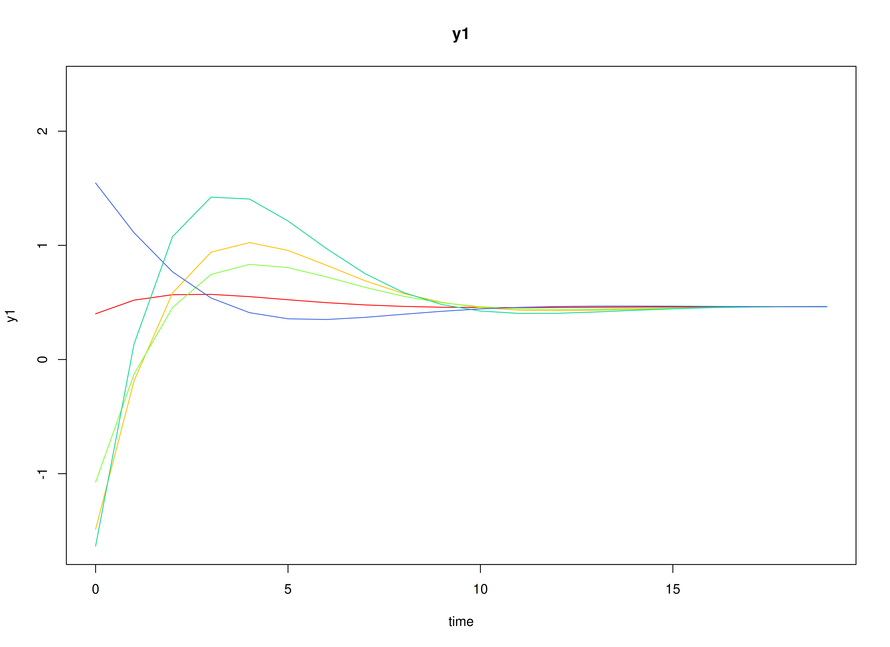
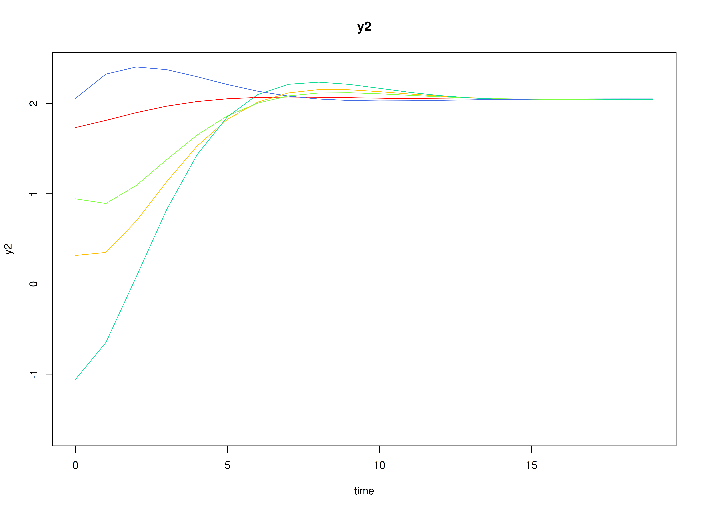
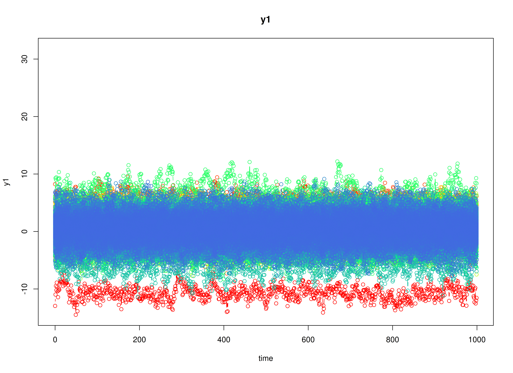
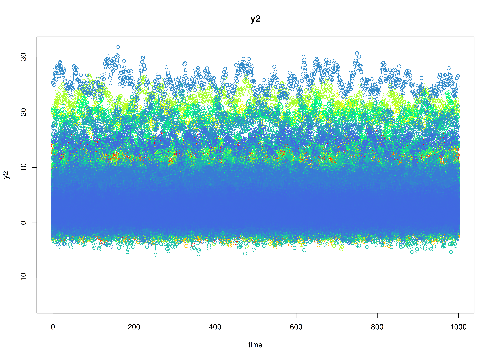

## Dynamics Description

The *Adaptive Recovery* process reflects an asymmetric regulatory dynamic between two latent constructs---such as stress and coping---where activation in one system initiates a corrective response in the other. Specifically, stress tends to increase coping responses, while coping reduces subsequent stress, producing a negative feedback loop that promotes stability and recovery.

Individuals differ in the strength and balance of these cross-regulatory influences, leading to variability in how quickly they return to equilibrium after disturbances. The process noise covariance is moderate and negatively correlated, representing compensatory fluctuations where increases in stress are often accompanied by decreases in coping, while measurement error variance is small and symmetric across variables.

This configuration captures a psychologically meaningful *stress-response* mechanism, characterized by self-correcting dynamics that stabilize the system over time through coordinated but asymmetric influences.

## Model

The measurement model is given by
\begin{equation}
  \mathbf{y}_{i, t} = \boldsymbol{\Lambda} \boldsymbol{\eta}_{i, t} + \boldsymbol{\varepsilon}_{i, t}, \quad \mathrm{with} \quad \boldsymbol{\varepsilon}_{i, t} \sim \mathcal{N} \left( \mathbf{0}, \boldsymbol{\Theta} \right)
\end{equation}
where $\mathbf{y}_{i, t}$, $\boldsymbol{\eta}_{i, t}$, and $\boldsymbol{\varepsilon}_{i, t}$ are random variables and $\boldsymbol{\Lambda}$, and $\boldsymbol{\Theta}$ are model parameters. $\mathbf{y}_{i, t}$ represents a vector of observed random variables, $\boldsymbol{\eta}_{i, t}$ a vector of latent random variables, and $\boldsymbol{\varepsilon}_{i, t}$ a vector of random measurement errors, at time $t$ and individual $i$. $\boldsymbol{\Lambda}$ denotes a matrix of factor loadings, and $\boldsymbol{\Theta}$ the covariance matrix of $\boldsymbol{\varepsilon}$ that is invariant across individuals. In this model, $\boldsymbol{\Lambda}$ is an identity matrix and $\boldsymbol{\Theta}$ is a symmetric matrix.

The dynamic structure is given by
\begin{equation}
  \boldsymbol{\eta}_{i, t} = \boldsymbol{\alpha}_{i} + \boldsymbol{\beta}_{i} \boldsymbol{\eta}_{i, t - 1} + \boldsymbol{\zeta}_{i, t}, \quad \mathrm{with} \quad \boldsymbol{\zeta}_{i, t} \sim \mathcal{N}   \left( \mathbf{0}, \boldsymbol{\Psi} \right)
\end{equation}
where $\boldsymbol{\eta}_{i, t}$, $\boldsymbol{\eta}_{i, t - 1}$, and $\boldsymbol{\zeta}_{i, t}$ are random variables, and $\boldsymbol{\beta}_{i}$, and $\boldsymbol{\Psi}$ are model parameters. Here, $\boldsymbol{\eta}_{i, t}$ is a vector of latent variables at time $t$ and individual $i$, $\boldsymbol{\eta}_{i, t - 1}$ represents a vector of latent variables at time $t - 1$ and individual $i$, and $\boldsymbol{\zeta}_{i, t}$ represents a vector of dynamic noise at time $t$ and individual $i$. $\boldsymbol{\beta}_{i}$ is a matrix of autoregression and cross regression coefficients for individual $i$, and $\boldsymbol{\Psi}$ the covariance matrix of $\boldsymbol{\zeta}_{i, t}$ that is invariant across all individuals. In this model, $\boldsymbol{\Psi}$ is a symmetric matrix.

### Alternative Parameterization

An alternative parameterization of the dynamic structure that directly estimates the set-point vector $\boldsymbol{\mu}_{i}$ is given by
\begin{equation}
  \boldsymbol{\eta}_{i, t} = \boldsymbol{\mu}_{i} + \boldsymbol{\beta}_{i} \left( \boldsymbol{\eta}_{i, t - 1} - \boldsymbol{\mu}_{i} \right) + \boldsymbol{\zeta}_{i, t} .
\end{equation}

Algebraic manipulation of the equation results in the following
\begin{equation}
  \boldsymbol{\eta}_{i, t} = \boldsymbol{\mu}_{i} - \boldsymbol{\beta}_{i} \boldsymbol{\mu}_{i} + \boldsymbol{\beta}_{i} \boldsymbol{\eta}_{i, t - 1} + \boldsymbol{\zeta}_{i, t} ,
\end{equation}
where we can see that the intercept vector $\boldsymbol{\alpha}_{i}$ is implied by $\boldsymbol{\mu}_{i} - \boldsymbol{\beta}_{i} \boldsymbol{\mu}_{i}$.

## Data Generation

### Notation

Let $t = 1000$ be the number of time points and $n = 1000$ be the number of individuals. We simulate a total of time $= 11000$ points per individual, discarding the first $10000$ as burn-in. The analysis uses the final $1000$ measurement occasions.

Let the factor loadings matrix $\boldsymbol{\Lambda}$ be given by
\begin{equation}
  \boldsymbol{\Lambda}
  =
  \left(
    \begin{array}{cc}
      1 & 0 \\
      0 & 1 \\
    \end{array}
  \right) .
\end{equation}

Let the measurement error covariance matrix $\boldsymbol{\Theta}$ be given by
\begin{equation}
  \boldsymbol{\Theta}
  =
  \left(
  \begin{array}{cc}
    0.5 & 0 \\
    0 & 0.5 \\
  \end{array}
  \right) .
\end{equation}

Let the initial condition $\boldsymbol{\eta}_{0}$ be given by
\begin{equation}
  \boldsymbol{\eta}_{0} \sim \mathcal{N} \left( \boldsymbol{\mu}_{\boldsymbol{\eta} \mid 0}, \boldsymbol{\Sigma}_{\boldsymbol{\eta} \mid 0} \right) .
\end{equation}
$\boldsymbol{\mu}_{\boldsymbol{\eta} \mid 0}$ and $\boldsymbol{\Sigma}_{\boldsymbol{\eta} \mid 0}$ are functions of $\boldsymbol{\alpha}$ and $\boldsymbol{\beta}$.

Let the intercept vector $\boldsymbol{\alpha}$ be normally distributed with the following means
\begin{equation}
  \left(
    \begin{array}{c}
      0.8 \\
      0.5 \\
    \end{array}
  \right)
\end{equation}
and covariance matrix
\begin{equation}
  \left(
    \begin{array}{cc}
      0.15 & 0.05 \\
      0.05 & 0.1 \\
    \end{array}
  \right) .
\end{equation}

Let the transition matrix $\boldsymbol{\beta}$ be normally distributed with the following means
\begin{equation}
  \left(
    \begin{array}{cc}
      0.6 & -0.3 \\
      0.25 & 0.7 \\
    \end{array}
  \right)
\end{equation}
and covariance matrix
\begin{equation}
  \left(
    \begin{array}{cccc}
      0.025 & 0.01 & 0 & 0 \\
      0.01 & 0.02 & 0 & 0 \\
      0 & 0 & 0.02 & 0.01 \\
      0 & 0 & 0.01 & 0.025 \\
    \end{array}
  \right) .
\end{equation}

The `SimAlphaN` and `SimBetaN` functions from the `simStateSpace` package generate random intercept vectors and transition matrices from the multivariate normal distribution. Note that the `SimBetaN` function generates transition matrices that are weakly stationary with an option to set lower and upper bounds. The person-specific set-point vector $\boldsymbol{\mu}_{i}$ was derived from the generated $\boldsymbol{\alpha}_{i}$ and $\boldsymbol{\beta}_{i}$.

Let the dynamic process noise $\boldsymbol{\Psi}$ be given by
\begin{equation}
  \boldsymbol{\Psi}
  =
  \left(
    \begin{array}{cc}
      0.25 & -0.1 \\
      -0.1 & 0.22 \\
    \end{array}
  \right) .
\end{equation}


### R Function Arguments


``` r
n
#> [1] 1000
time
#> [1] 11000
burnin
#> [1] 10000
# first mu0 in the list of length n
mu0[[1]]
#> [1] -0.6409103  1.8437611
# first sigma0 in the list of length n
sigma0[[1]]
#>            [,1]       [,2]
#> [1,]  0.6803744 -0.2369735
#> [2,] -0.2369735  0.3548975
# first sigma0_l in the list of length n
sigma0_l[[1]] # sigma0_l <- t(chol(sigma0))
#>            [,1]      [,2]
#> [1,]  0.8248481 0.0000000
#> [2,] -0.2872935 0.5218811
# first alpha in the list of length n
alpha[[1]]
#> [1] 0.5941503 0.6684587
# first beta in the list of length n
beta[[1]]
#>           [,1]       [,2]
#> [1,] 0.5736830 -0.4704412
#> [2,] 0.1415191  0.6866418
# first psi in the list of length n
psi[[1]]
#>       [,1]  [,2]
#> [1,]  0.25 -0.10
#> [2,] -0.10  0.22
psi_l[[1]] # psi_l <- t(chol(psi))
#>      [,1]      [,2]
#> [1,]  0.5 0.0000000
#> [2,] -0.2 0.4242641
nu
#> [[1]]
#> [1] 0 0
lambda
#> [[1]]
#>      [,1] [,2]
#> [1,]    1    0
#> [2,]    0    1
theta
#> [[1]]
#>      [,1] [,2]
#> [1,]  0.5  0.0
#> [2,]  0.0  0.5
theta_l # theta_l <- t(chol(theta))
#> [[1]]
#>           [,1]      [,2]
#> [1,] 0.7071068 0.0000000
#> [2,] 0.0000000 0.7071068
# first mu_eta (set-point) in the list of length n
mu_eta[[1]]
#> [1] -0.6409103  1.8437611
```

### Visualizing the Dynamics Without Process Noise and Measurement Error (n = 5 with Different Initial Condition)



### Using the `SimSSMIVary` Function from the `simStateSpace` Package to Simulate Data


``` r
library(simStateSpace)
sim <- SimSSMIVary(
  n = n,
  time = time,
  mu0 = mu0,
  sigma0_l = sigma0_l,
  alpha = alpha,
  beta = beta,
  psi_l = psi_l,
  nu = nu,
  lambda = lambda,
  theta_l = theta_l
)
data <- as.data.frame(sim, burnin = burnin)
head(data)
#>   id time         y1        y2
#> 1  1    0 -1.3784256 3.4783987
#> 2  1    1 -1.7787675 2.2002487
#> 3  1    2  0.1032886 1.2379348
#> 4  1    3 -0.2237299 0.8511623
#> 5  1    4 -1.1157617 2.0194513
#> 6  1    5 -0.1886396 1.5396721
plot(sim, burnin = burnin)
```



## Model Fitting


``` r
library(OpenMx)
library(fitDTVARMxID)
```

The `FitDTVARMxID` function fits a DT-VAR model on each individual $i$. To set up the estimation, we first provide **starting values** for each parameter matrix.

### Set-Point (`mu_eta`)

The set-point vector $\boldsymbol{\mu}$ is initialized with starting values.


``` r
mu_eta_values <- mu_eta
```

### Autoregressive Parameters (`beta`)

We initialize the autoregressive coefficient matrix $\boldsymbol{\beta}$ with the true values used in simulation.


``` r
beta_values <- beta
```

### LDL'-parameterized covariance matrices

Covariances such as `psi` and `theta` are estimated using the LDL' decomposition of a positive definite covariance matrix. The decomposition expresses a covariance matrix $\Sigma$ as  
\begin{equation}
  \boldsymbol{\Sigma} = \left( \mathbf{L} + \mathbf{I} \right) \mathrm{diag} \left( \mathrm{Softplus} \left( \mathbf{d}_{uc} \right) \right) \left( \mathbf{L} + \mathbf{I} \right)^{\prime},
\end{equation}
where:
- $\mathbf{L}$ is a strictly lower-triangular matrix of free parameters (`l_mat_strict`),  
- $\mathbf{I}$ is the identity matrix,  
- $\mathbf{d}_{uc}$ is an unconstrained vector,  
- $\mathrm{Softplus} \left(\mathbf{d}_{uc} \right) = \log \left(1 + \exp \left( \mathbf{d}_{uc} \right) \right)$ ensures strictly positive diagonal entries.  

The `LDL()` function extracts this decomposition from a positive definite covariance matrix. It returns:  
- `d_uc`: unconstrained diagonal parameters, equal to `InvSoftplus(d_vec)`,  
- `d_vec`: diagonal entries, equal to `Softplus(d_uc)`,  
- `l_mat_strict`: the strictly lower-triangular factor.  


``` r
sigma <- matrix(
  data = c(1.0, 0.5, 0.5, 1.0),
  nrow = 2,
  ncol = 2
)
ldl_sigma <- LDL(sigma)
d_uc <- ldl_sigma$d_uc
l_mat_strict <- ldl_sigma$l_mat_strict
I <- diag(2)
sigma_reconstructed <- (l_mat_strict + I) %*% diag(log1p(exp(d_uc)), 2) %*% t(l_mat_strict + I)
sigma_reconstructed
#>      [,1] [,2]
#> [1,]  1.0  0.5
#> [2,]  0.5  1.0
```

#### Process Noise Covariance Matrix (`psi`)

Starting values for the process noise covariance matrix $\boldsymbol{\Psi}$ are given below, with corresponding LDL' parameters.


``` r
psi_values <- psi[[1]]
ldl_psi_values <- LDL(psi_values)
psi_d_values <- ldl_psi_values$d_uc
psi_l_values <- ldl_psi_values$l_mat_strict
```


``` r
psi_d_values
#> [1] -1.258692 -1.623449
```


``` r
psi_l_values
#>      [,1] [,2]
#> [1,]  0.0    0
#> [2,] -0.4    0
```

#### Measurement Error Covariance Matrix (`theta`)

Starting values for the measurement error covariance matrix $\boldsymbol{\Theta}$ are given below, with corresponding LDL' parameters.


``` r
theta_values <- theta[[1]]
ldl_theta_values <- LDL(theta_values)
theta_d_values <- ldl_theta_values$d_uc
theta_l_values <- ldl_theta_values$l_mat_strict
```


``` r
theta_d_values
#> [1] -0.4327521 -0.4327521
```


``` r
theta_l_values
#>      [,1] [,2]
#> [1,]    0    0
#> [2,]    0    0
```

### Initial mean vector (`mu_0`) and covariance matrix (`sigma_0`)

The initial mean vector $\boldsymbol{\mu_0}$ and covariance matrix $\boldsymbol{\Sigma_0}$ are fixed using `mu0` and `sigma0`.


``` r
mu0_values <- mu0
```


``` r
sigma0_values <- lapply(
  X = sigma0,
  FUN = LDL
)
sigma0_d_values <- lapply(
  X = sigma0_values,
  FUN = function(i) {
    i$d_uc
  }
)
sigma0_l_values <- lapply(
  X = sigma0_values,
  FUN = function(i) {
    i$l_mat_strict
  }
)
```

### `FitDTVARMxID`


``` r
fit <- FitDTVARMxID(
  data = data,
  observed = c("y1", "y2"),
  id = "id",
  center = TRUE,
  mu_eta_values = mu_eta_values,
  beta_values = beta_values,
  psi_d_values = psi_d_values,
  psi_l_values = psi_l_values,
  theta_d_values = theta_d_values,
  mu0_values = mu0_values,
  sigma0_d_values = sigma0_d_values,
  sigma0_l_values = sigma0_l_values,
  ncores = parallel::detectCores()
)
```

#### Parameter estimates


``` r
head(summary(fit))
#>                             beta_1_1   beta_2_1   beta_1_2  beta_2_2 mu_eta_1_1
#> FitDTVARMxID_DTVAR_ID1.Rds 0.4354550 0.17318034 -0.8617860 0.7654212 -0.5891073
#> FitDTVARMxID_DTVAR_ID2.Rds 0.3723701 0.60873921 -0.3355289 0.9928778  0.1821793
#> FitDTVARMxID_DTVAR_ID3.Rds 0.5090962 0.43699533 -0.1897852 0.8883645  0.3937449
#> FitDTVARMxID_DTVAR_ID4.Rds 0.6211980 0.17807858 -0.1433649 0.5820667  1.0160762
#> FitDTVARMxID_DTVAR_ID5.Rds 0.6419239 0.22464598 -0.2416318 0.7745309 -0.8752583
#> FitDTVARMxID_DTVAR_ID6.Rds 0.4912871 0.02894239 -0.2063216 0.6044975  0.9047161
#>                            mu_eta_2_1  psi_l_2_1 psi_d_1_1 psi_d_2_1
#> FitDTVARMxID_DTVAR_ID1.Rds   1.785867 -0.3603330 -1.838030 -1.802444
#> FitDTVARMxID_DTVAR_ID2.Rds   6.061074 -0.4465356 -1.254230 -2.289462
#> FitDTVARMxID_DTVAR_ID3.Rds   4.190544 -0.3889435 -1.583936 -1.441315
#> FitDTVARMxID_DTVAR_ID4.Rds   4.097153 -0.6286424 -1.208268 -1.613658
#> FitDTVARMxID_DTVAR_ID5.Rds   3.992908 -0.4504113 -1.163153 -1.758080
#> FitDTVARMxID_DTVAR_ID6.Rds   2.626440 -0.1484303 -1.025647 -1.244879
#>                            theta_d_1_1 theta_d_2_1
#> FitDTVARMxID_DTVAR_ID1.Rds  -0.4881215  -0.2447964
#> FitDTVARMxID_DTVAR_ID2.Rds  -0.3589143  -0.2971942
#> FitDTVARMxID_DTVAR_ID3.Rds  -0.3636831  -0.5559566
#> FitDTVARMxID_DTVAR_ID4.Rds  -0.2978613  -0.4055079
#> FitDTVARMxID_DTVAR_ID5.Rds  -0.4315600  -0.5602322
#> FitDTVARMxID_DTVAR_ID6.Rds  -0.7717579  -0.4389711
```

#### Proportion of converged cases


``` r
converged(
  fit,
  theta_tol = 0.01,
  prop = TRUE
)
#> [1] 0.975
```

#### Fixed-Effect Meta-Analysis of Measurement Error

When fitting DT-VAR models per person, separating process noise ($\boldsymbol{\Psi}$) from measurement error ($\boldsymbol{\Theta}$) can be unstable for some individuals. To stabilize inference, we first pool the person-level $\boldsymbol{\Theta}_{i}$ estimates from only the converged fits using a fixed-effect meta-analysis. This yields a high-precision estimate of the common measurement-error covariance that we will then hold fixed in a second pass of model fitting.

What the code does:
- Selects individuals that converged and whose $\boldsymbol{\Theta}_i$ diagonals exceed a small threshold (`theta_tol`), filtering out near-zero or ill-conditioned solutions.
- Extracts each person's LDL' diagonal parameters for $\boldsymbol{\Theta}_i$ and their sampling covariance matrices.
- Computes the inverse-variance-weighted pooled estimate (fixed effect), returning it on the same LDL' parameterization used by `FitDTVARMxID()`.


``` r
library(metaDyn)
fixed_theta <- MetaVARMx(
  fit,
  random = FALSE, # TRUE by default
  effects = FALSE, # TRUE by default
  cov_meas = TRUE, # FALSE by default
  theta_tol = 0.01,
  ncores = parallel::detectCores()
)
```




You can read `summary(fixed_theta)` as providing the pooled (fixed) measurement-error scale that is common across persons. If individual instruments truly share the same reliability structure, fixing $\boldsymbol{\Theta}$ to this pooled value improves stability and often reduces bias in the dynamic parameters.

> **Note:** Fixed-effect pooling assumes a common $\boldsymbol{\Theta}$ across individuals.


``` r
coef(fixed_theta)
#>  alpha_1_1  alpha_2_1 
#> -0.3925476 -0.4087855
summary(fixed_theta)
#> [1] 0
#> Call:
#> MetaVARMx(object = fit, random = FALSE, effects = FALSE, cov_meas = TRUE, 
#>     theta_tol = 0.01, ncores = parallel::detectCores())
#> 
#> CI type = "normal"
#>                est     se        z p    2.5%   97.5%
#> alpha[1,1] -0.3925 0.0041 -94.8609 0 -0.4007 -0.3844
#> alpha[2,1] -0.4088 0.0041 -98.5881 0 -0.4169 -0.4007
```


``` r
theta_d_values <- coef(fixed_theta)
```

#### Refit the model with fixed measurement error covariance matrix

We refit the individual models using the pooled $\boldsymbol{\Theta}$ as a fixed measurement-error covariance matrix.


``` r
fit <- FitDTVARMxID(
  data = data,
  observed = c("y1", "y2"),
  id = "id",
  center = TRUE,
  mu_eta_values = mu_eta_values,
  beta_values = beta_values,
  psi_d_values = psi_d_values,
  psi_l_values = psi_l_values,
  theta_fixed = TRUE,
  theta_d_values = theta_d_values,
  mu0_values = mu0_values,
  sigma0_d_values = sigma0_d_values,
  sigma0_l_values = sigma0_l_values,
  ncores = parallel::detectCores()
)
```

With $\boldsymbol{\Theta}$ fixed, the re-estimation focuses on the dynamic structure ($\boldsymbol{\mu}$, $\boldsymbol{\beta}$, $\boldsymbol{\Psi}$). In practice, this often increases the proportion of converged fits and yields more stable cross-lag estimates.

#### Proportion of converged cases


``` r
converged(
  fit,
  prop = TRUE
)
#> Error in `x$output`:
#> ! $ operator is invalid for atomic vectors
```

## Random-Effects Meta-Analysis of Person-Specific Dynamics and Means

Having stabilized $\boldsymbol{\Theta}$, we synthesize the person-specific estimates to recover population-level effects and their between-person variability. We use a random-effects model so the pooled mean reflects both within-person estimation uncertainty and between-person heterogeneity.


``` r
random <- MetaVARMx(
  fit,
  effects = TRUE,
  set_point = TRUE,
  robust_v = FALSE,
  robust = TRUE,
  ncores = parallel::detectCores()
)
#> Error in `x$output`:
#> ! $ operator is invalid for atomic vectors
```


``` r
summary(random)
#> Error:
#> ! object 'random' not found
```

### Normal Theory Confidence Intervals


``` r
confint(random, level = 0.95, lb = FALSE)
#> Error:
#> ! object 'random' not found
```


``` r
confint(random, level = 0.99, lb = FALSE)
#> Error:
#> ! object 'random' not found
```

### Robust Confidence Intervals


``` r
confint(random, level = 0.95, lb = FALSE, robust = TRUE)
#> Error:
#> ! object 'random' not found
```


``` r
confint(random, level = 0.99, lb = FALSE, robust = TRUE)
#> Error:
#> ! object 'random' not found
```

### Profile-Likelihood Confidence Intervals


``` r
confint(random, level = 0.95, lb = TRUE)
#> Error:
#> ! object 'random' not found
```


``` r
confint(random, level = 0.99, lb = TRUE)
#> Error:
#> ! object 'random' not found
```

- The fixed part of the random-effects model gives pooled means $\boldsymbol{\alpha} = \mathbb{E} \left[ \mathrm{Vec} \left( \boldsymbol{\mu}, \boldsymbol{\beta} \right)  \right]$.
- The random part yields between-person covariances ($\boldsymbol{\tau}^{2}$) quantifying heterogeneity in set-point ($\boldsymbol{\mu}$) and dynamics ($\boldsymbol{\beta}$) across individuals.


``` r
means <- extract(random, what = "alpha")
#> Error:
#> ! object 'random' not found
means
#> Error:
#> ! object 'means' not found
covariances <- extract(random, what = "tau_sqr")
#> Error:
#> ! object 'random' not found
covariances
#> Error:
#> ! object 'covariances' not found
```

Finally, we compare the meta-analytic population estimates to the known generating values.


``` r
pop_mean
#> [1]  0.4408869  2.6095167  0.5990229  0.2511529 -0.3048517  0.6895688
pop_cov
#>              [,1]        [,2]          [,3]         [,4]          [,5]
#> [1,]  1.406089868 -0.53172453  2.334149e-02 1.792627e-03  3.819205e-02
#> [2,] -0.531724531  7.32735340  3.345138e-02 3.769325e-02  1.504922e-01
#> [3,]  0.023341485  0.03345138  2.380050e-02 9.249947e-03 -4.466312e-05
#> [4,]  0.001792627  0.03769325  9.249947e-03 1.909528e-02  2.736111e-04
#> [5,]  0.038192047  0.15049219 -4.466312e-05 2.736111e-04  1.885667e-02
#> [6,] -0.061114643  0.19748361 -5.601484e-04 1.248519e-05  8.802218e-03
#>               [,6]
#> [1,] -6.111464e-02
#> [2,]  1.974836e-01
#> [3,] -5.601484e-04
#> [4,]  1.248519e-05
#> [5,]  8.802218e-03
#> [6,]  2.238834e-02
```

## Summary

This vignette demonstrates a two-stage hierarchical estimation approach for dynamic systems:
1. individual-level DT-VAR estimation with stabilized measurement error, and  
2. population-level meta-analysis of person-specific dynamics and means.

## References


