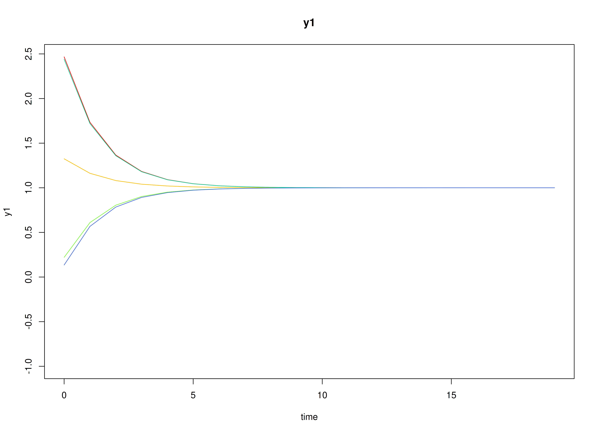
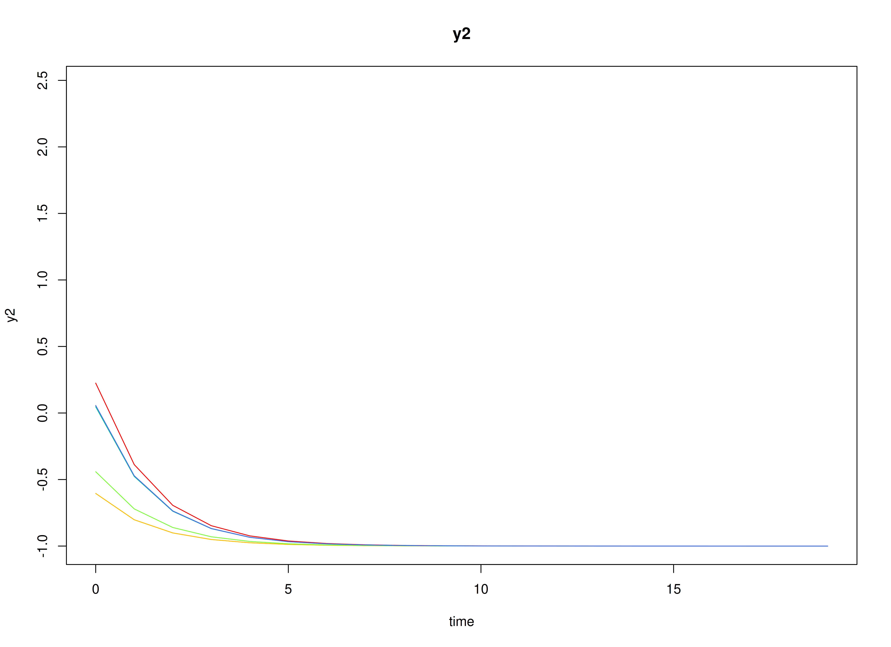
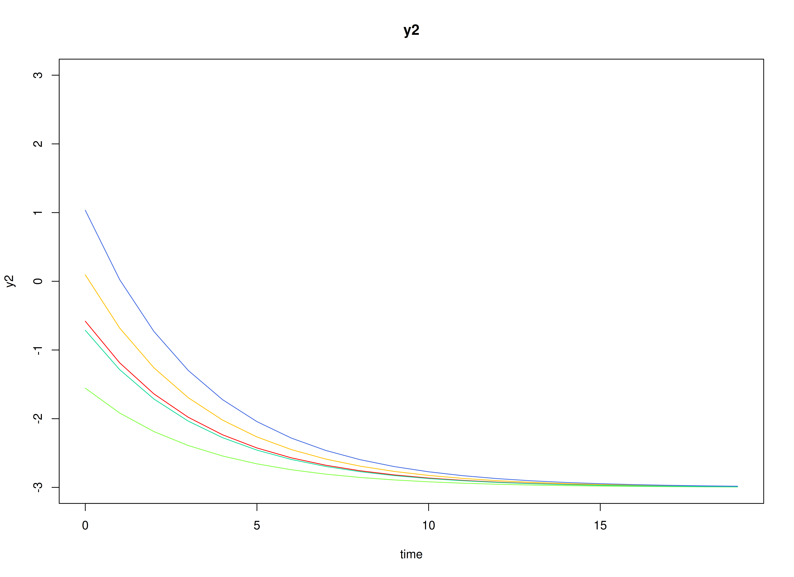

## Dynamics Description

The *Stable Persistence with Baseline-Moderated Autoregression* process represents a bivariate dynamic system in which two latent psychological constructs (e.g., positive and negative affect) exhibit within-construct persistence over time through autoregressive dynamics. The transition matrix is diagonal, implying that each construct evolves according to its own self-regulatory process and there are no cross-lagged (reciprocal) influences between the constructs in the systematic dynamics.

Between-person heterogeneity in persistence is captured via a time-invariant baseline covariate $x_i \in \left\{ 0, 1 \right\}$ with one value per individual. The individual-specific transition matrix is modeled as
\begin{equation}
  \mathrm{vec} \left( \boldsymbol{\beta}_i \right) = \mathrm{vec} \left( \boldsymbol{\beta} \left( x_i \right) \right) = \mathrm{vec} \left( \boldsymbol{\beta}_0 \right) + \mathrm{vec} \left( \boldsymbol{\beta}_1 \right) x_i,
\end{equation}
so that individuals with $x_i = 0$ follows $\boldsymbol{\beta}_0$, whereas individuals with $x_i = 1$ follow $\boldsymbol{\beta}_0 + \boldsymbol{\beta}_1$. Under the current specification, $\boldsymbol{\beta}_1$ increases the diagonal autoregressive parameters, implying that the $x_i = 1$ group exhibits greater persistence---deviations from an individual's equilibrium decay more slowly---while remaining dynamically stable.

Between-person heterogeneity in baseline levels is also captured via the same time-invariant covariate $x_i \in \left\{ 0, 1 \right\}$ through the person-specific set-point vector
\begin{equation}
  \boldsymbol{\mu}_i = \boldsymbol{\mu} \left( x_i \right) = \boldsymbol{\mu}_{0} + \boldsymbol{\mu}_{1} x_i, 
\end{equation}
so that individuals with $x_i = 0$ follow $\boldsymbol{\mu}_{0}$, whereas individuals with $x_i = 1$ follow $\boldsymbol{\mu}_{0} + \boldsymbol{\mu}_{1}$.

The process noise covariance allows for small disturbances that may be correlated across constructs, permitting coordinated innovations even though the lagged dynamics are decoupled. Measurement errors are assumed to be minimal and symmetric across indicators.

## Model

The measurement model is given by
\begin{equation}
  \mathbf{y}_{i, t} = \boldsymbol{\eta}_{i, t}
\end{equation}
where $\mathbf{y}_{i, t}$ and $\boldsymbol{\eta}_{i, t}$ are random variables.

The dynamic structure is given by
\begin{equation}
  \boldsymbol{\eta}_{i, t} = \boldsymbol{\alpha}_{i} + \boldsymbol{\beta}_{i} \boldsymbol{\eta}_{i, t - 1} + \boldsymbol{\zeta}_{i, t}, \quad \mathrm{with} \quad \boldsymbol{\zeta}_{i, t} \sim \mathcal{N}   \left( \mathbf{0}, \boldsymbol{\Psi} \right)
\end{equation}
where $\boldsymbol{\eta}_{i, t}$, $\boldsymbol{\eta}_{i, t - 1}$, and $\boldsymbol{\zeta}_{i, t}$ are random variables, and $\boldsymbol{\beta}_{i}$, and $\boldsymbol{\Psi}$ are model parameters. Here, $\boldsymbol{\eta}_{i, t}$ is a vector of latent variables at time $t$ and individual $i$, $\boldsymbol{\eta}_{i, t - 1}$ represents a vector of latent variables at time $t - 1$ and individual $i$, and $\boldsymbol{\zeta}_{i, t}$ represents a vector of dynamic noise at time $t$ and individual $i$. $\boldsymbol{\beta}_{i}$ is a matrix of autoregression and cross regression coefficients for individual $i$, and $\boldsymbol{\Psi}$ the covariance matrix of $\boldsymbol{\zeta}_{i, t}$ that is invariant across all individuals. In this model, $\boldsymbol{\Psi}$ is a symmetric matrix.

### Alternative Parameterization

An alternative parameterization of the dynamic structure that directly estimates the set-point vector $\boldsymbol{\mu}_{i}$ is given by
\begin{equation}
  \boldsymbol{\eta}_{i, t} = \boldsymbol{\mu}_{i} + \boldsymbol{\beta}_{i} \left( \boldsymbol{\eta}_{i, t - 1} - \boldsymbol{\mu}_{i} \right) + \boldsymbol{\zeta}_{i, t} .
\end{equation}

Algebraic manipulation of the equation results in the following
\begin{equation}
  \boldsymbol{\eta}_{i, t} = \boldsymbol{\mu}_{i} - \boldsymbol{\beta}_{i} \boldsymbol{\mu}_{i} + \boldsymbol{\beta}_{i} \boldsymbol{\eta}_{i, t - 1} + \boldsymbol{\zeta}_{i, t} ,
\end{equation}
where we can see that the intercept vector $\boldsymbol{\alpha}_{i}$ is implied by $\boldsymbol{\mu}_{i} - \boldsymbol{\beta}_{i} \boldsymbol{\mu}_{i}$.

## Data Generation

### Notation

Let $t = 100$ be the number of time points and $n = 1000$ be the number of individuals. We simulate a total of time $= 10100$ points per individual, discarding the first $10000$ as burn-in. The analysis uses the final $100$ measurement occasions.

Let the initial condition $\boldsymbol{\eta}_{0}$ be given by
\begin{equation}
  \boldsymbol{\eta}_{0} \sim \mathcal{N} \left( \boldsymbol{\mu}_{\boldsymbol{\eta} \mid 0}, \boldsymbol{\Sigma}_{\boldsymbol{\eta} \mid 0} \right) .
\end{equation}
$\boldsymbol{\mu}_{\boldsymbol{\eta} \mid 0}$ and $\boldsymbol{\Sigma}_{\boldsymbol{\eta} \mid 0}$ are functions of $\boldsymbol{\alpha}$ and $\boldsymbol{\beta}$.

Let the intercept vector $\boldsymbol{\alpha}$ when $X = 0$ be
\begin{equation}
  \left(
    \begin{array}{c}
      0.5 \\
      -0.5 \\
    \end{array}
  \right) .
\end{equation}
Let the intercept vector $\boldsymbol{\alpha}$ when $X = 1$ be
\begin{equation}
\left(
\begin{array}{c}
  0.75 \\
  -0.75 \\
\end{array}
\right) .
\end{equation}
Let the covariance matrix be
\begin{equation}
  \left(
    \begin{array}{cc}
      0.1 & -0.05 \\
      -0.05 & 0.1 \\
    \end{array}
  \right) .
\end{equation}

Let the transition matrix $\boldsymbol{\beta}$ when $X = 0$ be
\begin{equation}
  \left(
    \begin{array}{cc}
      0.5 & 0 \\
      0 & 0.5 \\
    \end{array}
  \right) .
\end{equation}
Let the transition matrix $\boldsymbol{\beta}$ when $X = 1$ be
\begin{equation}
\left(
\begin{array}{cc}
  0.75 & 0 \\
  0 & 0.75 \\
\end{array}
\right) .
\end{equation}
Let the covariance matrix be
and covariance matrix
\begin{equation}
  \left(
    \begin{array}{cccc}
      0.02 & 0.01 & 0 & 0 \\
      0.01 & 0.015 & 0 & 0 \\
      0 & 0 & 0.01 & 0.005 \\
      0 & 0 & 0.005 & 0.015 \\
    \end{array}
  \right) .
\end{equation}

The `SimAlphaN` and `SimBetaNCovariate` functions from the `simStateSpace` package generate random intercept vectors and transition matrices from the multivariate normal distribution. Note that the `SimBetaNCovariate` function generates transition matrices that are weakly stationary with an option to set lower and upper bounds. The person-specific set-point vector $\boldsymbol{\mu}_{i}$ was derived from the generated $\boldsymbol{\alpha}_{i}$ and $\boldsymbol{\beta}_{i}$.

Let the dynamic process noise $\boldsymbol{\Psi}$ be given by
\begin{equation}
  \boldsymbol{\Psi}
  =
  \left(
    \begin{array}{cc}
      0.2 & -0.05 \\
      -0.05 & 0.18 \\
    \end{array}
  \right) .
\end{equation}


### R Function Arguments


``` r
n
#> [1] 1000
time
#> [1] 10100
burnin
#> [1] 10000
# first mu0 in the list of length n
mu0[[1]]
#> [1]  0.7520376 -0.5127468
# first sigma0 in the list of length n
sigma0[[1]]
#>            [,1]       [,2]
#> [1,]  0.2787159 -0.1023574
#> [2,] -0.1023574  0.2538853
# first sigma0_l in the list of length n
sigma0_l[[1]] # sigma0_l <- t(chol(sigma0))
#>            [,1]      [,2]
#> [1,]  0.5279355 0.0000000
#> [2,] -0.1938823 0.4650752
# first alpha in the list of length n
alpha[[1]]
#> [1]  0.3319244 -0.1910529
# first beta in the list of length n
beta[[1]]
#>             [,1]       [,2]
#> [1,]  0.47646139 -0.1205201
#> [2,] -0.08920883  0.4965522
# first psi in the list of length n
psi[[1]]
#>       [,1]  [,2]
#> [1,]  0.20 -0.05
#> [2,] -0.05  0.18
psi_l[[1]] # psi_l <- t(chol(psi))
#>            [,1]      [,2]
#> [1,]  0.4472136 0.0000000
#> [2,] -0.1118034 0.4092676
# first mu (set-point) in the list of length n
mu[[1]]
#> [1]  0.7520376 -0.5127468
```

### Visualizing the Dynamics Without Process Noise and Measurement Error (n = 5 with Different Initial Condition)

#### $X = 0$



#### $X = 1$



### Using the `SimSSMVARFixed` Function from the `simStateSpace` Package to Simulate Data


``` r
library(simStateSpace)
sim <- SimSSMVARFixed(
  n = n,
  time = time,
  mu0 = mu0,
  sigma0_l = sigma0_l,
  alpha = alpha,
  beta = beta,
  psi_l = psi_l
)
#> Error:
#> ! Not compatible with requested type: [type=list; target=double].
data <- as.data.frame(sim, burnin = burnin)
#> Error in `.Long()`:
#> ! `burnin` should not be greater than the measurement occasions.
head(data)
#>                                                                             
#> 1 function (..., list = character(), package = NULL, lib.loc = NULL,        
#> 2     verbose = getOption("verbose"), envir = .GlobalEnv, overwrite = TRUE) 
#> 3 {                                                                         
#> 4     fileExt <- function(x) {                                              
#> 5         db <- grepl("\\\\.[^.]+\\\\.(gz|bz2|xz)$", x)                     
#> 6         ans <- sub(".*\\\\.", "", x)
plot(sim, burnin = burnin)
#> Error in `.Long()`:
#> ! `burnin` should not be greater than the measurement occasions.
```

## Model Fitting


``` r
library(OpenMx)
library(fitVARMxID)
```

The `FitVARMxID` function fits a VAR model on each individual $i$.

### LDL'-parameterized covariance matrices

Covariances such as `psi` and `theta` are estimated using the LDL' decomposition of a positive definite covariance matrix. The decomposition expresses a covariance matrix $\Sigma$ as  
\begin{equation}
  \boldsymbol{\Sigma} = \left( \mathbf{L} + \mathbf{I} \right) \mathrm{diag} \left( \mathrm{Softplus} \left( \mathbf{d}_{uc} \right) \right) \left( \mathbf{L} + \mathbf{I} \right)^{\prime},
\end{equation}
where:
- $\mathbf{L}$ is a strictly lower-triangular matrix of free parameters (`l_mat_strict`),  
- $\mathbf{I}$ is the identity matrix,  
- $\mathbf{d}_{uc}$ is an unconstrained vector,  
- $\mathrm{Softplus} \left(\mathbf{d}_{uc} \right) = \log \left(1 + \exp \left( \mathbf{d}_{uc} \right) \right)$ ensures strictly positive diagonal entries.  

The `LDL()` function extracts this decomposition from a positive definite covariance matrix. It returns:  
- `d_uc`: unconstrained diagonal parameters, equal to `InvSoftplus(d_vec)`,  
- `d_vec`: diagonal entries, equal to `Softplus(d_uc)`,  
- `l_mat_strict`: the strictly lower-triangular factor.  


``` r
sigma <- matrix(
  data = c(1.0, 0.5, 0.5, 1.0),
  nrow = 2,
  ncol = 2
)
ldl_sigma <- LDL(sigma)
d_uc <- ldl_sigma$d_uc
l_mat_strict <- ldl_sigma$l_mat_strict
I <- diag(2)
sigma_reconstructed <- (l_mat_strict + I) %*% diag(log1p(exp(d_uc)), 2) %*% t(l_mat_strict + I)
sigma_reconstructed
#>      [,1] [,2]
#> [1,]  1.0  0.5
#> [2,]  0.5  1.0
```

### `FitVARMxID`


``` r
fit <- FitVARMxID(
  data = data,
  observed = c("y1", "y2"),
  id = "id",
  center = TRUE,
  tries_explore = 1000,
  tries_local = 100,
  max_attempts = 100,
  ncores = parallel::detectCores()
)
#> Error in `data[, id]`:
#> ! object of type 'closure' is not subsettable
```

#### Parameter estimates


``` r
head(summary(fit))
#> Error:
#> ! object 'fit' not found
```

#### Proportion of converged cases


``` r
converged(
  fit,
  prop = TRUE
)
#> Error:
#> ! object 'fit' not found
```

## Mixed-Effects Meta-Analysis of Person-Specific Dynamics and Means

We synthesize the person-specific estimates to recover population-level effects, between-person variability, and systematic covariate-related differences. We fit a mixed-effects meta-analytic model in which each individual's estimate is weighted by its within-person sampling uncertainty, random effects capture residual heterogeneity across individuals, and fixed effects quantify the association between covariate $X$ and the person-specific dynamic parameters.


``` r
random <- MetaVARMx(
  fit,
  x = x,
  effects = TRUE,
  set_point = TRUE,
  robust_v = FALSE,
  robust = TRUE,
  lb = TRUE,
  ncores = parallel::detectCores()
)
#> Error:
#> ! object 'fit' not found
```


```
#> Warning in rm(fit): object 'fit' not found
```


``` r
summary(random)
#> Error:
#> ! object 'random' not found
```

### Normal Theory Confidence Intervals


``` r
confint(random, level = 0.95, lb = FALSE)
#> Error:
#> ! object 'random' not found
```


``` r
confint(random, level = 0.99, lb = FALSE)
#> Error:
#> ! object 'random' not found
```

### Robust Confidence Intervals


``` r
confint(random, level = 0.95, lb = FALSE, robust = TRUE)
#> Error:
#> ! object 'random' not found
```


``` r
confint(random, level = 0.99, lb = FALSE, robust = TRUE)
#> Error:
#> ! object 'random' not found
```

### Profile-Likelihood Confidence Intervals


``` r
confint(random, level = 0.95, lb = TRUE)
#> Error:
#> ! object 'random' not found
```


``` r
confint(random, level = 0.99, lb = TRUE)
#> Error:
#> ! object 'random' not found
```

- The fixed part of the random-effects model gives pooled means for the person-specific parameters (e.g., $\mathbb{E}[\boldsymbol{\nu}_i]$ and $\mathbb{E}[\mathrm{vec}(\boldsymbol{\beta}_i)]$) and fixed effects for how $X$ shifts these parameters.
- The random part yields between-person covariances ($\boldsymbol{\tau}^2$) quantifying residual heterogeneity in set-point and dynamics beyond what is explained by $X$.


``` r
means <- extract(random, what = "alpha")
#> Error:
#> ! object 'random' not found
means
#> Error:
#> ! object 'means' not found
covariances <- extract(random, what = "tau_sqr")
#> Error:
#> ! object 'random' not found
covariances
#> Error:
#> ! object 'covariances' not found
```

Finally, we compare the meta-analytic population estimates to the known generating values.


``` r
pop_mean
#> [1]  2.25717566 -2.11275830  0.61362799 -0.00661199 -0.00502123  0.61560881
pop_cov
#>             [,1]        [,2]         [,3]          [,4]          [,5]
#> [1,]  7.87336834  0.88804821  0.273086594  0.0638425889 -0.0915731218
#> [2,]  0.88804821  8.36786378 -0.036344806  0.1331000366 -0.0374675414
#> [3,]  0.27308659 -0.03634481  0.030143625  0.0079252730 -0.0011555838
#> [4,]  0.06384259  0.13310004  0.007925273  0.0139995106 -0.0006635365
#> [5,] -0.09157312 -0.03746754 -0.001155584 -0.0006635365  0.0097715146
#> [6,]  0.09000510 -0.23694437  0.012738301 -0.0012966040  0.0040795653
#>              [,6]
#> [1,]  0.090005095
#> [2,] -0.236944365
#> [3,]  0.012738301
#> [4,] -0.001296604
#> [5,]  0.004079565
#> [6,]  0.027041975
```

## Summary

This vignette demonstrates a two-stage hierarchical estimation approach for dynamic systems:
1. Individual-level DT-VAR estimation.
2. Population-level meta-analysis of person-specific dynamics and means.
3. Estimation and interpretation of covariate effects, where $X$ predicts systematic between-person differences in dynamics and baseline levels.

## References


