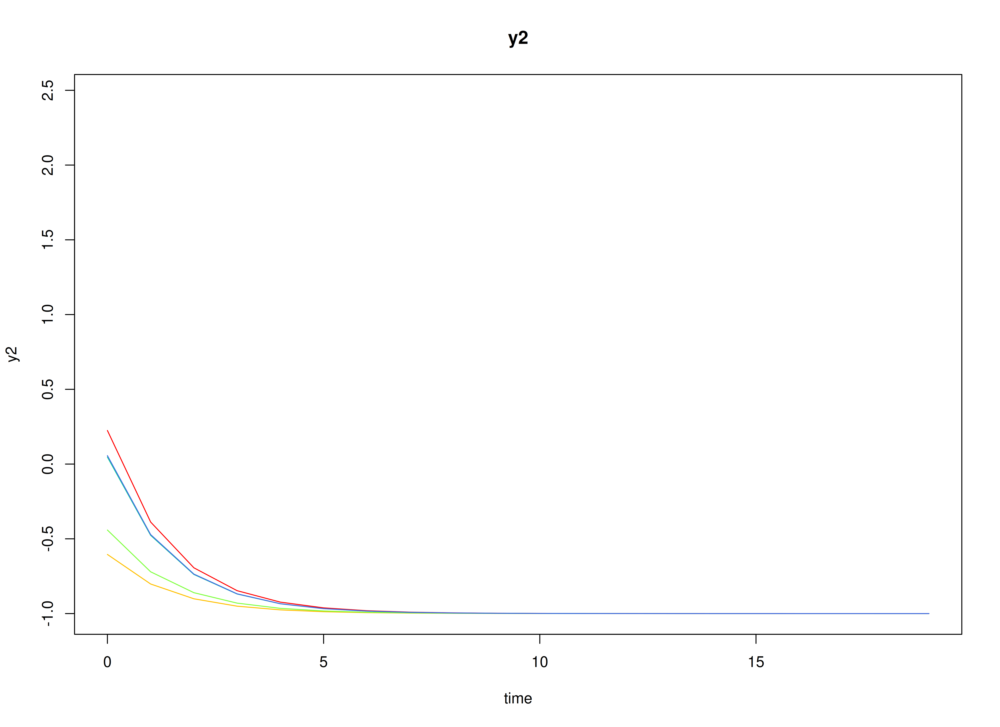
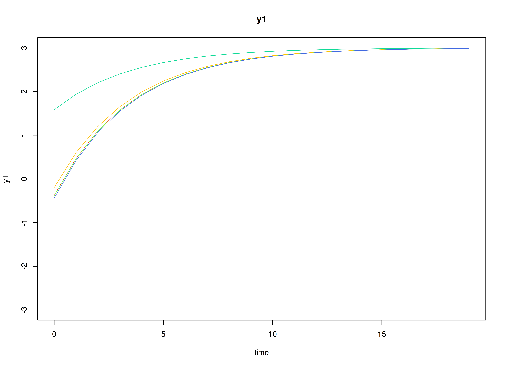

## Dynamics Description

The *Stable Persistence with Baseline-Moderated Autoregression* process represents a bivariate dynamic system in which two latent psychological constructs (e.g., positive and negative affect) exhibit within-construct persistence over time through autoregressive dynamics. The transition matrix is diagonal, implying that each construct evolves according to its own self-regulatory process and there are no cross-lagged (reciprocal) influences between the constructs in the systematic dynamics.

Between-person heterogeneity in persistence is captured via a time-invariant baseline covariate $x_i \in \left\{ 0, 1 \right\}$ with one value per individual. The individual-specific transition matrix is modeled as
\begin{equation}
  \mathrm{vec} \left( \boldsymbol{\beta}_i \right) = \mathrm{vec} \left( \boldsymbol{\beta} \left( x_i \right) \right) = \mathrm{vec} \left( \boldsymbol{\beta}_0 \right) + \mathrm{vec} \left( \boldsymbol{\beta}_1 \right) x_i,
\end{equation}
so that individuals with $x_i = 0$ follows $\boldsymbol{\beta}_0$, whereas individuals with $x_i = 1$ follow $\boldsymbol{\beta}_0 + \boldsymbol{\beta}_1$. Under the current specification, $\boldsymbol{\beta}_1$ increases the diagonal autoregressive parameters, implying that the $x_i = 1$ group exhibits greater persistence---deviations from an individual's equilibrium decay more slowly---while remaining dynamically stable.

Between-person heterogeneity in baseline levels is also captured via the same time-invariant covariate $x_i \in \left\{ 0, 1 \right\}$ through the person-specific set-point vector
\begin{equation}
  \boldsymbol{\mu}_i = \boldsymbol{\mu} \left( x_i \right) = \boldsymbol{\mu}_{0} + \boldsymbol{\mu}_{1} x_i, 
\end{equation}
so that individuals with $x_i = 0$ follow $\boldsymbol{\mu}_{0}$, whereas individuals with $x_i = 1$ follow $\boldsymbol{\mu}_{0} + \boldsymbol{\mu}_{1}$.

In addition to explaining between-person differences in the DT-VAR parameters via the baseline covariate $x_i$, we also include a distal outcome $z_i$ measured once per individual. Conceptually, $z_i$ can be interpreted as a later outcome (e.g., symptom severity, functioning, or substance use) whose between-person differences are partly explained by (a) each person's estimated set-point and dynamic parameters and (b) $x_i$.

The process noise covariance allows for small disturbances that may be correlated across constructs, permitting coordinated innovations even though the lagged dynamics are decoupled. Measurement errors are assumed to be minimal and symmetric across indicators.

## Model

The measurement model is given by
\begin{equation}
  \mathbf{y}_{i, t} = \boldsymbol{\Lambda} \boldsymbol{\eta}_{i, t} + \boldsymbol{\varepsilon}_{i, t}, \quad \mathrm{with} \quad \boldsymbol{\varepsilon}_{i, t} \sim \mathcal{N} \left( \mathbf{0}, \boldsymbol{\Theta} \right)
\end{equation}
where $\mathbf{y}_{i, t}$, $\boldsymbol{\eta}_{i, t}$, and $\boldsymbol{\varepsilon}_{i, t}$ are random variables and $\boldsymbol{\Lambda}$, and $\boldsymbol{\Theta}$ are model parameters. $\mathbf{y}_{i, t}$ represents a vector of observed random variables, $\boldsymbol{\eta}_{i, t}$ a vector of latent random variables, and $\boldsymbol{\varepsilon}_{i, t}$ a vector of random measurement errors, at time $t$ and individual $i$. $\boldsymbol{\Lambda}$ denotes a matrix of factor loadings, and $\boldsymbol{\Theta}$ the covariance matrix of $\boldsymbol{\varepsilon}$ that is invariant across individuals. In this model, $\boldsymbol{\Lambda}$ is an identity matrix and $\boldsymbol{\Theta}$ is a symmetric matrix.

The dynamic structure is given by
\begin{equation}
  \boldsymbol{\eta}_{i, t} = \boldsymbol{\alpha}_{i} + \boldsymbol{\beta}_{i} \boldsymbol{\eta}_{i, t - 1} + \boldsymbol{\zeta}_{i, t}, \quad \mathrm{with} \quad \boldsymbol{\zeta}_{i, t} \sim \mathcal{N}   \left( \mathbf{0}, \boldsymbol{\Psi} \right)
\end{equation}
where $\boldsymbol{\eta}_{i, t}$, $\boldsymbol{\eta}_{i, t - 1}$, and $\boldsymbol{\zeta}_{i, t}$ are random variables, and $\boldsymbol{\beta}_{i}$, and $\boldsymbol{\Psi}$ are model parameters. Here, $\boldsymbol{\eta}_{i, t}$ is a vector of latent variables at time $t$ and individual $i$, $\boldsymbol{\eta}_{i, t - 1}$ represents a vector of latent variables at time $t - 1$ and individual $i$, and $\boldsymbol{\zeta}_{i, t}$ represents a vector of dynamic noise at time $t$ and individual $i$. $\boldsymbol{\beta}_{i}$ is a matrix of autoregression and cross regression coefficients for individual $i$, and $\boldsymbol{\Psi}$ the covariance matrix of $\boldsymbol{\zeta}_{i, t}$ that is invariant across all individuals. In this model, $\boldsymbol{\Psi}$ is a symmetric matrix.

### Alternative Parameterization

An alternative parameterization of the dynamic structure that directly estimates the set-point vector $\boldsymbol{\mu}_{i}$ is given by
\begin{equation}
  \boldsymbol{\eta}_{i, t} = \boldsymbol{\mu}_{i} + \boldsymbol{\beta}_{i} \left( \boldsymbol{\eta}_{i, t - 1} - \boldsymbol{\mu}_{i} \right) + \boldsymbol{\zeta}_{i, t} .
\end{equation}

Algebraic manipulation of the equation results in the following
\begin{equation}
  \boldsymbol{\eta}_{i, t} = \boldsymbol{\mu}_{i} - \boldsymbol{\beta}_{i} \boldsymbol{\mu}_{i} + \boldsymbol{\beta}_{i} \boldsymbol{\eta}_{i, t - 1} + \boldsymbol{\zeta}_{i, t} ,
\end{equation}
where we can see that the intercept vector $\boldsymbol{\alpha}_{i}$ is implied by $\boldsymbol{\mu}_{i} - \boldsymbol{\beta}_{i} \boldsymbol{\mu}_{i}$.

### Distal outcome model

Let $z_i$ denote a distal outcome observed once per individual $i$. We model $z_i$ as a linear function of (a) the person-specific DT-VAR parameters and (b) the baseline covariate $x_i$:
\begin{equation}
  z_i = \kappa + \boldsymbol{\phi}^{\prime} \mathbf{w}_i + \omega x_i + \xi_i, \quad \mathrm{with} \quad \xi_i \sim \mathcal{N}(0, \psi),
\end{equation}
where $\kappa$ is an intercept, $\boldsymbol{\phi}$ is a vector of regression coefficients, $\omega$ is the direct effect of $x_i$ on $z_i$, and $\psi$ is the residual variance of the distal outcome. The predictor vector $\mathbf{w}_i$ stacks the person-specific DT-VAR coefficients and intercepts used for prediction. In this vignette we use
\begin{equation}
  \mathbf{w}_i = \left[ \mathrm{vec}(\boldsymbol{\beta}_i)^{\prime}, \; \boldsymbol{\nu}_i^{\prime} \right]^{\prime},
\end{equation}
so $\mathbf{w}_i$ has length $p^2 + p$ (here $4 + 2 = 6$).

## Data Generation

### Notation

Let $t = 1000$ be the number of time points and $n = 1000$ be the number of individuals. We simulate a total of time $= 11000$ points per individual, discarding the first $10000$ as burn-in. The analysis uses the final $1000$ measurement occasions.

Let the factor loadings matrix $\boldsymbol{\Lambda}$ be given by
\begin{equation}
  \boldsymbol{\Lambda}
  =
  \left(
    \begin{array}{cc}
      1 & 0 \\
      0 & 1 \\
    \end{array}
  \right) .
\end{equation}

Let the measurement error covariance matrix $\boldsymbol{\Theta}$ be given by
\begin{equation}
  \boldsymbol{\Theta}
  =
  \left(
  \begin{array}{cc}
    0.5 & 0 \\
    0 & 0.5 \\
  \end{array}
  \right) .
\end{equation}

Let the initial condition $\boldsymbol{\eta}_{0}$ be given by
\begin{equation}
  \boldsymbol{\eta}_{0} \sim \mathcal{N} \left( \boldsymbol{\mu}_{\boldsymbol{\eta} \mid 0}, \boldsymbol{\Sigma}_{\boldsymbol{\eta} \mid 0} \right) .
\end{equation}
$\boldsymbol{\mu}_{\boldsymbol{\eta} \mid 0}$ and $\boldsymbol{\Sigma}_{\boldsymbol{\eta} \mid 0}$ are functions of $\boldsymbol{\alpha}$ and $\boldsymbol{\beta}$.

Let the intercept vector $\boldsymbol{\alpha}$ when $X = 0$ be
\begin{equation}
  \left(
    \begin{array}{c}
      0.5 \\
      -0.5 \\
    \end{array}
  \right) .
\end{equation}
Let the intercept vector $\boldsymbol{\alpha}$ when $X = 1$ be
\begin{equation}
\left(
\begin{array}{c}
  0.75 \\
  -0.75 \\
\end{array}
\right) .
\end{equation}
Let the covariance matrix be
\begin{equation}
  \left(
    \begin{array}{cc}
      0.1 & -0.05 \\
      -0.05 & 0.1 \\
    \end{array}
  \right) .
\end{equation}

Let the transition matrix $\boldsymbol{\beta}$ when $X = 0$ be
\begin{equation}
  \left(
    \begin{array}{cc}
      0.5 & 0 \\
      0 & 0.5 \\
    \end{array}
  \right) .
\end{equation}
Let the transition matrix $\boldsymbol{\beta}$ when $X = 1$ be
\begin{equation}
\left(
\begin{array}{cc}
  0.75 & 0 \\
  0 & 0.75 \\
\end{array}
\right) .
\end{equation}
Let the covariance matrix be
and covariance matrix
\begin{equation}
  \left(
    \begin{array}{cccc}
      0.02 & 0.01 & 0 & 0 \\
      0.01 & 0.015 & 0 & 0 \\
      0 & 0 & 0.01 & 0.005 \\
      0 & 0 & 0.005 & 0.015 \\
    \end{array}
  \right) .
\end{equation}

The `SimAlphaN` and `SimBetaNCovariate` functions from the `simStateSpace` package generate random intercept vectors and transition matrices from the multivariate normal distribution. Note that the `SimBetaNCovariate` function generates transition matrices that are weakly stationary with an option to set lower and upper bounds. The person-specific set-point vector $\boldsymbol{\mu}_{i}$ was derived from the generated $\boldsymbol{\alpha}_{i}$ and $\boldsymbol{\beta}_{i}$.

Let the dynamic process noise $\boldsymbol{\Psi}$ be given by
\begin{equation}
  \boldsymbol{\Psi}
  =
  \left(
    \begin{array}{cc}
      0.2 & -0.05 \\
      -0.05 & 0.18 \\
    \end{array}
  \right) .
\end{equation}


### R Function Arguments


``` r
n
#> [1] 1000
time
#> [1] 11000
burnin
#> [1] 10000
# first mu0 in the list of length n
mu0[[1]]
#> [1]  0.7520376 -0.5127468
# first sigma0 in the list of length n
sigma0[[1]]
#>            [,1]       [,2]
#> [1,]  0.2787159 -0.1023574
#> [2,] -0.1023574  0.2538853
# first sigma0_l in the list of length n
sigma0_l[[1]] # sigma0_l <- t(chol(sigma0))
#>            [,1]      [,2]
#> [1,]  0.5279355 0.0000000
#> [2,] -0.1938823 0.4650752
# first alpha in the list of length n
alpha[[1]]
#> [1]  0.3319244 -0.1910529
# first beta in the list of length n
beta[[1]]
#>             [,1]       [,2]
#> [1,]  0.47646139 -0.1205201
#> [2,] -0.08920883  0.4965522
# first psi in the list of length n
psi[[1]]
#>       [,1]  [,2]
#> [1,]  0.20 -0.05
#> [2,] -0.05  0.18
psi_l[[1]] # psi_l <- t(chol(psi))
#>            [,1]      [,2]
#> [1,]  0.4472136 0.0000000
#> [2,] -0.1118034 0.4092676
nu
#> [[1]]
#> [1] 0 0
lambda
#> [[1]]
#>      [,1] [,2]
#> [1,]    1    0
#> [2,]    0    1
theta
#> [[1]]
#>      [,1] [,2]
#> [1,]  0.5  0.0
#> [2,]  0.0  0.5
theta_l # theta_l <- t(chol(theta))
#> [[1]]
#>           [,1]      [,2]
#> [1,] 0.7071068 0.0000000
#> [2,] 0.0000000 0.7071068
# first mu_eta (set-point) in the list of length n
mu_eta[[1]]
#> [1]  0.7520376 -0.5127468
# distal outcome parameters
kappa_z
#> [1] 10
phi_z
#>      [,1] [,2] [,3] [,4] [,5] [,6]
#> [1,]    5    5    5    5    5    5
omega_z
#> [1] 0.15
psi_z
#> [1] 0.45
```

### Visualizing the Dynamics Without Process Noise and Measurement Error (n = 5 with Different Initial Condition)

#### $X = 0$



#### $X = 1$



### Using the `SimSSMIVary` Function from the `simStateSpace` Package to Simulate Data


``` r
library(simStateSpace)
sim <- SimSSMIVary(
  n = n,
  time = time,
  mu0 = mu0,
  sigma0_l = sigma0_l,
  alpha = alpha,
  beta = beta,
  psi_l = psi_l,
  nu = nu,
  lambda = lambda,
  theta_l = theta_l
)
data <- as.data.frame(sim, burnin = burnin)
head(data)
#>   id time         y1         y2
#> 1  1    0 -0.2039857 -0.5271213
#> 2  1    1  2.3635709 -0.8225477
#> 3  1    2  1.0336287 -1.3055546
#> 4  1    3  0.3748494 -0.1758500
#> 5  1    4 -0.6424827 -1.8117723
#> 6  1    5  1.0244405 -0.1976583
plot(sim, burnin = burnin)
```


## Model Fitting


``` r
library(OpenMx)
library(fitDTVARMxID)
```

The `FitDTVARMxID` function fits a DT-VAR model on each individual $i$. To set up the estimation, we first provide **starting values** for each parameter matrix.

### Set-Point (`mu_eta`)

The set-point vector $\boldsymbol{\mu}$ is initialized with starting values.


``` r
mu_eta_values <- mu_eta
```

### Autoregressive Parameters (`beta`)

We initialize the autoregressive coefficient matrix $\boldsymbol{\beta}$ with the true values used in simulation.


``` r
beta_values <- beta
```

### LDL'-parameterized covariance matrices

Covariances such as `psi` and `theta` are estimated using the LDL' decomposition of a positive definite covariance matrix. The decomposition expresses a covariance matrix $\Sigma$ as  
\begin{equation}
  \boldsymbol{\Sigma} = \left( \mathbf{L} + \mathbf{I} \right) \mathrm{diag} \left( \mathrm{Softplus} \left( \mathbf{d}_{uc} \right) \right) \left( \mathbf{L} + \mathbf{I} \right)^{\prime},
\end{equation}
where:
- $\mathbf{L}$ is a strictly lower-triangular matrix of free parameters (`l_mat_strict`),  
- $\mathbf{I}$ is the identity matrix,  
- $\mathbf{d}_{uc}$ is an unconstrained vector,  
- $\mathrm{Softplus} \left(\mathbf{d}_{uc} \right) = \log \left(1 + \exp \left( \mathbf{d}_{uc} \right) \right)$ ensures strictly positive diagonal entries.  

The `LDL()` function extracts this decomposition from a positive definite covariance matrix. It returns:  
- `d_uc`: unconstrained diagonal parameters, equal to `InvSoftplus(d_vec)`,  
- `d_vec`: diagonal entries, equal to `Softplus(d_uc)`,  
- `l_mat_strict`: the strictly lower-triangular factor.  


``` r
sigma <- matrix(
  data = c(1.0, 0.5, 0.5, 1.0),
  nrow = 2,
  ncol = 2
)
ldl_sigma <- LDL(sigma)
d_uc <- ldl_sigma$d_uc
l_mat_strict <- ldl_sigma$l_mat_strict
I <- diag(2)
sigma_reconstructed <- (l_mat_strict + I) %*% diag(log1p(exp(d_uc)), 2) %*% t(l_mat_strict + I)
sigma_reconstructed
#>      [,1] [,2]
#> [1,]  1.0  0.5
#> [2,]  0.5  1.0
```

#### Process Noise Covariance Matrix (`psi`)

Starting values for the process noise covariance matrix $\boldsymbol{\Psi}$ are given below, with corresponding LDL' parameters.


``` r
psi_values <- psi[[1]]
ldl_psi_values <- LDL(psi_values)
psi_d_values <- ldl_psi_values$d_uc
psi_l_values <- ldl_psi_values$l_mat_strict
```


``` r
psi_d_values
#> [1] -1.507772 -1.701853
```


``` r
psi_l_values
#>       [,1] [,2]
#> [1,]  0.00    0
#> [2,] -0.25    0
```

#### Measurement Error Covariance Matrix (`theta`)

Starting values for the measurement error covariance matrix $\boldsymbol{\Theta}$ are given below, with corresponding LDL' parameters.


``` r
theta_values <- theta[[1]]
ldl_theta_values <- LDL(theta_values)
theta_d_values <- ldl_theta_values$d_uc
theta_l_values <- ldl_theta_values$l_mat_strict
```


``` r
theta_d_values
#> [1] -0.4327521 -0.4327521
```


``` r
theta_l_values
#>      [,1] [,2]
#> [1,]    0    0
#> [2,]    0    0
```

### Initial mean vector (`mu_0`) and covariance matrix (`sigma_0`)

The initial mean vector $\boldsymbol{\mu_0}$ and covariance matrix $\boldsymbol{\Sigma_0}$ are fixed using `mu0` and `sigma0`.


``` r
mu0_values <- mu0
```


``` r
sigma0_values <- lapply(
  X = sigma0,
  FUN = LDL
)
sigma0_d_values <- lapply(
  X = sigma0_values,
  FUN = function(i) {
    i$d_uc
  }
)
sigma0_l_values <- lapply(
  X = sigma0_values,
  FUN = function(i) {
    i$l_mat_strict
  }
)
```

### `FitDTVARMxID`


``` r
fit <- FitDTVARMxID(
  data = data,
  observed = c("y1", "y2"),
  id = "id",
  center = TRUE,
  mu_eta_values = mu_eta_values,
  beta_values = beta_values,
  psi_d_values = psi_d_values,
  psi_l_values = psi_l_values,
  theta_d_values = theta_d_values,
  mu0_values = mu0_values,
  sigma0_d_values = sigma0_d_values,
  sigma0_l_values = sigma0_l_values,
  ncores = parallel::detectCores()
)
```

#### Parameter estimates


``` r
head(summary(fit))
#>                             beta_1_1    beta_2_1     beta_1_2  beta_2_2
#> FitDTVARMxID_DTVAR_ID1.Rds 0.7356647 -0.03709508  0.124911294 0.6075660
#> FitDTVARMxID_DTVAR_ID2.Rds 0.3932550  0.33128856  0.070209848 0.6452306
#> FitDTVARMxID_DTVAR_ID3.Rds 0.3667931  0.17275648  0.005867861 0.6412371
#> FitDTVARMxID_DTVAR_ID4.Rds 0.4814453 -0.20665773 -0.083737394 0.1282792
#> FitDTVARMxID_DTVAR_ID5.Rds 0.3894912 -0.09250685  0.029823476 0.5788790
#> FitDTVARMxID_DTVAR_ID6.Rds 0.1466637 -0.04662990  0.044473537 0.3646829
#>                            mu_eta_1_1    mu_eta_2_1   psi_l_2_1   psi_d_1_1
#> FitDTVARMxID_DTVAR_ID1.Rds  0.7429922 -0.5422434386 -0.64137358 -2.09263860
#> FitDTVARMxID_DTVAR_ID2.Rds  2.1089697 -0.9809131058 -0.37478408 -1.74439266
#> FitDTVARMxID_DTVAR_ID3.Rds  0.9790736 -1.7645485016 -0.26088418 -1.21125563
#> FitDTVARMxID_DTVAR_ID4.Rds  1.5471235 -0.7583743612 -0.05025920 -1.63597326
#> FitDTVARMxID_DTVAR_ID5.Rds  0.8140559 -0.0001548687 -0.11296257 -0.87220954
#> FitDTVARMxID_DTVAR_ID6.Rds  0.6719574 -1.2148346783 -0.09648513  0.02601587
#>                              psi_d_2_1 theta_d_1_1 theta_d_2_1
#> FitDTVARMxID_DTVAR_ID1.Rds -2.44661974  -0.3062973  -0.2501242
#> FitDTVARMxID_DTVAR_ID2.Rds -2.01994760  -0.2184480  -0.3630670
#> FitDTVARMxID_DTVAR_ID3.Rds -1.83009313  -0.7312709  -0.5093707
#> FitDTVARMxID_DTVAR_ID4.Rds  0.08626565  -0.3614859 -14.3344963
#> FitDTVARMxID_DTVAR_ID5.Rds -1.77703664  -0.7189124  -0.6065102
#> FitDTVARMxID_DTVAR_ID6.Rds -0.80564615 -17.1757445  -0.8495140
```

#### Proportion of converged cases


``` r
converged(
  fit,
  theta_tol = 0.01,
  prop = TRUE
)
#> [1] 0.903
```

#### Fixed-Effect Meta-Analysis of Measurement Error

When fitting DT-VAR models per person, separating process noise ($\boldsymbol{\Psi}$) from measurement error ($\boldsymbol{\Theta}$) can be unstable for some individuals. To stabilize inference, we first pool the person-level $\boldsymbol{\Theta}_{i}$ estimates from only the converged fits using a fixed-effect meta-analysis. This yields a high-precision estimate of the common measurement-error covariance that we will then hold fixed in a second pass of model fitting.

What the code does:
- Selects individuals that converged and whose $\boldsymbol{\Theta}_i$ diagonals exceed a small threshold (`theta_tol`), filtering out near-zero or ill-conditioned solutions.
- Extracts each person's LDL' diagonal parameters for $\boldsymbol{\Theta}_i$ and their sampling covariance matrices.
- Computes the inverse-variance-weighted pooled estimate (fixed effect), returning it on the same LDL' parameterization used by `FitDTVARMxID()`.


``` r
library(metaDyn)
fixed_theta <- MetaVARMx(
  fit,
  random = FALSE, # TRUE by default
  effects = FALSE, # TRUE by default
  cov_meas = TRUE, # FALSE by default
  theta_tol = 0.01,
  ncores = parallel::detectCores()
)
```




You can read `summary(fixed_theta)` as providing the pooled (fixed) measurement-error scale that is common across persons. If individual instruments truly share the same reliability structure, fixing $\boldsymbol{\Theta}$ to this pooled value improves stability and often reduces bias in the dynamic parameters.

> **Note:** Fixed-effect pooling assumes a common $\boldsymbol{\Theta}$ across individuals.


``` r
coef(fixed_theta)
#>  alpha_1_1  alpha_2_1 
#> -0.3799746 -0.3850024
summary(fixed_theta)
#> [1] 0
#> Call:
#> MetaVARMx(object = fit, random = FALSE, effects = FALSE, cov_meas = TRUE, 
#>     theta_tol = 0.01, ncores = parallel::detectCores())
#> 
#> CI type = "normal"
#>               est     se        z p    2.5%   97.5%
#> alpha[1,1] -0.380 0.0045 -84.0864 0 -0.3888 -0.3711
#> alpha[2,1] -0.385 0.0043 -88.7342 0 -0.3935 -0.3765
```


``` r
theta_d_values <- coef(fixed_theta)
```

#### Refit the model with fixed measurement error covariance matrix

We refit the individual models using the pooled $\boldsymbol{\Theta}$ as a fixed measurement-error covariance matrix.


``` r
fit <- FitDTVARMxID(
  data = data,
  observed = c("y1", "y2"),
  id = "id",
  center = TRUE,
  mu_eta_values = mu_eta_values,
  beta_values = beta_values,
  psi_d_values = psi_d_values,
  psi_l_values = psi_l_values,
  theta_fixed = TRUE,
  theta_d_values = theta_d_values,
  mu0_values = mu0_values,
  sigma0_d_values = sigma0_d_values,
  sigma0_l_values = sigma0_l_values,
  ncores = parallel::detectCores()
)
```

With $\boldsymbol{\Theta}$ fixed, the re-estimation focuses on the dynamic structure ($\boldsymbol{\mu}$, $\boldsymbol{\beta}$, $\boldsymbol{\Psi}$). In practice, this often increases the proportion of converged fits and yields more stable cross-lag estimates.

#### Proportion of converged cases


``` r
converged(
  fit,
  prop = TRUE
)
#> [1] 1
```

## Mixed-Effects Meta-Analysis with Distal Outcome of Person-Specific Dynamics and Means


Having stabilized $\boldsymbol{\Theta}$, we synthesize the person-specific estimates to recover population-level effects, between-person variability, and systematic covariate-related differences. We fit a mixed-effects meta-analytic model in which each individual's estimate is weighted by its within-person sampling uncertainty, random effects capture residual heterogeneity across individuals, and fixed effects quantify the association between covariate $X$ and the person-specific dynamic parameters as well as effects on a distal outcome.


``` r
random <- MetaVARMx(
  fit,
  x = x,
  z = z,
  effects = TRUE,
  set_point = TRUE,
  robust_v = FALSE,
  robust = TRUE,
  ncores = parallel::detectCores()
)
```








``` r
summary(random)
#> [1] 0
#> Call:
#> MetaVARMx(object = fit, x = x, z = z, effects = TRUE, set_point = TRUE, 
#>     robust_v = FALSE, robust = TRUE, ncores = parallel::detectCores())
#> 
#> CI type = "normal"
#>                  est     se           z      p    2.5%   97.5%
#> alpha[1,1]    1.0304 0.1203      8.5661 0.0000  0.7947  1.2662
#> alpha[2,1]   -1.0166 0.1187     -8.5671 0.0000 -1.2492 -0.7841
#> alpha[3,1]    0.5512 0.0061     89.8970 0.0000  0.5392  0.5633
#> alpha[4,1]    0.0204 0.0059      3.4430 0.0006  0.0088  0.0321
#> alpha[5,1]    0.0208 0.0055      3.7539 0.0002  0.0099  0.0316
#> alpha[6,1]    0.5548 0.0058     95.0284 0.0000  0.5434  0.5662
#> gamma[1,1]    2.2504 0.1702     13.2254 0.0000  1.9169  2.5839
#> gamma[2,1]   -2.4506 0.1679    -14.5969 0.0000 -2.7797 -2.1216
#> gamma[3,1]    0.1982 0.0081     24.5164 0.0000  0.1824  0.2141
#> gamma[4,1]   -0.0394 0.0078     -5.0169 0.0000 -0.0547 -0.0240
#> gamma[5,1]   -0.0140 0.0071     -1.9702 0.0488 -0.0278 -0.0001
#> gamma[6,1]    0.2054 0.0075     27.2734 0.0000  0.1906  0.2202
#> kappa[1,1]    9.8547 0.1296     76.0346 0.0000  9.6006 10.1087
#> phi[1,1]      4.9958 0.0095    528.1960 0.0000  4.9773  5.0144
#> phi[1,2]      5.0136 0.0096    524.6785 0.0000  4.9949  5.0324
#> phi[1,3]      5.1450 0.1712     30.0444 0.0000  4.8093  5.4806
#> phi[1,4]      4.8677 0.1714     28.4060 0.0000  4.5318  5.2035
#> phi[1,5]      4.8221 0.1856     25.9876 0.0000  4.4584  5.1858
#> phi[1,6]      5.1816 0.1747     29.6553 0.0000  4.8391  5.5240
#> omega[1,1]    0.1571 0.0714      2.2009 0.0277  0.0172  0.2970
#> psi[1,1]      0.4670 0.0209     22.3583 0.0000  0.4261  0.5080
#> tau_sqr[1,1]  7.2471 0.3255     22.2614 0.0000  6.6091  7.8852
#> tau_sqr[2,1]  2.1395 0.2368      9.0359 0.0000  1.6754  2.6036
#> tau_sqr[3,1]  0.1274 0.0106     11.9767 0.0000  0.1066  0.1483
#> tau_sqr[4,1]  0.0747 0.0098      7.5956 0.0000  0.0554  0.0939
#> tau_sqr[5,1] -0.1148 0.0092    -12.4251 0.0000 -0.1329 -0.0967
#> tau_sqr[6,1] -0.0644 0.0094     -6.8529 0.0000 -0.0829 -0.0460
#> tau_sqr[2,2]  7.0474 0.3162     22.2897 0.0000  6.4278  7.6671
#> tau_sqr[3,2]  0.0632 0.0101      6.2641 0.0000  0.0434  0.0829
#> tau_sqr[4,2]  0.1344 0.0105     12.8141 0.0000  0.1138  0.1549
#> tau_sqr[5,2] -0.0516 0.0083     -6.2242 0.0000 -0.0679 -0.0354
#> tau_sqr[6,2] -0.1101 0.0095    -11.6039 0.0000 -0.1287 -0.0915
#> tau_sqr[3,3]  0.0123 0.0007     16.9726 0.0000  0.0109  0.0137
#> tau_sqr[4,3]  0.0061 0.0005     11.4198 0.0000  0.0051  0.0072
#> tau_sqr[5,3] -0.0016 0.0004     -3.6236 0.0003 -0.0024 -0.0007
#> tau_sqr[6,3] -0.0007 0.0005     -1.5101 0.1310 -0.0016  0.0002
#> tau_sqr[4,4]  0.0116 0.0007     16.8124 0.0000  0.0103  0.0130
#> tau_sqr[5,4] -0.0026 0.0004     -6.3546 0.0000 -0.0034 -0.0018
#> tau_sqr[6,4] -0.0017 0.0004     -3.8649 0.0001 -0.0026 -0.0009
#> tau_sqr[5,5]  0.0083 0.0005     15.6871 0.0000  0.0073  0.0093
#> tau_sqr[6,5]  0.0032 0.0004      7.7167 0.0000  0.0024  0.0040
#> tau_sqr[6,6]  0.0100 0.0006     16.1503 0.0000  0.0088  0.0112
#> i_sqr[1,1]    0.9998 0.0000  97223.5559 0.0000  0.9998  0.9998
#> i_sqr[2,1]    0.9998 0.0000 105463.0328 0.0000  0.9998  0.9998
#> i_sqr[3,1]    0.9131 0.0047    195.3185 0.0000  0.9039  0.9222
#> i_sqr[4,1]    0.9279 0.0038    241.1741 0.0000  0.9204  0.9354
#> i_sqr[5,1]    0.8770 0.0068    129.3072 0.0000  0.8637  0.8903
#> i_sqr[6,1]    0.9093 0.0050    181.2682 0.0000  0.8994  0.9191
```

### Normal Theory Confidence Intervals


``` r
confint(random, level = 0.95, lb = FALSE)
#>                     2.5 %        97.5 %
#> alpha[1,1]    0.794653461  1.266180e+00
#> alpha[2,1]   -1.249233807 -7.840622e-01
#> alpha[3,1]    0.539215888  5.632523e-01
#> alpha[4,1]    0.008798324  3.205394e-02
#> alpha[5,1]    0.009918117  3.158959e-02
#> alpha[6,1]    0.543357305  5.662429e-01
#> gamma[1,1]    1.916909586  2.583920e+00
#> gamma[2,1]   -2.779692578 -2.121586e+00
#> gamma[3,1]    0.182393535  2.140905e-01
#> gamma[4,1]   -0.054730821 -2.398060e-02
#> gamma[5,1]   -0.027845568 -7.228428e-05
#> gamma[6,1]    0.190637948  2.201593e-01
#> kappa[1,1]    9.600634345  1.010869e+01
#> phi[1,1]      4.977307339  5.014383e+00
#> phi[1,2]      4.994921207  5.032379e+00
#> phi[1,3]      4.809346101  5.480618e+00
#> phi[1,4]      4.531796314  5.203517e+00
#> phi[1,5]      4.458398341  5.185753e+00
#> phi[1,6]      4.839105476  5.524020e+00
#> omega[1,1]    0.017194402  2.969600e-01
#> psi[1,1]      0.426086101  5.079668e-01
#> tau_sqr[1,1]  6.609056306  7.885173e+00
#> tau_sqr[2,1]  1.675447161  2.603614e+00
#> tau_sqr[3,1]  0.106561936  1.482636e-01
#> tau_sqr[4,1]  0.055400485  9.393499e-02
#> tau_sqr[5,1] -0.132882306 -9.667178e-02
#> tau_sqr[6,1] -0.082871993 -4.601097e-02
#> tau_sqr[2,2]  6.427755543  7.667138e+00
#> tau_sqr[3,2]  0.043410224  8.294499e-02
#> tau_sqr[4,2]  0.113833075  1.549432e-01
#> tau_sqr[5,2] -0.067856242 -3.535541e-02
#> tau_sqr[6,2] -0.128699525 -9.150555e-02
#> tau_sqr[3,3]  0.010897632  1.374310e-02
#> tau_sqr[4,3]  0.005064895  7.163656e-03
#> tau_sqr[5,3] -0.002427322 -7.232387e-04
#> tau_sqr[6,3] -0.001612093  2.089944e-04
#> tau_sqr[4,4]  0.010253963  1.296024e-02
#> tau_sqr[5,4] -0.003406650 -1.800565e-03
#> tau_sqr[6,4] -0.002615428 -8.553284e-04
#> tau_sqr[5,5]  0.007265673  9.340461e-03
#> tau_sqr[6,5]  0.002401384  4.036557e-03
#> tau_sqr[6,6]  0.008751158  1.116856e-02
#> i_sqr[1,1]    0.999750866  9.997912e-01
#> i_sqr[2,1]    0.999770119  9.998073e-01
#> i_sqr[3,1]    0.903893892  9.222184e-01
#> i_sqr[4,1]    0.920350982  9.354325e-01
#> i_sqr[5,1]    0.863719394  8.903059e-01
#> i_sqr[6,1]    0.899439670  9.191027e-01
```


``` r
confint(random, level = 0.99, lb = FALSE)
#>                     0.5 %        99.5 %
#> alpha[1,1]    0.720571231  1.3402624980
#> alpha[2,1]   -1.322317562 -0.7109784506
#> alpha[3,1]    0.535439500  0.5670286504
#> alpha[4,1]    0.005144601  0.0357076653
#> alpha[5,1]    0.006513282  0.0349944230
#> alpha[6,1]    0.539761725  0.5698384335
#> gamma[1,1]    1.812114722  2.6887144369
#> gamma[2,1]   -2.883088644 -2.0181897489
#> gamma[3,1]    0.177413585  0.2190704212
#> gamma[4,1]   -0.059562031 -0.0191493892
#> gamma[5,1]   -0.032209067  0.0042912148
#> gamma[6,1]    0.185999804  0.2247974692
#> kappa[1,1]    9.520813513 10.1885076763
#> phi[1,1]      4.971482290  5.0202083094
#> phi[1,2]      4.989036207  5.0382637099
#> phi[1,3]      4.703881571  5.5860829782
#> phi[1,4]      4.426261380  5.3090517148
#> phi[1,5]      4.344122719  5.3000281280
#> phi[1,6]      4.731497684  5.6316272938
#> omega[1,1]   -0.026759958  0.3409143557
#> psi[1,1]      0.413221707  0.5208312237
#> tau_sqr[1,1]  6.408563796  8.0856658075
#> tau_sqr[2,1]  1.529621651  2.7494390719
#> tau_sqr[3,1]  0.100010123  0.1548154569
#> tau_sqr[4,1]  0.049346275  0.0999891984
#> tau_sqr[5,1] -0.138571392 -0.0909826932
#> tau_sqr[6,1] -0.088663280 -0.0402196778
#> tau_sqr[2,2]  6.233034460  7.8618589977
#> tau_sqr[3,2]  0.037198863  0.0891563499
#> tau_sqr[4,2]  0.107374198  0.1614021248
#> tau_sqr[5,2] -0.072962493 -0.0302491547
#> tau_sqr[6,2] -0.134543122 -0.0856619531
#> tau_sqr[3,3]  0.010450578  0.0141901505
#> tau_sqr[4,3]  0.004735156  0.0074933957
#> tau_sqr[5,3] -0.002695053 -0.0004555077
#> tau_sqr[6,3] -0.001898206  0.0004951080
#> tau_sqr[4,4]  0.009828776  0.0133854275
#> tau_sqr[5,4] -0.003658984 -0.0015482304
#> tau_sqr[6,4] -0.002891960 -0.0005787967
#> tau_sqr[5,5]  0.006939701  0.0096664334
#> tau_sqr[6,5]  0.002144479  0.0042934613
#> tau_sqr[6,6]  0.008371356  0.0115483650
#> i_sqr[1,1]    0.999744533  0.9997975088
#> i_sqr[2,1]    0.999764280  0.9998131180
#> i_sqr[3,1]    0.901014905  0.9250973791
#> i_sqr[4,1]    0.917981506  0.9378019635
#> i_sqr[5,1]    0.859542352  0.8944829411
#> i_sqr[6,1]    0.896350388  0.9221919553
```

### Robust Confidence Intervals


``` r
confint(random, level = 0.95, lb = FALSE, robust = TRUE)
#>                     2.5 %        97.5 %
#> alpha[1,1]    0.953425643  1.1074080860
#> alpha[2,1]   -1.093396425 -0.9398995874
#> alpha[3,1]    0.538442780  0.5640253702
#> alpha[4,1]    0.008413730  0.0324385360
#> alpha[5,1]    0.009662120  0.0318455849
#> alpha[6,1]    0.542474411  0.5671257467
#> gamma[1,1]    1.915960339  2.5848688196
#> gamma[2,1]   -2.780316719 -2.1209616735
#> gamma[3,1]    0.182060020  0.2144239861
#> gamma[4,1]   -0.054980835 -0.0237305850
#> gamma[5,1]   -0.028209414  0.0002915618
#> gamma[6,1]    0.190197198  0.2206000754
#> kappa[1,1]    9.611646034 10.0976751555
#> phi[1,1]      4.978260754  5.0134298452
#> phi[1,2]      4.996829230  5.0304706860
#> phi[1,3]      4.815119167  5.4748453819
#> phi[1,4]      4.531853263  5.2034598314
#> phi[1,5]      4.461931537  5.1822193100
#> phi[1,6]      4.851228838  5.5118961400
#> omega[1,1]    0.019405509  0.2947488892
#> psi[1,1]      0.426074216  0.5079787149
#> tau_sqr[1,1]  5.386158885  9.1080707184
#> tau_sqr[2,1]  0.944240352  3.3348203705
#> tau_sqr[3,1]  0.100884302  0.1539412777
#> tau_sqr[4,1]  0.053777574  0.0955578996
#> tau_sqr[5,1] -0.138085216 -0.0914688684
#> tau_sqr[6,1] -0.085067112 -0.0438158464
#> tau_sqr[2,2]  5.455383410  8.6395100476
#> tau_sqr[3,2]  0.036186450  0.0901687631
#> tau_sqr[4,2]  0.104966260  0.1638100629
#> tau_sqr[5,2] -0.070738292 -0.0324733560
#> tau_sqr[6,2] -0.130798838 -0.0894062370
#> tau_sqr[3,3]  0.010887396  0.0137533326
#> tau_sqr[4,3]  0.004985214  0.0072433374
#> tau_sqr[5,3] -0.002448367 -0.0007021936
#> tau_sqr[6,3] -0.001610069  0.0002069709
#> tau_sqr[4,4]  0.010176565  0.0130376382
#> tau_sqr[5,4] -0.003434046 -0.0017731693
#> tau_sqr[6,4] -0.002583464 -0.0008872930
#> tau_sqr[5,5]  0.007327345  0.0092787890
#> tau_sqr[6,5]  0.002324928  0.0041130128
#> tau_sqr[6,6]  0.008600421  0.0113192994
#> i_sqr[1,1]    0.999712238  0.9998298041
#> i_sqr[2,1]    0.999739003  0.9998383952
#> i_sqr[3,1]    0.903826025  0.9222862590
#> i_sqr[4,1]    0.919808364  0.9359751059
#> i_sqr[5,1]    0.864407577  0.8896177156
#> i_sqr[6,1]    0.898003554  0.9205387895
```


``` r
confint(random, level = 0.99, lb = FALSE, robust = TRUE)
#>                     0.5 %        99.5 %
#> alpha[1,1]    0.929233247  1.1316004812
#> alpha[2,1]   -1.117512526 -0.9157834863
#> alpha[3,1]    0.534423464  0.5680446864
#> alpha[4,1]    0.004639160  0.0362131066
#> alpha[5,1]    0.006176846  0.0353308598
#> alpha[6,1]    0.538601406  0.5709987521
#> gamma[1,1]    1.810867200  2.6899619585
#> gamma[2,1]   -2.883908905 -2.0173694880
#> gamma[3,1]    0.176975272  0.2195087337
#> gamma[4,1]   -0.059890606 -0.0188208148
#> gamma[5,1]   -0.032687242  0.0047693897
#> gamma[6,1]    0.185420559  0.2253767137
#> kappa[1,1]    9.535285324 10.1740358649
#> phi[1,1]      4.972735289  5.0189553099
#> phi[1,2]      4.991543775  5.0357561418
#> phi[1,3]      4.711468667  5.5784958823
#> phi[1,4]      4.426336224  5.3089768707
#> phi[1,5]      4.348766126  5.2953847208
#> phi[1,6]      4.747430482  5.6156944960
#> omega[1,1]   -0.023854072  0.3380084696
#> psi[1,1]      0.413206086  0.5208468443
#> tau_sqr[1,1]  4.801404156  9.6928254477
#> tau_sqr[2,1]  0.568653010  3.7104077122
#> tau_sqr[3,1]  0.092548447  0.1622771328
#> tau_sqr[4,1]  0.047213409  0.1021220644
#> tau_sqr[5,1] -0.145409176 -0.0841449093
#> tau_sqr[6,1] -0.091548155 -0.0373348029
#> tau_sqr[2,2]  4.955120859  9.1397725991
#> tau_sqr[3,2]  0.027705213  0.0986499992
#> tau_sqr[4,2]  0.095721229  0.1730550944
#> tau_sqr[5,2] -0.076750149 -0.0264614989
#> tau_sqr[6,2] -0.137302087 -0.0829029880
#> tau_sqr[3,3]  0.010437124  0.0142036039
#> tau_sqr[4,3]  0.004630437  0.0075981143
#> tau_sqr[5,3] -0.002722711 -0.0004278498
#> tau_sqr[6,3] -0.001895547  0.0004924486
#> tau_sqr[4,4]  0.009727058  0.0134871454
#> tau_sqr[5,4] -0.003694988 -0.0015122267
#> tau_sqr[6,4] -0.002849951 -0.0006208052
#> tau_sqr[5,5]  0.007020751  0.0095853831
#> tau_sqr[6,5]  0.002043999  0.0043939413
#> tau_sqr[6,6]  0.008173255  0.0117464661
#> i_sqr[1,1]    0.999693767  0.9998482751
#> i_sqr[2,1]    0.999723387  0.9998540109
#> i_sqr[3,1]    0.900925712  0.9251865720
#> i_sqr[4,1]    0.917268384  0.9385150851
#> i_sqr[5,1]    0.860446777  0.8935785154
#> i_sqr[6,1]    0.894463012  0.9240793317
```

### Profile-Likelihood Confidence Intervals


``` r
confint(random, level = 0.95, lb = TRUE)
#> Error in `[.data.frame`:
#> ! undefined columns selected
```


``` r
confint(random, level = 0.99, lb = TRUE)
#> Error in `[.data.frame`:
#> ! undefined columns selected
```

- The fixed part of the random-effects model gives pooled means for the person-specific parameters (e.g., $\mathbb{E}[\mathrm{vec}(\boldsymbol{\beta}_i)]$ and $\mathbb{E}[\boldsymbol{\nu}_i]$) and fixed effects for how $X$ shifts these parameters.
- The random part yields between-person covariances ($\boldsymbol{\tau}^2$) quantifying residual heterogeneity in dynamics and intercepts beyond what is explained by $X$.
- The distal-outcome sub-model yields regression effects linking the the estimated person-specific parameters (via $\boldsymbol{\phi}$) to distal outcome $z_i$, a direct effect of $X$ on $z_i$ (via $\omega$), and the residual variance $\psi$.


``` r
means <- extract(random, what = "alpha")
means
#> [1]  1.03041686 -1.01664801  0.55123408  0.02042613  0.02075385  0.55480008
covariances <- extract(random, what = "tau_sqr")
covariances
#>             [,1]        [,2]          [,3]         [,4]         [,5]
#> [1,]  7.24711480  2.13953036  0.1274127898  0.074667737 -0.114777042
#> [2,]  2.13953036  7.04744673  0.0631776064  0.134388162 -0.051605824
#> [3,]  0.12741279  0.06317761  0.0123203641  0.006114276 -0.001575280
#> [4,]  0.07466774  0.13438816  0.0061142756  0.011607102 -0.002603607
#> [5,] -0.11477704 -0.05160582 -0.0015752805 -0.002603607  0.008303067
#> [6,] -0.06444148 -0.11010254 -0.0007015493 -0.001735378  0.003218970
#>               [,6]
#> [1,] -0.0644414791
#> [2,] -0.1101025376
#> [3,] -0.0007015493
#> [4,] -0.0017353783
#> [5,]  0.0032189703
#> [6,]  0.0099598603
```

Finally, we compare the meta-analytic population estimates to the known generating values.


``` r
pop_mean
#> [1]  2.25717566 -2.11275830  0.61362799 -0.00661199 -0.00502123  0.61560881
pop_cov
#>             [,1]        [,2]         [,3]          [,4]          [,5]
#> [1,]  7.87336834  0.88804821  0.273086594  0.0638425889 -0.0915731218
#> [2,]  0.88804821  8.36786378 -0.036344806  0.1331000366 -0.0374675414
#> [3,]  0.27308659 -0.03634481  0.030143625  0.0079252730 -0.0011555838
#> [4,]  0.06384259  0.13310004  0.007925273  0.0139995106 -0.0006635365
#> [5,] -0.09157312 -0.03746754 -0.001155584 -0.0006635365  0.0097715146
#> [6,]  0.09000510 -0.23694437  0.012738301 -0.0012966040  0.0040795653
#>              [,6]
#> [1,]  0.090005095
#> [2,] -0.236944365
#> [3,]  0.012738301
#> [4,] -0.001296604
#> [5,]  0.004079565
#> [6,]  0.027041975
```

## Summary

This vignette demonstrates a two-stage hierarchical estimation approach for dynamic systems:
1. Individual-level DT-VAR estimation with stabilized measurement error.
2. Population-level meta-analysis of person-specific dynamics and means.
3. Estimation and interpretation of covariate effects, where $X$ predicts systematic between-person differences in dynamics and baseline levels.
4. A distal outcome model linking $z_i$ to person-specific dynamic/mean features and to $X$.

## References


