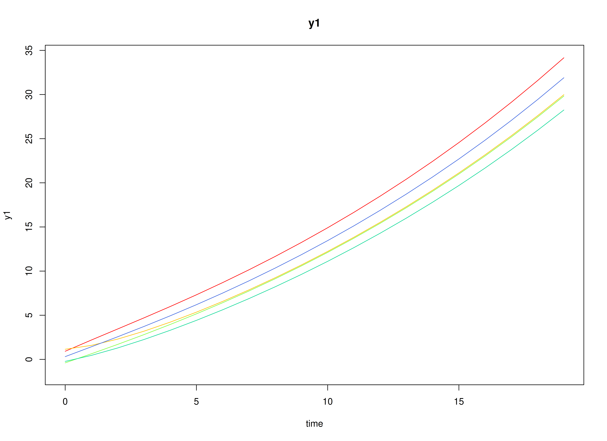
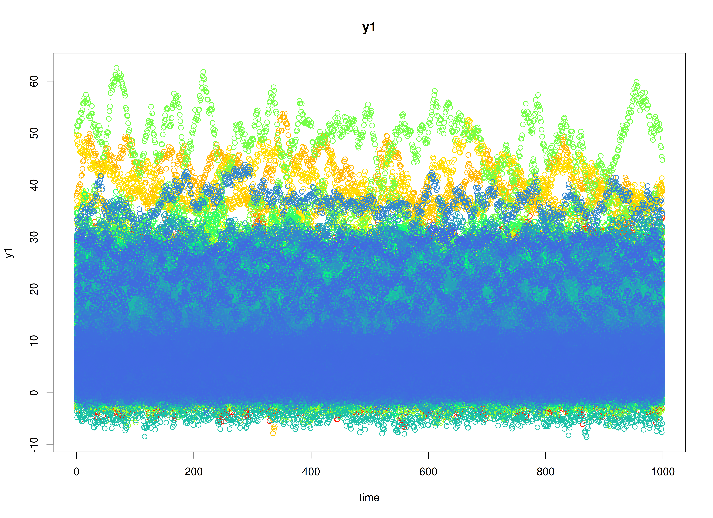
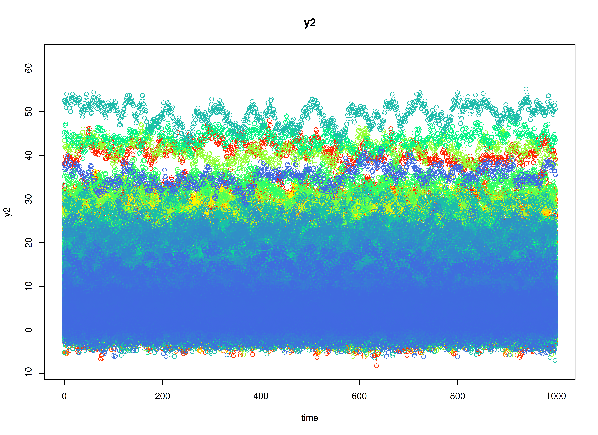

## Dynamics Description

The *Escalating Co-Activation* process represents a bivariate dynamic system in which two latent constructs---such as stress and rumination---mutually reinforce each other over time. Both constructs display strong autoregressive effects, indicating persistence, and positive cross-effects, suggesting that increases in one tend to amplify the other in subsequent time points.

At the population level, this pattern yields a slow return to equilibrium and, in some cases, near-unstable trajectories that can produce sustained co-activation or escalation. Between-person variability in the transition parameters captures individual differences in the strength of this self-reinforcing loop. The process noise covariance is relatively large and positively correlated, representing shared perturbations that drive both variables upward, while measurement error variance is moderate, reflecting realistic self-report imprecision.

This configuration models a *vicious cycle dynamic*---common in maladaptive emotional or cognitive processes---where mutual amplification between system components (e.g., stress and rumination) can sustain or exacerbate dysregulation over time.

## Model

The measurement model is given by
\begin{equation}
  \mathbf{y}_{i, t} = \boldsymbol{\Lambda} \boldsymbol{\eta}_{i, t} + \boldsymbol{\varepsilon}_{i, t}, \quad \mathrm{with} \quad \boldsymbol{\varepsilon}_{i, t} \sim \mathcal{N} \left( \mathbf{0}, \boldsymbol{\Theta} \right)
\end{equation}
where $\mathbf{y}_{i, t}$, $\boldsymbol{\eta}_{i, t}$, and $\boldsymbol{\varepsilon}_{i, t}$ are random variables and $\boldsymbol{\Lambda}$, and $\boldsymbol{\Theta}$ are model parameters. $\mathbf{y}_{i, t}$ represents a vector of observed random variables, $\boldsymbol{\eta}_{i, t}$ a vector of latent random variables, and $\boldsymbol{\varepsilon}_{i, t}$ a vector of random measurement errors, at time $t$ and individual $i$. $\boldsymbol{\Lambda}$ denotes a matrix of factor loadings, and $\boldsymbol{\Theta}$ the covariance matrix of $\boldsymbol{\varepsilon}$ that is invariant across individuals. In this model, $\boldsymbol{\Lambda}$ is an identity matrix and $\boldsymbol{\Theta}$ is a symmetric matrix.

The dynamic structure is given by
\begin{equation}
  \boldsymbol{\eta}_{i, t} = \boldsymbol{\alpha}_{i} + \boldsymbol{\beta}_{i} \boldsymbol{\eta}_{i, t - 1} + \boldsymbol{\zeta}_{i, t}, \quad \mathrm{with} \quad \boldsymbol{\zeta}_{i, t} \sim \mathcal{N}   \left( \mathbf{0}, \boldsymbol{\Psi} \right)
\end{equation}
where $\boldsymbol{\eta}_{i, t}$, $\boldsymbol{\eta}_{i, t - 1}$, and $\boldsymbol{\zeta}_{i, t}$ are random variables, and $\boldsymbol{\beta}_{i}$, and $\boldsymbol{\Psi}$ are model parameters. Here, $\boldsymbol{\eta}_{i, t}$ is a vector of latent variables at time $t$ and individual $i$, $\boldsymbol{\eta}_{i, t - 1}$ represents a vector of latent variables at time $t - 1$ and individual $i$, and $\boldsymbol{\zeta}_{i, t}$ represents a vector of dynamic noise at time $t$ and individual $i$. $\boldsymbol{\beta}_{i}$ is a matrix of autoregression and cross regression coefficients for individual $i$, and $\boldsymbol{\Psi}$ the covariance matrix of $\boldsymbol{\zeta}_{i, t}$ that is invariant across all individuals. In this model, $\boldsymbol{\Psi}$ is a symmetric matrix.

### Alternative Parameterization

An alternative parameterization of the dynamic structure that directly estimates the set-point vector $\boldsymbol{\mu}_{i}$ is given by
\begin{equation}
  \boldsymbol{\eta}_{i, t} = \boldsymbol{\mu}_{i} + \boldsymbol{\beta}_{i} \left( \boldsymbol{\eta}_{i, t - 1} - \boldsymbol{\mu}_{i} \right) + \boldsymbol{\zeta}_{i, t} .
\end{equation}

Algebraic manipulation of the equation results in the following
\begin{equation}
  \boldsymbol{\eta}_{i, t} = \boldsymbol{\mu}_{i} - \boldsymbol{\beta}_{i} \boldsymbol{\mu}_{i} + \boldsymbol{\beta}_{i} \boldsymbol{\eta}_{i, t - 1} + \boldsymbol{\zeta}_{i, t} ,
\end{equation}
where we can see that the intercept vector $\boldsymbol{\alpha}_{i}$ is implied by $\boldsymbol{\mu}_{i} - \boldsymbol{\beta}_{i} \boldsymbol{\mu}_{i}$.

## Data Generation

### Notation

Let $t = 1000$ be the number of time points and $n = 1000$ be the number of individuals. We simulate a total of time $= 11000$ points per individual, discarding the first $10000$ as burn-in. The analysis uses the final $1000$ measurement occasions.

Let the factor loadings matrix $\boldsymbol{\Lambda}$ be given by
\begin{equation}
  \boldsymbol{\Lambda}
  =
  \left(
    \begin{array}{cc}
      1 & 0 \\
      0 & 1 \\
    \end{array}
  \right) .
\end{equation}

Let the measurement error covariance matrix $\boldsymbol{\Theta}$ be given by
\begin{equation}
  \boldsymbol{\Theta}
  =
  \left(
  \begin{array}{cc}
    0.5 & 0 \\
    0 & 0.5 \\
  \end{array}
  \right) .
\end{equation}

Let the initial condition $\boldsymbol{\eta}_{0}$ be given by
\begin{equation}
  \boldsymbol{\eta}_{0} \sim \mathcal{N} \left( \boldsymbol{\mu}_{\boldsymbol{\eta} \mid 0}, \boldsymbol{\Sigma}_{\boldsymbol{\eta} \mid 0} \right) .
\end{equation}
$\boldsymbol{\mu}_{\boldsymbol{\eta} \mid 0}$ and $\boldsymbol{\Sigma}_{\boldsymbol{\eta} \mid 0}$ are functions of $\boldsymbol{\alpha}$ and $\boldsymbol{\beta}$.

Let the intercept vector $\boldsymbol{\alpha}$ be normally distributed with the following means
\begin{equation}
  \left(
    \begin{array}{c}
      1 \\
      1 \\
    \end{array}
  \right)
\end{equation}
and covariance matrix
\begin{equation}
  \left(
    \begin{array}{cc}
      0.25 & 0.2 \\
      0.2 & 0.25 \\
    \end{array}
  \right) .
\end{equation}

Let the transition matrix $\boldsymbol{\beta}$ be normally distributed with the following means
\begin{equation}
  \left(
    \begin{array}{cc}
      0.8 & 0.25 \\
      0.2 & 0.85 \\
    \end{array}
  \right)
\end{equation}
and covariance matrix
\begin{equation}
  \left(
    \begin{array}{cccc}
      0.04 & 0.02 & 0.015 & 0.01 \\
      0.02 & 0.03 & 0.01 & 0.015 \\
      0.015 & 0.01 & 0.03 & 0.02 \\
      0.01 & 0.015 & 0.02 & 0.04 \\
    \end{array}
  \right) .
\end{equation}

The `SimAlphaN` and `SimBetaN` functions from the `simStateSpace` package generate random intercept vectors and transition matrices from the multivariate normal distribution. Note that the `SimBetaN` function generates transition matrices that are weakly stationary with an option to set lower and upper bounds. The person-specific set-point vector $\boldsymbol{\mu}_{i}$ was derived from the generated $\boldsymbol{\alpha}_{i}$ and $\boldsymbol{\beta}_{i}$.

Let the dynamic process noise $\boldsymbol{\Psi}$ be given by
\begin{equation}
  \boldsymbol{\Psi}
  =
  \left(
    \begin{array}{cc}
      0.35 & 0.2 \\
      0.2 & 0.4 \\
    \end{array}
  \right) .
\end{equation}


### R Function Arguments


``` r
n
#> [1] 1000
time
#> [1] 11000
burnin
#> [1] 10000
# first mu0 in the list of length n
mu0[[1]]
#> [1] 3.979101 5.261786
# first sigma0 in the list of length n
sigma0[[1]]
#>           [,1]      [,2]
#> [1,] 0.9444850 0.6684182
#> [2,] 0.6684182 1.0861736
# first sigma0_l in the list of length n
sigma0_l[[1]] # sigma0_l <- t(chol(sigma0))
#>           [,1]     [,2]
#> [1,] 0.9718462 0.000000
#> [2,] 0.6877819 0.783026
# first alpha in the list of length n
alpha[[1]]
#> [1] 0.7342491 1.0337751
# first beta in the list of length n
beta[[1]]
#>            [,1]      [,2]
#> [1,] 0.76671137 0.0368753
#> [2,] 0.07383966 0.7476920
# first psi in the list of length n
psi[[1]]
#>      [,1] [,2]
#> [1,] 0.35  0.2
#> [2,] 0.20  0.4
psi_l[[1]] # psi_l <- t(chol(psi))
#>           [,1]      [,2]
#> [1,] 0.5916080 0.0000000
#> [2,] 0.3380617 0.5345225
nu
#> [[1]]
#> [1] 0 0
lambda
#> [[1]]
#>      [,1] [,2]
#> [1,]    1    0
#> [2,]    0    1
theta
#> [[1]]
#>      [,1] [,2]
#> [1,]  0.5  0.0
#> [2,]  0.0  0.5
theta_l # theta_l <- t(chol(theta))
#> [[1]]
#>           [,1]      [,2]
#> [1,] 0.7071068 0.0000000
#> [2,] 0.0000000 0.7071068
# first mu_eta (set-point) in the list of length n
mu_eta[[1]]
#> [1] 3.979101 5.261786
```

### Visualizing the Dynamics Without Process Noise and Measurement Error (n = 5 with Different Initial Condition)



### Using the `SimSSMIVary` Function from the `simStateSpace` Package to Simulate Data


``` r
library(simStateSpace)
sim <- SimSSMIVary(
  n = n,
  time = time,
  mu0 = mu0,
  sigma0_l = sigma0_l,
  alpha = alpha,
  beta = beta,
  psi_l = psi_l,
  nu = nu,
  lambda = lambda,
  theta_l = theta_l
)
data <- as.data.frame(sim, burnin = burnin)
head(data)
#>   id time       y1       y2
#> 1  1    0 4.697993 6.174017
#> 2  1    1 6.122606 5.793871
#> 3  1    2 5.539980 5.582454
#> 4  1    3 5.022958 6.170438
#> 5  1    4 5.907917 6.090866
#> 6  1    5 5.464929 3.791365
plot(sim, burnin = burnin)
```



## Model Fitting


``` r
library(OpenMx)
library(fitDTVARMxID)
```

The `FitDTVARMxID` function fits a DT-VAR model on each individual $i$. To set up the estimation, we first provide **starting values** for each parameter matrix.

### Set-Point (`mu_eta`)

The set-point vector $\boldsymbol{\mu}$ is initialized with starting values.


``` r
mu_eta_values <- mu_eta
```

### Autoregressive Parameters (`beta`)

We initialize the autoregressive coefficient matrix $\boldsymbol{\beta}$ with the true values used in simulation.


``` r
beta_values <- beta
```

### LDL'-parameterized covariance matrices

Covariances such as `psi` and `theta` are estimated using the LDL' decomposition of a positive definite covariance matrix. The decomposition expresses a covariance matrix $\Sigma$ as  
\begin{equation}
  \boldsymbol{\Sigma} = \left( \mathbf{L} + \mathbf{I} \right) \mathrm{diag} \left( \mathrm{Softplus} \left( \mathbf{d}_{uc} \right) \right) \left( \mathbf{L} + \mathbf{I} \right)^{\prime},
\end{equation}
where:
- $\mathbf{L}$ is a strictly lower-triangular matrix of free parameters (`l_mat_strict`),  
- $\mathbf{I}$ is the identity matrix,  
- $\mathbf{d}_{uc}$ is an unconstrained vector,  
- $\mathrm{Softplus} \left(\mathbf{d}_{uc} \right) = \log \left(1 + \exp \left( \mathbf{d}_{uc} \right) \right)$ ensures strictly positive diagonal entries.  

The `LDL()` function extracts this decomposition from a positive definite covariance matrix. It returns:  
- `d_uc`: unconstrained diagonal parameters, equal to `InvSoftplus(d_vec)`,  
- `d_vec`: diagonal entries, equal to `Softplus(d_uc)`,  
- `l_mat_strict`: the strictly lower-triangular factor.  


``` r
sigma <- matrix(
  data = c(1.0, 0.5, 0.5, 1.0),
  nrow = 2,
  ncol = 2
)
ldl_sigma <- LDL(sigma)
d_uc <- ldl_sigma$d_uc
l_mat_strict <- ldl_sigma$l_mat_strict
I <- diag(2)
sigma_reconstructed <- (l_mat_strict + I) %*% diag(log1p(exp(d_uc)), 2) %*% t(l_mat_strict + I)
sigma_reconstructed
#>      [,1] [,2]
#> [1,]  1.0  0.5
#> [2,]  0.5  1.0
```

#### Process Noise Covariance Matrix (`psi`)

Starting values for the process noise covariance matrix $\boldsymbol{\Psi}$ are given below, with corresponding LDL' parameters.


``` r
psi_values <- psi[[1]]
ldl_psi_values <- LDL(psi_values)
psi_d_values <- ldl_psi_values$d_uc
psi_l_values <- ldl_psi_values$l_mat_strict
```


``` r
psi_d_values
#> [1] -0.8697232 -1.1065068
```


``` r
psi_l_values
#>           [,1] [,2]
#> [1,] 0.0000000    0
#> [2,] 0.5714286    0
```

#### Measurement Error Covariance Matrix (`theta`)

Starting values for the measurement error covariance matrix $\boldsymbol{\Theta}$ are given below, with corresponding LDL' parameters.


``` r
theta_values <- theta[[1]]
ldl_theta_values <- LDL(theta_values)
theta_d_values <- ldl_theta_values$d_uc
theta_l_values <- ldl_theta_values$l_mat_strict
```


``` r
theta_d_values
#> [1] -0.4327521 -0.4327521
```


``` r
theta_l_values
#>      [,1] [,2]
#> [1,]    0    0
#> [2,]    0    0
```

### Initial mean vector (`mu_0`) and covariance matrix (`sigma_0`)

The initial mean vector $\boldsymbol{\mu_0}$ and covariance matrix $\boldsymbol{\Sigma_0}$ are fixed using `mu0` and `sigma0`.


``` r
mu0_values <- mu0
```


``` r
sigma0_values <- lapply(
  X = sigma0,
  FUN = LDL
)
sigma0_d_values <- lapply(
  X = sigma0_values,
  FUN = function(i) {
    i$d_uc
  }
)
sigma0_l_values <- lapply(
  X = sigma0_values,
  FUN = function(i) {
    i$l_mat_strict
  }
)
```

### `FitDTVARMxID`


``` r
fit <- FitDTVARMxID(
  data = data,
  observed = c("y1", "y2"),
  id = "id",
  center = TRUE,
  mu_eta_values = mu_eta_values,
  beta_values = beta_values,
  psi_d_values = psi_d_values,
  psi_l_values = psi_l_values,
  theta_d_values = theta_d_values,
  mu0_values = mu0_values,
  sigma0_d_values = sigma0_d_values,
  sigma0_l_values = sigma0_l_values,
  ncores = parallel::detectCores()
)
```

#### Parameter estimates


``` r
head(summary(fit))
#>                             beta_1_1    beta_2_1    beta_1_2  beta_2_2
#> FitDTVARMxID_DTVAR_ID1.Rds 0.8758739  0.06980566 -0.04782908 0.7607040
#> FitDTVARMxID_DTVAR_ID2.Rds 0.6441904 -0.22484340  0.09571917 0.9399838
#> FitDTVARMxID_DTVAR_ID3.Rds 0.7946076  0.10527667  0.33387178 0.6895026
#> FitDTVARMxID_DTVAR_ID4.Rds 0.8381163  0.20027095  0.07653694 0.5060161
#> FitDTVARMxID_DTVAR_ID5.Rds 0.8214917  0.11109383  0.08229443 0.8553835
#> FitDTVARMxID_DTVAR_ID6.Rds 0.5267410 -0.11081204  0.20395749 0.6069352
#>                            mu_eta_1_1 mu_eta_2_1 psi_l_2_1  psi_d_1_1
#> FitDTVARMxID_DTVAR_ID1.Rds   4.075797   5.325837 0.6867072 -1.3318704
#> FitDTVARMxID_DTVAR_ID2.Rds   7.583295   6.301787 0.6215924 -0.8054012
#> FitDTVARMxID_DTVAR_ID3.Rds  24.442146  11.337333 0.5936404 -0.8989028
#> FitDTVARMxID_DTVAR_ID4.Rds  16.728504  11.594649 0.6589971 -1.0581211
#> FitDTVARMxID_DTVAR_ID5.Rds  14.877025  23.754310 0.6950561 -1.0394769
#> FitDTVARMxID_DTVAR_ID6.Rds   3.114842   1.722967 0.6260117 -0.8201061
#>                             psi_d_2_1 theta_d_1_1 theta_d_2_1
#> FitDTVARMxID_DTVAR_ID1.Rds -1.5159321  -0.2852040  -0.4999119
#> FitDTVARMxID_DTVAR_ID2.Rds -1.7101736  -0.4796943  -0.2688015
#> FitDTVARMxID_DTVAR_ID3.Rds -0.8905995  -0.5724221  -0.6011569
#> FitDTVARMxID_DTVAR_ID4.Rds -1.1689994  -0.3153879  -0.4663390
#> FitDTVARMxID_DTVAR_ID5.Rds -1.2347727  -0.4597019  -0.5121433
#> FitDTVARMxID_DTVAR_ID6.Rds -0.4541105  -0.4560209  -0.9659768
```

#### Proportion of converged cases


``` r
converged(
  fit,
  theta_tol = 0.01,
  prop = TRUE
)
#> [1] 0.949
```

#### Fixed-Effect Meta-Analysis of Measurement Error

When fitting DT-VAR models per person, separating process noise ($\boldsymbol{\Psi}$) from measurement error ($\boldsymbol{\Theta}$) can be unstable for some individuals. To stabilize inference, we first pool the person-level $\boldsymbol{\Theta}_{i}$ estimates from only the converged fits using a fixed-effect meta-analysis. This yields a high-precision estimate of the common measurement-error covariance that we will then hold fixed in a second pass of model fitting.

What the code does:
- Selects individuals that converged and whose $\boldsymbol{\Theta}_i$ diagonals exceed a small threshold (`theta_tol`), filtering out near-zero or ill-conditioned solutions.
- Extracts each person's LDL' diagonal parameters for $\boldsymbol{\Theta}_i$ and their sampling covariance matrices.
- Computes the inverse-variance-weighted pooled estimate (fixed effect), returning it on the same LDL' parameterization used by `FitDTVARMxID()`.


``` r
library(metaDyn)
fixed_theta <- MetaVARMx(
  fit,
  random = FALSE, # TRUE by default
  effects = FALSE, # TRUE by default
  cov_meas = TRUE, # FALSE by default
  theta_tol = 0.01,
  ncores = parallel::detectCores()
)
```




You can read `summary(fixed_theta)` as providing the pooled (fixed) measurement-error scale that is common across persons. If individual instruments truly share the same reliability structure, fixing $\boldsymbol{\Theta}$ to this pooled value improves stability and often reduces bias in the dynamic parameters.

> **Note:** Fixed-effect pooling assumes a common $\boldsymbol{\Theta}$ across individuals.


``` r
coef(fixed_theta)
#>  alpha_1_1  alpha_2_1 
#> -0.3897896 -0.3833341
summary(fixed_theta)
#> [1] 0
#> Call:
#> MetaVARMx(object = fit, random = FALSE, effects = FALSE, cov_meas = TRUE, 
#>     theta_tol = 0.01, ncores = parallel::detectCores())
#> 
#> CI type = "normal"
#>                est     se        z p    2.5%   97.5%
#> alpha[1,1] -0.3898 0.0047 -82.1074 0 -0.3991 -0.3805
#> alpha[2,1] -0.3833 0.0051 -75.1412 0 -0.3933 -0.3733
```


``` r
theta_d_values <- coef(fixed_theta)
```

#### Refit the model with fixed measurement error covariance matrix

We refit the individual models using the pooled $\boldsymbol{\Theta}$ as a fixed measurement-error covariance matrix.


``` r
fit <- FitDTVARMxID(
  data = data,
  observed = c("y1", "y2"),
  id = "id",
  center = TRUE,
  mu_eta_values = mu_eta_values,
  beta_values = beta_values,
  psi_d_values = psi_d_values,
  psi_l_values = psi_l_values,
  theta_fixed = TRUE,
  theta_d_values = theta_d_values,
  mu0_values = mu0_values,
  sigma0_d_values = sigma0_d_values,
  sigma0_l_values = sigma0_l_values,
  ncores = parallel::detectCores()
)
```

With $\boldsymbol{\Theta}$ fixed, the re-estimation focuses on the dynamic structure ($\boldsymbol{\mu}$, $\boldsymbol{\beta}$, $\boldsymbol{\Psi}$). In practice, this often increases the proportion of converged fits and yields more stable cross-lag estimates.

#### Proportion of converged cases


``` r
converged(
  fit,
  prop = TRUE
)
#> [1] 1
```

## Random-Effects Meta-Analysis of Person-Specific Dynamics and Means

Having stabilized $\boldsymbol{\Theta}$, we synthesize the person-specific estimates to recover population-level effects and their between-person variability. We use a random-effects model so the pooled mean reflects both within-person estimation uncertainty and between-person heterogeneity.


``` r
random <- MetaVARMx(
  fit,
  effects = TRUE,
  set_point = TRUE,
  robust_v = FALSE,
  robust = TRUE,
  ncores = parallel::detectCores()
)
```














``` r
summary(random)
#> [1] 0
#> Call:
#> MetaVARMx(object = fit, effects = TRUE, set_point = TRUE, robust_v = FALSE, 
#>     robust = TRUE, ncores = parallel::detectCores())
#> 
#> CI type = "normal"
#>                  est     se           z      p    2.5%   97.5%
#> alpha[1,1]    6.3755 0.1971     32.3483 0.0000  5.9893  6.7618
#> alpha[2,1]    5.9803 0.1926     31.0528 0.0000  5.6028  6.3577
#> alpha[3,1]    0.6758 0.0048    141.0167 0.0000  0.6664  0.6852
#> alpha[4,1]    0.0504 0.0046     11.0059 0.0000  0.0414  0.0594
#> alpha[5,1]    0.1116 0.0050     22.3277 0.0000  0.1018  0.1214
#> alpha[6,1]    0.7084 0.0045    155.8597 0.0000  0.6995  0.7173
#> tau_sqr[1,1] 38.8258 1.7417     22.2913 0.0000 35.4121 42.2396
#> tau_sqr[2,1] 21.2984 1.3780     15.4555 0.0000 18.5975 23.9993
#> tau_sqr[3,1]  0.3431 0.0309     11.0924 0.0000  0.2825  0.4038
#> tau_sqr[4,1]  0.0862 0.0277      3.1112 0.0019  0.0319  0.1405
#> tau_sqr[5,1]  0.4483 0.0340     13.1937 0.0000  0.3817  0.5148
#> tau_sqr[6,1]  0.1528 0.0283      5.3955 0.0000  0.0973  0.2084
#> tau_sqr[2,2] 37.0694 1.6614     22.3118 0.0000 33.8131 40.3258
#> tau_sqr[3,2]  0.0470 0.0292      1.6080 0.1078 -0.0103  0.1044
#> tau_sqr[4,2]  0.3740 0.0303     12.3333 0.0000  0.3146  0.4334
#> tau_sqr[5,2]  0.0649 0.0299      2.1700 0.0300  0.0063  0.1236
#> tau_sqr[6,2]  0.3366 0.0290     11.6234 0.0000  0.2799  0.3934
#> tau_sqr[3,3]  0.0194 0.0010     18.6354 0.0000  0.0174  0.0215
#> tau_sqr[4,3]  0.0055 0.0007      7.4754 0.0000  0.0041  0.0069
#> tau_sqr[5,3]  0.0020 0.0007      2.6967 0.0070  0.0005  0.0035
#> tau_sqr[6,3] -0.0011 0.0007     -1.5952 0.1107 -0.0024  0.0002
#> tau_sqr[4,4]  0.0173 0.0009     18.4145 0.0000  0.0155  0.0192
#> tau_sqr[5,4] -0.0056 0.0007     -7.8065 0.0000 -0.0071 -0.0042
#> tau_sqr[6,4]  0.0005 0.0007      0.8116 0.4170 -0.0008  0.0018
#> tau_sqr[5,5]  0.0220 0.0011     19.9406 0.0000  0.0198  0.0241
#> tau_sqr[6,5]  0.0065 0.0008      8.5921 0.0000  0.0050  0.0080
#> tau_sqr[6,6]  0.0174 0.0009     18.5296 0.0000  0.0155  0.0192
#> i_sqr[1,1]    0.9999 0.0000 255261.2495 0.0000  0.9999  0.9999
#> i_sqr[2,1]    0.9999 0.0000 246788.6126 0.0000  0.9999  0.9999
#> i_sqr[3,1]    0.9607 0.0020    473.9396 0.0000  0.9567  0.9647
#> i_sqr[4,1]    0.9571 0.0022    438.7215 0.0000  0.9529  0.9614
#> i_sqr[5,1]    0.9872 0.0006   1661.7430 0.0000  0.9860  0.9884
#> i_sqr[6,1]    0.9861 0.0007   1515.8741 0.0000  0.9848  0.9874
```

### Normal Theory Confidence Intervals


``` r
confint(random, level = 0.95, lb = FALSE)
#>                      2.5 %        97.5 %
#> alpha[1,1]    5.9892576098  6.7618378021
#> alpha[2,1]    5.6028056698  6.3577188620
#> alpha[3,1]    0.6664360056  0.6852224473
#> alpha[4,1]    0.0414374820  0.0593939047
#> alpha[5,1]    0.1018300454  0.1214280508
#> alpha[6,1]    0.6995296013  0.7173470861
#> tau_sqr[1,1] 35.4120750640 42.2395971685
#> tau_sqr[2,1] 18.5974999675 23.9993416021
#> tau_sqr[3,1]  0.2825075854  0.4037681572
#> tau_sqr[4,1]  0.0318989311  0.1405127986
#> tau_sqr[5,1]  0.3816666406  0.5148465601
#> tau_sqr[6,1]  0.0973237405  0.2083701132
#> tau_sqr[2,2] 33.8130875906 40.3257528507
#> tau_sqr[3,2] -0.0102931352  0.1043557966
#> tau_sqr[4,2]  0.3145551423  0.4334202739
#> tau_sqr[5,2]  0.0062871509  0.1236012294
#> tau_sqr[6,2]  0.2798682087  0.3933950738
#> tau_sqr[3,3]  0.0173722048  0.0214559195
#> tau_sqr[4,3]  0.0040594949  0.0069446781
#> tau_sqr[5,3]  0.0005472225  0.0034589584
#> tau_sqr[6,3] -0.0024046498  0.0002467261
#> tau_sqr[4,4]  0.0154763347  0.0191632367
#> tau_sqr[5,4] -0.0070610283 -0.0042269759
#> tau_sqr[6,4] -0.0007523962  0.0018158224
#> tau_sqr[5,5]  0.0198137372  0.0241333048
#> tau_sqr[6,5]  0.0050204617  0.0079878013
#> tau_sqr[6,6]  0.0155193817  0.0191908515
#> i_sqr[1,1]    0.9999049920  0.9999203472
#> i_sqr[2,1]    0.9999016324  0.9999175147
#> i_sqr[3,1]    0.9567476579  0.9646937249
#> i_sqr[4,1]    0.9528563144  0.9614081846
#> i_sqr[5,1]    0.9860441804  0.9883729318
#> i_sqr[6,1]    0.9848245188  0.9873744924
```


``` r
confint(random, level = 0.99, lb = FALSE)
#>                      0.5 %        99.5 %
#> alpha[1,1]    5.867876e+00  6.8832189475
#> alpha[2,1]    5.484200e+00  6.4763243205
#> alpha[3,1]    6.634844e-01  0.6881740112
#> alpha[4,1]    3.861632e-02  0.0622150632
#> alpha[5,1]    9.875098e-02  0.1245071206
#> alpha[6,1]    6.967303e-01  0.7201464158
#> tau_sqr[1,1]  3.433939e+01 43.3122786341
#> tau_sqr[2,1]  1.774881e+01 24.8480324321
#> tau_sqr[3,1]  2.634562e-01  0.4228195738
#> tau_sqr[4,1]  1.483446e-02  0.1575772739
#> tau_sqr[5,1]  3.607426e-01  0.5357706419
#> tau_sqr[6,1]  7.987709e-02  0.2258167628
#> tau_sqr[2,2]  3.278987e+01 41.3489667208
#> tau_sqr[3,2] -2.830579e-02  0.1223684493
#> tau_sqr[4,2]  2.958801e-01  0.4520953396
#> tau_sqr[5,2] -1.214423e-02  0.1420326069
#> tau_sqr[6,2]  2.620318e-01  0.4112314370
#> tau_sqr[3,3]  1.673061e-02  0.0220975175
#> tau_sqr[4,3]  3.606200e-03  0.0073979733
#> tau_sqr[5,3]  8.975566e-05  0.0039164253
#> tau_sqr[6,3] -2.821211e-03  0.0006632875
#> tau_sqr[4,4]  1.489708e-02  0.0197424910
#> tau_sqr[5,4] -7.506290e-03 -0.0037817140
#> tau_sqr[6,4] -1.155893e-03  0.0022193188
#> tau_sqr[5,5]  1.913508e-02  0.0248119580
#> tau_sqr[6,5]  4.554259e-03  0.0084540041
#> tau_sqr[6,6]  1.494255e-02  0.0197676812
#> i_sqr[1,1]    9.999026e-01  0.9999227597
#> i_sqr[2,1]    9.998991e-01  0.9999200100
#> i_sqr[3,1]    9.554992e-01  0.9659421426
#> i_sqr[4,1]    9.515127e-01  0.9627517808
#> i_sqr[5,1]    9.856783e-01  0.9887388052
#> i_sqr[6,1]    9.844239e-01  0.9877751223
```

### Robust Confidence Intervals


``` r
confint(random, level = 0.95, lb = FALSE, robust = TRUE)
#>                      2.5 %       97.5 %
#> alpha[1,1]    5.9877509633  6.763344449
#> alpha[2,1]    5.6016341840  6.358890348
#> alpha[3,1]    0.6659894710  0.685668982
#> alpha[4,1]    0.0412731461  0.059558241
#> alpha[5,1]    0.1017712352  0.121486861
#> alpha[6,1]    0.6991210127  0.717755675
#> tau_sqr[1,1] 31.7884605624 45.863211670
#> tau_sqr[2,1] 16.7517210277 25.845120542
#> tau_sqr[3,1]  0.2843972579  0.401878485
#> tau_sqr[4,1]  0.0376020434  0.134809686
#> tau_sqr[5,1]  0.3715495612  0.524963640
#> tau_sqr[6,1]  0.0914715382  0.214222316
#> tau_sqr[2,2] 29.6110302896 44.527810152
#> tau_sqr[3,2] -0.0051303711  0.099193033
#> tau_sqr[4,2]  0.3071073962  0.440868020
#> tau_sqr[5,2]  0.0156328271  0.114255553
#> tau_sqr[6,2]  0.2816447153  0.391618567
#> tau_sqr[3,3]  0.0172526668  0.021575457
#> tau_sqr[4,3]  0.0038894871  0.007114686
#> tau_sqr[5,3]  0.0003713106  0.003634870
#> tau_sqr[6,3] -0.0024598717  0.000301948
#> tau_sqr[4,4]  0.0153897596  0.019249812
#> tau_sqr[5,4] -0.0070369423 -0.004251062
#> tau_sqr[6,4] -0.0008662858  0.001929712
#> tau_sqr[5,5]  0.0197826328  0.024164409
#> tau_sqr[6,5]  0.0048996366  0.008108626
#> tau_sqr[6,6]  0.0154132629  0.019296970
#> i_sqr[1,1]    0.9998968425  0.999928497
#> i_sqr[2,1]    0.9998914457  0.999927701
#> i_sqr[3,1]    0.9565123460  0.964929037
#> i_sqr[4,1]    0.9528686747  0.961395824
#> i_sqr[5,1]    0.9858217677  0.988595345
#> i_sqr[6,1]    0.9846943236  0.987504688
```


``` r
confint(random, level = 0.99, lb = FALSE, robust = TRUE)
#>                      0.5 %        99.5 %
#> alpha[1,1]    5.8658963954  6.8851990165
#> alpha[2,1]    5.4826606180  6.4778639138
#> alpha[3,1]    0.6628975957  0.6887608571
#> alpha[4,1]    0.0384003495  0.0624310372
#> alpha[5,1]    0.0986736859  0.1245844102
#> alpha[6,1]    0.6961932951  0.7206833922
#> tau_sqr[1,1] 29.5771568983 48.0745153342
#> tau_sqr[2,1] 15.3230444202 27.2737971495
#> tau_sqr[3,1]  0.2659396194  0.4203361232
#> tau_sqr[4,1]  0.0223296158  0.1500821139
#> tau_sqr[5,1]  0.3474464626  0.5490667381
#> tau_sqr[6,1]  0.0721859934  0.2335078604
#> tau_sqr[2,2] 27.2674343203 46.8714061210
#> tau_sqr[3,2] -0.0215207657  0.1155834271
#> tau_sqr[4,2]  0.2860920791  0.4618833371
#> tau_sqr[5,2]  0.0001380738  0.1297503065
#> tau_sqr[6,2]  0.2643665710  0.4088967116
#> tau_sqr[3,3]  0.0165735072  0.0222546171
#> tau_sqr[4,3]  0.0033827717  0.0076214013
#> tau_sqr[5,3] -0.0001414319  0.0041476128
#> tau_sqr[6,3] -0.0028937850  0.0007358613
#> tau_sqr[4,4]  0.0147833014  0.0198562700
#> tau_sqr[5,4] -0.0074746359 -0.0038133684
#> tau_sqr[6,4] -0.0013055689  0.0023689951
#> tau_sqr[5,5]  0.0190942058  0.0248528361
#> tau_sqr[6,5]  0.0043954678  0.0086127951
#> tau_sqr[6,6]  0.0148030883  0.0199071450
#> i_sqr[1,1]    0.9998918692  0.9999334700
#> i_sqr[2,1]    0.9998857496  0.9999333974
#> i_sqr[3,1]    0.9551899880  0.9662513948
#> i_sqr[4,1]    0.9515289624  0.9627355367
#> i_sqr[5,1]    0.9853860072  0.9890311051
#> i_sqr[6,1]    0.9842527834  0.9879462279
```

### Profile-Likelihood Confidence Intervals


``` r
confint(random, level = 0.95, lb = TRUE)
#> Error in `[.data.frame`:
#> ! undefined columns selected
```


``` r
confint(random, level = 0.99, lb = TRUE)
#> Error in `[.data.frame`:
#> ! undefined columns selected
```

- The fixed part of the random-effects model gives pooled means $\boldsymbol{\alpha} = \mathbb{E} \left[ \mathrm{Vec} \left( \boldsymbol{\mu}, \boldsymbol{\beta} \right)  \right]$.
- The random part yields between-person covariances ($\boldsymbol{\tau}^{2}$) quantifying heterogeneity in set-point ($\boldsymbol{\mu}$) and dynamics ($\boldsymbol{\beta}$) across individuals.


``` r
means <- extract(random, what = "alpha")
means
#> [1] 6.37554771 5.98026227 0.67582923 0.05041569 0.11162905 0.70843834
covariances <- extract(random, what = "tau_sqr")
covariances
#>             [,1]        [,2]         [,3]          [,4]         [,5]
#> [1,] 38.82583612 21.29842078  0.343137871  0.0862058649  0.448256600
#> [2,] 21.29842078 37.06942022  0.047031331  0.3739877081  0.064944190
#> [3,]  0.34313787  0.04703133  0.019414062  0.0055020865  0.002003090
#> [4,]  0.08620586  0.37398771  0.005502086  0.0173197857 -0.005644002
#> [5,]  0.44825660  0.06494419  0.002003090 -0.0056440021  0.021973521
#> [6,]  0.15284693  0.33663164 -0.001078962  0.0005317131  0.006504131
#>               [,6]
#> [1,]  0.1528469269
#> [2,]  0.3366316413
#> [3,] -0.0010789618
#> [4,]  0.0005317131
#> [5,]  0.0065041315
#> [6,]  0.0173551166
```

Finally, we compare the meta-analytic population estimates to the known generating values.


``` r
pop_mean
#> [1] 6.28825913 5.98495580 0.65102637 0.06119726 0.11709416 0.69102888
pop_cov
#>            [,1]        [,2]         [,3]         [,4]         [,5]         [,6]
#> [1,] 45.5777745 22.45624703  0.435267659  0.102000623  0.416987471  0.166499263
#> [2,] 22.4562470 39.00449724  0.105053400  0.374443135  0.068369236  0.369552699
#> [3,]  0.4352677  0.10505340  0.022036851  0.006076962  0.002414367 -0.001588914
#> [4,]  0.1020006  0.37444314  0.006076962  0.018776010 -0.004104598  0.001061573
#> [5,]  0.4169875  0.06836924  0.002414367 -0.004104598  0.020922669  0.006573304
#> [6,]  0.1664993  0.36955270 -0.001588914  0.001061573  0.006573304  0.019815765
```

## Summary

This vignette demonstrates a two-stage hierarchical estimation approach for dynamic systems:
1. individual-level DT-VAR estimation with stabilized measurement error, and  
2. population-level meta-analysis of person-specific dynamics and means.

## References


