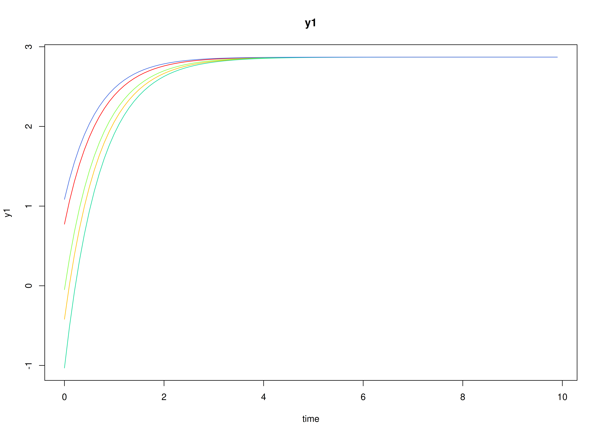
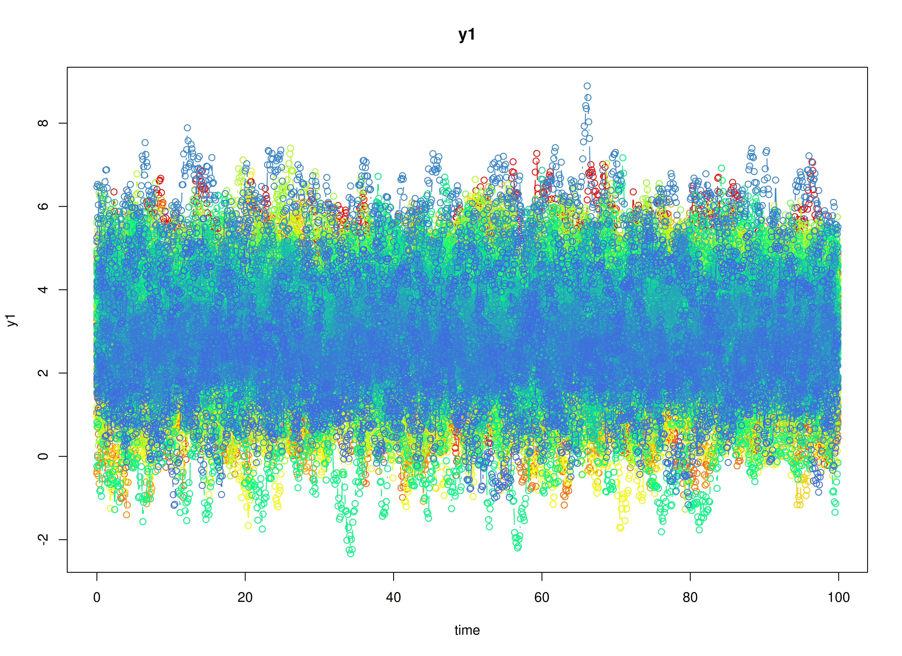

## Dynamics Description

The *Stable Reciprocal Regulation* process is modeled as a continuous-time bivariate dynamic system in which two latent psychological constructs (e.g., negative and positive affect) mutually influence each other through their instantaneous rates of change. The dynamics are governed by the continuous-time drift matrix whose negative diagonal elements indicate substantial self-regulation: deviations from a person's equilibrium are pulled back toward baseline at a moderate-to-strong rate. The negative off-diagonal elements reflect reciprocal inhibition: higher levels of one construct are associated with an increased instantaneous tendency for the other construct to decline. Because the cross-effects are modest relative to the self-regulatory terms, the system exhibits stable, non-oscillatory relaxation back toward person-specific equilibrium points.

Individuals are allowed to differ in both their self-regulatory rates and the strength of these antagonistic couplings. Stochastic disturbances enter through the process-noise covariance, permitting small (potentially correlated) departures from the deterministic drift, while measurement errors are assumed to be minimal and comparable across indicators. Overall, this pattern captures a psychologically plausible mechanism of reciprocal inhibition in which short-term perturbations in one component (e.g., negative affect) are naturally counteracted by compensatory adjustment in the other (e.g., positive affect), supporting emotional homeostasis over time.

## Model

The measurement model is given by
\begin{equation}
  \mathbf{y}_{i, t} = \boldsymbol{\eta}_{i, t}
\end{equation}
where $\mathbf{y}_{i, t}$ and $\boldsymbol{\eta}_{i, t}$ are random variables.

The dynamic structure is given by
\begin{equation}
  \mathrm{d} \boldsymbol{\eta}_{i, t} = \left( \boldsymbol{\alpha}_{i} + \boldsymbol{\beta}_{i} \boldsymbol{\eta}_{i, t} \right) \mathrm{d} t + \boldsymbol{\Psi}^{\frac{1}{2}} \mathrm{d} \mathbf{W}_{i, t}
\end{equation}
where $\mathrm{d}\boldsymbol{W}_{i, t}$ is a Wiener process or Brownian motion, which represents random fluctuations, $\boldsymbol{\eta}_{i, t}$ is a random variable, and $\boldsymbol{\beta}_{i}$, and $\boldsymbol{\Psi}$ are model parameters. Here, $\boldsymbol{\eta}_{i, t}$ is a vector of latent variables at time $t$ and individual $i$. $\boldsymbol{\beta}_{i}$ is a matrix of auto and cross effect coefficients for individual $i$, and $\boldsymbol{\Psi}$ the covariance matrix of the process noise.

### Alternative Parameterization

An alternative parameterization of the dynamic structure that directly estimates the set point vector $\boldsymbol{\mu}_{i}$ is given by
\begin{equation}
  \mathrm{d} \boldsymbol{\eta}_{i, t} = \boldsymbol{\beta}_{i} \left( \boldsymbol{\eta}_{i, t} - \boldsymbol{\mu}_{i} \right) \mathrm{d} t + \boldsymbol{\Psi}^{\frac{1}{2}} \mathrm{d} \mathbf{W}_{i, t} .
\end{equation}

Algebraic manipulation of the equation results in the following
\begin{equation}
  \mathrm{d} \boldsymbol{\eta}_{i, t} =  \left( - \boldsymbol{\beta}_{i} \boldsymbol{\mu}_{i} + \boldsymbol{\beta}_{i} \boldsymbol{\eta}_{i, t} \right) \mathrm{d} t + \boldsymbol{\Psi}^{\frac{1}{2}} \mathrm{d} \mathbf{W}_{i, t}
\end{equation}
where we can see that the intercept vector $\boldsymbol{\alpha}_{i}$ is implied by $- \boldsymbol{\beta}_{i} \boldsymbol{\mu}_{i}$.

## Data Generation

### Notation

Let $t = 1000$ be the number of time points and $n = 100$ be the number of individuals.

Let the initial condition $\boldsymbol{\eta}_{0}$ be given by
\begin{equation}
  \boldsymbol{\eta}_{0} \sim \mathcal{N} \left( \boldsymbol{\mu}_{\boldsymbol{\eta} \mid 0}, \boldsymbol{\Sigma}_{\boldsymbol{\eta} \mid 0} \right) .
\end{equation}
$\boldsymbol{\mu}_{\boldsymbol{\eta} \mid 0}$ and $\boldsymbol{\Sigma}_{\boldsymbol{\eta} \mid 0}$ are functions of $\boldsymbol{\alpha}$ and $\boldsymbol{\beta}$.

Let the set point vector $\boldsymbol{\mu}$ be normally distributed with the following means
\begin{equation}
  \left(
    \begin{array}{c}
      2.87 \\
      2.04 \\
    \end{array}
  \right)
\end{equation}
and covariance matrix
\begin{equation}
  \left(
    \begin{array}{cc}
      1.2 & 0.46 \\
      0.46 & 1.1 \\
    \end{array}
  \right) .
\end{equation}

Let the drift matrix $\boldsymbol{\beta}$ be normally distributed with the following means
\begin{equation}
  \left(
    \begin{array}{cc}
      -1.2843504 & -0.1792463 \\
      -0.1307004 & -1.3590363 \\
    \end{array}
  \right)
\end{equation}
and covariance matrix
\begin{equation}
  \left(
    \begin{array}{cccc}
      0.017 & 0.005 & 0.001 & 0.008 \\
      0.005 & 0.008 & 0.001 & 0.006 \\
      0.001 & 0.001 & 0.001 & 0.002 \\
      0.008 & 0.006 & 0.002 & 0.026 \\
    \end{array}
  \right) .
\end{equation}

The `SimMuN` and `SimPhiN` functions from the `simStateSpace` package generate random set point vectors and drift matrices from the multivariate normal distribution. Note that the `SimPhiN` function generates drift matrices that are weakly stationary with an option to set lower and upper bounds.

Let the dynamic process noise $\boldsymbol{\Psi}$ be given by
\begin{equation}
  \boldsymbol{\Psi}
  =
  \left(
    \begin{array}{cc}
      1.3 & 0.57 \\
      0.57 & 1.56 \\
    \end{array}
  \right) .
\end{equation}


### R Function Arguments


``` r
n
#> [1] 100
time
#> [1] 1000
# first mu0 in the list of length n
mu0[[1]]
#> [1] 2.287769 2.606098
# first sigma0 in the list of length n
sigma0[[1]]
#>           [,1]      [,2]
#> [1,] 0.5037766 0.1478276
#> [2,] 0.1478276 0.5694164
# first sigma0_l in the list of length n
sigma0_l[[1]] # sigma0_l <- t(chol(sigma0))
#>           [,1]      [,2]
#> [1,] 0.7097722 0.0000000
#> [2,] 0.2082747 0.7252848
# first alpha in the list of length n
alpha[[1]]
#> [1] 3.312112 3.842713
# first beta in the list of length n
beta[[1]]
#>           [,1]      [,2]
#> [1,] -1.235608 -0.186227
#> [2,] -0.169327 -1.325864
# first psi in the list of length n
psi[[1]]
#>      [,1] [,2]
#> [1,] 1.30 0.57
#> [2,] 0.57 1.56
psi_l[[1]] # psi_l <- t(chol(psi))
#>           [,1]     [,2]
#> [1,] 1.1401754 0.000000
#> [2,] 0.4999231 1.144586
# first mu (set point) in the list of length n
mu[[1]]
#> [1] 2.287769 2.606098
```

### Visualizing the Dynamics Without Process Noise and Measurement Error (n = 5 with Different Initial Condition)



### Using the `SimSSMLinSDEFixed` Function from the `simStateSpace` Package to Simulate Data

> **Note:** The `SimSSMLinSDEFixed` function uses a different set of parameter names.
> See `help(SimSSMLinSDEFixed)` for more details.


``` r
library(simStateSpace)
sim <- SimSSMLinSDEIVary(
  n = n,
  time = time,
  delta_t = 0.1,
  mu0 = mu0,
  sigma0_l = sigma0_l,
  iota = alpha,
  phi = beta,
  sigma_l = psi_l,
  nu = nu,
  lambda = lambda,
  theta_l = theta_l
)
data <- as.data.frame(sim)
head(data)
#>   id time       y1       y2
#> 1  1  0.0 2.523315 3.353060
#> 2  1  0.1 2.309397 3.020899
#> 3  1  0.2 2.600318 3.078564
#> 4  1  0.3 2.698363 2.929001
#> 5  1  0.4 2.444623 2.861375
#> 6  1  0.5 3.190602 2.891174
summary(data)
#>        id              time             y1               y2        
#>  Min.   :  1.00   Min.   : 0.00   Min.   :-2.335   Min.   :-1.951  
#>  1st Qu.: 25.75   1st Qu.:24.98   1st Qu.: 2.093   1st Qu.: 1.261  
#>  Median : 50.50   Median :49.95   Median : 2.990   Median : 2.187  
#>  Mean   : 50.50   Mean   :49.95   Mean   : 2.975   Mean   : 2.185  
#>  3rd Qu.: 75.25   3rd Qu.:74.92   3rd Qu.: 3.873   3rd Qu.: 3.081  
#>  Max.   :100.00   Max.   :99.90   Max.   : 8.893   Max.   : 6.970
plot(sim)
```



## Stage 1: Person-Specific VAR Model


``` r
library(OpenMx)
library(fitVARMxID)
```

The `FitVARMxID` function fits a VAR model on each individual $i$.

> **Note:** Consider using the argument `ncores` to use multiple cores for parallel processing.


``` r
fit <- FitVARMxID(
  data = data,
  observed = c("y1", "y2"),
  id = "id",
  ct = TRUE,
  time = "time",
  center = TRUE,
  ncores = parallel::detectCores()
)
```


``` r
summary(
  fit,
  means = TRUE
)
#> Call:
#> FitVARMxID(data = data, observed = c("y1", "y2"), id = "id", 
#>     time = "time", ct = TRUE, center = TRUE, ncores = parallel::detectCores())
#> 
#> Convergence:
#> 100.0%
#> 
#> Means of the estimated paramaters per individual.
#>   mu[1,1]   mu[2,1] beta[1,1] beta[2,1] beta[1,2] beta[2,2]  psi[1,1]  psi[2,1] 
#>    2.9743    2.1847   -1.3528   -0.1673   -0.1959   -1.4373    1.3040    0.5685 
#>  psi[2,2] 
#>    1.5566
```

## Stage 2: Random-Effects Meta-Analysis of Person-Specific Set Points and Dynamics

We synthesize the person-specific estimates to recover population-level effects and their between-person variability. We use a random-effects model so the pooled mean reflects both within-person estimation uncertainty and between-person heterogeneity.

All available parameters are meta-analyzed by default. Setting `cov_dyn = FALSE`, meta-analyzes only the set points and drift matrix. Setting `tau_sqr_l_free`, such that covariances between `mu` and `beta` are constained to zero, simplifies the random effects.


``` r
tau_sqr_l_free <- matrix(
  data = c(
    FALSE, FALSE, FALSE, FALSE, FALSE, FALSE,
    TRUE, FALSE, FALSE, FALSE, FALSE, FALSE,
    FALSE, FALSE, FALSE, FALSE, FALSE, FALSE,
    FALSE, FALSE, TRUE, FALSE, FALSE, FALSE,
    FALSE, FALSE, TRUE, TRUE, FALSE, FALSE,
    FALSE, FALSE, TRUE, TRUE, TRUE, FALSE
  ),
  byrow = TRUE,
  nrow = 6,
  ncol = 6
)
# FALSE values in tau_sqr_l_free will be treated as fixed values.
# TRUE values in tau_sqr_l_free will be treated as starting values.
tau_sqr_l_values <- matrix(
  data = 0,
  nrow = 6,
  ncol = 6
)
```

> **Note:** Consider using the argument `ncores` to use multiple cores for parallel processing.


``` r
library(metaDyn)
metavar <- MetaVARMx(
  object = fit,
  tau_sqr_l_free = tau_sqr_l_free,
  tau_sqr_l_values = tau_sqr_l_values,
  cov_dyn = FALSE,
  ncores = parallel::detectCores()
)
```


``` r
summary(metavar)
#> Call:
#> MetaVARMx(object = fit, tau_sqr_l_free = tau_sqr_l_free, tau_sqr_l_values = tau_sqr_l_values, 
#>     cov_dyn = FALSE, ncores = parallel::detectCores())
#> 
#> Status code:
#> 0
#> 
#> Confidence intervals type:
#> Wald
#> 
#> Sampling covariance matrix type:
#> Normal
#> 
#>                  est     se         z      p    2.5%   97.5%
#> alpha[1,1]    2.9742 0.1120   26.5554 0.0000  2.7547  3.1937
#> alpha[2,1]    2.1845 0.1062   20.5783 0.0000  1.9765  2.3926
#> alpha[3,1]   -1.3129 0.0238  -55.2208 0.0000 -1.3595 -1.2663
#> alpha[4,1]   -0.1670 0.0225   -7.4224 0.0000 -0.2111 -0.1229
#> alpha[5,1]   -0.1943 0.0186  -10.4593 0.0000 -0.2307 -0.1579
#> alpha[6,1]   -1.3984 0.0251  -55.8092 0.0000 -1.4475 -1.3492
#> tau_sqr[1,1]  1.2471 0.1775    7.0246 0.0000  0.8991  1.5950
#> tau_sqr[2,1]  0.5434 0.1307    4.1582 0.0000  0.2873  0.7996
#> tau_sqr[2,2]  1.1190 0.1593    7.0227 0.0000  0.8067  1.4313
#> tau_sqr[3,3]  0.0209 0.0072    2.8950 0.0038  0.0068  0.0351
#> tau_sqr[4,3]  0.0012 0.0048    0.2575 0.7968 -0.0083  0.0107
#> tau_sqr[5,3]  0.0005 0.0041    0.1157 0.9079 -0.0075  0.0084
#> tau_sqr[6,3] -0.0046 0.0058   -0.7890 0.4301 -0.0159  0.0068
#> tau_sqr[4,4]  0.0088 0.0063    1.3975 0.1623 -0.0036  0.0212
#> tau_sqr[5,4]  0.0045 0.0032    1.4271 0.1535 -0.0017  0.0107
#> tau_sqr[6,4] -0.0038 0.0056   -0.6875 0.4918 -0.0147  0.0071
#> tau_sqr[5,5]  0.0035 0.0036    0.9687 0.3327 -0.0036  0.0106
#> tau_sqr[6,5]  0.0032 0.0042    0.7705 0.4410 -0.0050  0.0114
#> tau_sqr[6,6]  0.0251 0.0079    3.1577 0.0016  0.0095  0.0406
#> i_sqr[1,1]    0.9948 0.0007 1339.1718 0.0000  0.9933  0.9962
#> i_sqr[2,1]    0.9937 0.0009 1110.1015 0.0000  0.9919  0.9954
#> i_sqr[3,1]    0.3830 0.0816    4.6925 0.0000  0.2231  0.5430
#> i_sqr[4,1]    0.1798 0.1055    1.7040 0.0884 -0.0270  0.3867
#> i_sqr[5,1]    0.1045 0.0966    1.0817 0.2794 -0.0848  0.2939
#> i_sqr[6,1]    0.4128 0.0768    5.3787 0.0000  0.2624  0.5633
```

### Normal Theory Confidence Intervals


``` r
confint(metavar, level = 0.95)
#>                     2.5 %       97.5 %
#> alpha[1,1]    2.754699010  3.193732990
#> alpha[2,1]    1.976478157  2.392609229
#> alpha[3,1]   -1.359473398 -1.266277046
#> alpha[4,1]   -0.211109134 -0.122907820
#> alpha[5,1]   -0.230699104 -0.157883068
#> alpha[6,1]   -1.447467560 -1.349249666
#> tau_sqr[1,1]  0.899129233  1.595035324
#> tau_sqr[2,1]  0.287295484  0.799594275
#> tau_sqr[2,2]  0.806714821  1.431335980
#> tau_sqr[3,3]  0.006750883  0.035053537
#> tau_sqr[4,3] -0.008250285  0.010746130
#> tau_sqr[5,3] -0.007500036  0.008441230
#> tau_sqr[6,3] -0.015885521  0.006766899
#> tau_sqr[4,4] -0.003551443  0.021200066
#> tau_sqr[5,4] -0.001690932  0.010749059
#> tau_sqr[6,4] -0.014722048  0.007076029
#> tau_sqr[5,5] -0.003581305  0.010580712
#> tau_sqr[6,5] -0.004980240  0.011432219
#> tau_sqr[6,6]  0.009511649  0.040642377
#> i_sqr[1,1]    0.993298521  0.996210295
#> i_sqr[2,1]    0.991919322  0.995428127
#> i_sqr[3,1]    0.223052567  0.543026615
#> i_sqr[4,1]   -0.027013751  0.386698228
#> i_sqr[5,1]   -0.084843662  0.293856388
#> i_sqr[6,1]    0.262408617  0.563286497
```


``` r
confint(metavar, level = 0.99)
#>                     0.5 %      99.5 %
#> alpha[1,1]    2.685721773  3.26271023
#> alpha[2,1]    1.911099227  2.45798816
#> alpha[3,1]   -1.374115607 -1.25163484
#> alpha[4,1]   -0.224966565 -0.10905039
#> alpha[5,1]   -0.242139332 -0.14644284
#> alpha[6,1]   -1.462898709 -1.33381852
#> tau_sqr[1,1]  0.789794462  1.70437010
#> tau_sqr[2,1]  0.206807510  0.88008225
#> tau_sqr[2,2]  0.708579725  1.52947108
#> tau_sqr[3,3]  0.002304214  0.03950021
#> tau_sqr[4,3] -0.011234838  0.01373068
#> tau_sqr[5,3] -0.010004591  0.01094578
#> tau_sqr[6,3] -0.019444475  0.01032585
#> tau_sqr[4,4] -0.007440187  0.02508881
#> tau_sqr[5,4] -0.003645396  0.01270352
#> tau_sqr[6,4] -0.018146774  0.01050076
#> tau_sqr[5,5] -0.005806319  0.01280573
#> tau_sqr[6,5] -0.007558824  0.01401080
#> tau_sqr[6,6]  0.004620657  0.04553337
#> i_sqr[1,1]    0.992841049  0.99666777
#> i_sqr[2,1]    0.991368049  0.99597940
#> i_sqr[3,1]    0.172781000  0.59329818
#> i_sqr[4,1]   -0.092012614  0.45169709
#> i_sqr[5,1]   -0.144341752  0.35335448
#> i_sqr[6,1]    0.215137276  0.61055784
```

### Robust Confidence Intervals


``` r
confint(metavar, level = 0.95, robust = TRUE)
#>                     2.5 %       97.5 %
#> alpha[1,1]    2.753596609  3.194835391
#> alpha[2,1]    1.975426910  2.393660475
#> alpha[3,1]   -1.358278219 -1.267472225
#> alpha[4,1]   -0.211826365 -0.122190589
#> alpha[5,1]   -0.230846111 -0.157736061
#> alpha[6,1]   -1.445580948 -1.351136278
#> tau_sqr[1,1]  0.908532766  1.585631791
#> tau_sqr[2,1]  0.284671049  0.802218709
#> tau_sqr[2,2]  0.848704437  1.389346364
#> tau_sqr[3,3]  0.006108136  0.035696285
#> tau_sqr[4,3] -0.007487942  0.009983787
#> tau_sqr[5,3] -0.007528531  0.008469725
#> tau_sqr[6,3] -0.015333406  0.006214784
#> tau_sqr[4,4] -0.002288340  0.019936963
#> tau_sqr[5,4] -0.001044388  0.010102515
#> tau_sqr[6,4] -0.012820415  0.005174397
#> tau_sqr[5,5] -0.002925482  0.009924890
#> tau_sqr[6,5] -0.004271695  0.010723675
#> tau_sqr[6,6]  0.005252349  0.044901677
#> i_sqr[1,1]    0.993337867  0.996170950
#> i_sqr[2,1]    0.992155199  0.995192251
#> i_sqr[3,1]    0.215786026  0.550293156
#> i_sqr[4,1]   -0.005901416  0.365585893
#> i_sqr[5,1]   -0.067306604  0.276319330
#> i_sqr[6,1]    0.221218216  0.604476898
```


``` r
confint(metavar, level = 0.99, robust = TRUE)
#>                      0.5 %       99.5 %
#> alpha[1,1]    2.6842729719  3.264159028
#> alpha[2,1]    1.9097176550  2.459369731
#> alpha[3,1]   -1.3725448745 -1.253205570
#> alpha[4,1]   -0.2259091662 -0.108107787
#> alpha[5,1]   -0.2423325323 -0.146249640
#> alpha[6,1]   -1.4604192809 -1.336297945
#> tau_sqr[1,1]  0.8021527990  1.692011758
#> tau_sqr[2,1]  0.2033584181  0.883531340
#> tau_sqr[2,2]  0.7637634335  1.474287367
#> tau_sqr[3,3]  0.0014595006  0.040344920
#> tau_sqr[4,3] -0.0102329498  0.012728794
#> tau_sqr[5,3] -0.0100420392  0.010983233
#> tau_sqr[6,3] -0.0187188718  0.009600250
#> tau_sqr[4,4] -0.0057801883  0.023428811
#> tau_sqr[5,4] -0.0027956936  0.011853821
#> tau_sqr[6,4] -0.0156476051  0.008001586
#> tau_sqr[5,5] -0.0049444221  0.011943830
#> tau_sqr[6,5] -0.0066276385  0.013079618
#> tau_sqr[6,6] -0.0009770124  0.051131038
#> i_sqr[1,1]    0.9928927576  0.996616059
#> i_sqr[2,1]    0.9916780435  0.995669406
#> i_sqr[3,1]    0.1632311473  0.602848035
#> i_sqr[4,1]   -0.0642663028  0.423950780
#> i_sqr[5,1]   -0.1212941515  0.330306877
#> i_sqr[6,1]    0.1610039129  0.664691201
```

- The fixed part of the random-effects model gives pooled means $\boldsymbol{\alpha} = \mathbb{E} \left[ \mathrm{Vec} \left( \boldsymbol{\mu}, \boldsymbol{\beta} \right)  \right]$.
- The random part yields between-person covariances ($\boldsymbol{\tau}^{2}$) quantifying heterogeneity in set point ($\boldsymbol{\mu}$) and dynamics ($\boldsymbol{\beta}$) across individuals.


``` r
means <- extract(metavar, what = "alpha")
means
#>         alpha
#> y1  2.9742160
#> y2  2.1845437
#> y3 -1.3128752
#> y4 -0.1670085
#> y5 -0.1942911
#> y6 -1.3983586
covariances <- extract(metavar, what = "tau_sqr")
covariances
#>           y1        y2            y3           y4           y5           y6
#> y1 1.2470823 0.5434449  0.0000000000  0.000000000 0.0000000000  0.000000000
#> y2 0.5434449 1.1190254  0.0000000000  0.000000000 0.0000000000  0.000000000
#> y3 0.0000000 0.0000000  0.0209022102  0.001247922 0.0004705969 -0.004559311
#> y4 0.0000000 0.0000000  0.0012479223  0.008824311 0.0045290636 -0.003823009
#> y5 0.0000000 0.0000000  0.0004705969  0.004529064 0.0034997038  0.003225990
#> y6 0.0000000 0.0000000 -0.0045593110 -0.003823009 0.0032259898  0.025077013
```

## Summary

This vignette demonstrates a two-stage hierarchical estimation approach for dynamic systems:
1. individual-level CT-VAR estimation, and  
2. population-level meta-analysis of person-specific set points and dynamics.

## References


