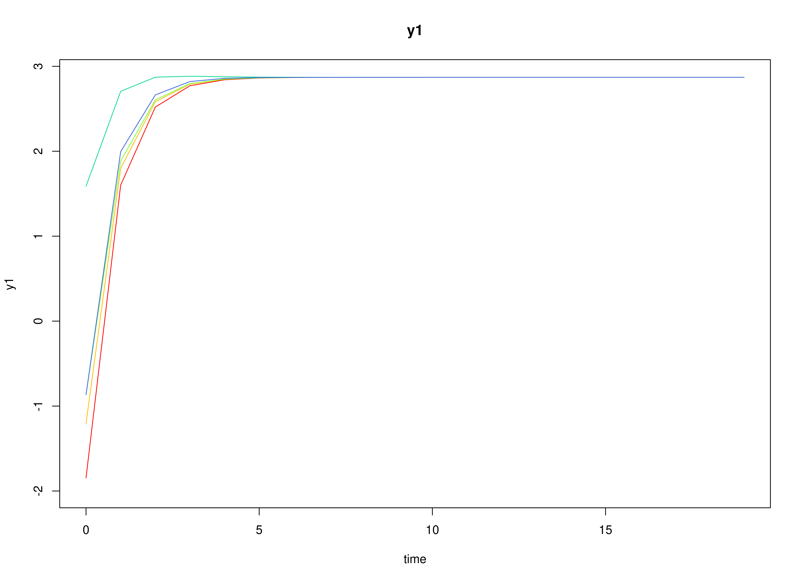
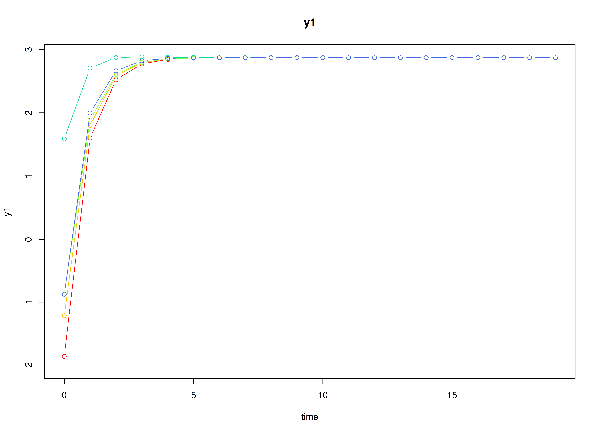

## Dynamics Description

The *Stable Reciprocal Regulation* process represents a bivariate dynamic system in which two latent psychological constructs---such as negative and positive affect---mutually influence each other over time. Each construct shows moderate self-regulation (autoregressive effects) and mild opposing cross-effects, reflecting an equilibrium-seeking mechanism characteristic of emotional balance.

Individuals vary in their self-regulatory tendencies and in the strength of these antagonistic couplings. At the population level, the transition matrix indicates that increases in one construct are followed by slight decreases in the other, producing a stable, damped oscillatory pattern around individual equilibrium points. The process noise covariance allows for small correlated disturbances, while measurement errors are assumed to be minimal and symmetric across indicators.

This dynamic pattern captures a psychologically plausible process of *reciprocal inhibition*---where short-term fluctuations in one system component (e.g., negative affect) are naturally counteracted by adjustments in its counterpart (e.g., positive affect), leading to emotional homeostasis over time.

## Model

The measurement model is given by
\begin{equation}
  \mathbf{y}_{i, t} = \boldsymbol{\eta}_{i, t}
\end{equation}
where $\mathbf{y}_{i, t}$ and $\boldsymbol{\eta}_{i, t}$ are random variables.

The dynamic structure is given by
\begin{equation}
  \boldsymbol{\eta}_{i, t} = \boldsymbol{\alpha}_{i} + \boldsymbol{\beta}_{i} \boldsymbol{\eta}_{i, t - 1} + \boldsymbol{\zeta}_{i, t}, \quad \mathrm{with} \quad \boldsymbol{\zeta}_{i, t} \sim \mathcal{N}   \left( \mathbf{0}, \boldsymbol{\Psi} \right)
\end{equation}
where $\boldsymbol{\eta}_{i, t}$, $\boldsymbol{\eta}_{i, t - 1}$, and $\boldsymbol{\zeta}_{i, t}$ are random variables, and $\boldsymbol{\beta}_{i}$, and $\boldsymbol{\Psi}$ are model parameters. Here, $\boldsymbol{\eta}_{i, t}$ is a vector of latent variables at time $t$ and individual $i$, $\boldsymbol{\eta}_{i, t - 1}$ represents a vector of latent variables at time $t - 1$ and individual $i$, and $\boldsymbol{\zeta}_{i, t}$ represents a vector of dynamic noise at time $t$ and individual $i$. $\boldsymbol{\beta}_{i}$ is a matrix of autoregression and cross regression coefficients for individual $i$, and $\boldsymbol{\Psi}$ the covariance matrix of $\boldsymbol{\zeta}_{i, t}$ that is invariant across all individuals. In this model, $\boldsymbol{\Psi}$ is a symmetric matrix.

### Alternative Parameterization

An alternative parameterization of the dynamic structure that directly estimates the set point vector $\boldsymbol{\mu}_{i}$ is given by
\begin{equation}
  \boldsymbol{\eta}_{i, t} = \boldsymbol{\mu}_{i} + \boldsymbol{\beta}_{i} \left( \boldsymbol{\eta}_{i, t - 1} - \boldsymbol{\mu}_{i} \right) + \boldsymbol{\zeta}_{i, t} .
\end{equation}

Algebraic manipulation of the equation results in the following
\begin{equation}
  \boldsymbol{\eta}_{i, t} = \boldsymbol{\mu}_{i} - \boldsymbol{\beta}_{i} \boldsymbol{\mu}_{i} + \boldsymbol{\beta}_{i} \boldsymbol{\eta}_{i, t - 1} + \boldsymbol{\zeta}_{i, t} ,
\end{equation}
where we can see that the intercept vector $\boldsymbol{\alpha}_{i}$ is implied by $\boldsymbol{\mu}_{i} - \boldsymbol{\beta}_{i} \boldsymbol{\mu}_{i}$.

## Data Generation

### Notation

Let $t = 1000$ be the number of time points and $n = 100$ be the number of individuals.

Let the initial condition $\boldsymbol{\eta}_{0}$ be given by
\begin{equation}
  \boldsymbol{\eta}_{0} \sim \mathcal{N} \left( \boldsymbol{\mu}_{\boldsymbol{\eta} \mid 0}, \boldsymbol{\Sigma}_{\boldsymbol{\eta} \mid 0} \right) .
\end{equation}
$\boldsymbol{\mu}_{\boldsymbol{\eta} \mid 0}$ and $\boldsymbol{\Sigma}_{\boldsymbol{\eta} \mid 0}$ are functions of $\boldsymbol{\alpha}$ and $\boldsymbol{\beta}$.

Let the set point vector $\boldsymbol{\mu}$ be normally distributed with the following means
\begin{equation}
  \left(
    \begin{array}{c}
      2.87 \\
      2.04 \\
    \end{array}
  \right)
\end{equation}
and covariance matrix
\begin{equation}
  \left(
    \begin{array}{cc}
      1.2 & 0.46 \\
      0.46 & 1.1 \\
    \end{array}
  \right) .
\end{equation}

Let the transition matrix $\boldsymbol{\beta}$ be normally distributed with the following means
\begin{equation}
  \left(
    \begin{array}{cc}
      0.28 & -0.048 \\
      -0.035 & 0.26 \\
    \end{array}
  \right)
\end{equation}
and covariance matrix
\begin{equation}
  \left(
    \begin{array}{cccc}
      0.017 & 0.005 & 0.001 & 0.008 \\
      0.005 & 0.008 & 0.001 & 0.006 \\
      0.001 & 0.001 & 0.001 & 0.002 \\
      0.008 & 0.006 & 0.002 & 0.026 \\
    \end{array}
  \right) .
\end{equation}

The `SimMuN` and `SimBetaN` functions from the `simStateSpace` package generate random set point vectors and transition matrices from the multivariate normal distribution. Note that the `SimBetaN` function generates transition matrices that are weakly stationary with an option to set lower and upper bounds.

Let the dynamic process noise $\boldsymbol{\Psi}$ be given by
\begin{equation}
  \boldsymbol{\Psi}
  =
  \left(
    \begin{array}{cc}
      1.3 & 0.57 \\
      0.57 & 1.56 \\
    \end{array}
  \right) .
\end{equation}


### R Function Arguments


``` r
n
#> [1] 100
time
#> [1] 1000
# first mu0 in the list of length n
mu0[[1]]
#> [1] 2.287769 2.606098
# first sigma0 in the list of length n
sigma0[[1]]
#>           [,1]      [,2]
#> [1,] 1.4403549 0.5646226
#> [2,] 0.5646226 1.6885649
# first sigma0_l in the list of length n
sigma0_l[[1]] # sigma0_l <- t(chol(sigma0))
#>           [,1]     [,2]
#> [1,] 1.2001479 0.000000
#> [2,] 0.4704608 1.211293
# first alpha in the list of length n
alpha[[1]]
#> [1] 1.678968 2.010503
# first beta in the list of length n
beta[[1]]
#>             [,1]        [,2]
#> [1,]  0.32874206 -0.05498069
#> [2,] -0.07362662  0.29317209
# first psi in the list of length n
psi[[1]]
#>      [,1] [,2]
#> [1,] 1.30 0.57
#> [2,] 0.57 1.56
psi_l[[1]] # psi_l <- t(chol(psi))
#>           [,1]     [,2]
#> [1,] 1.1401754 0.000000
#> [2,] 0.4999231 1.144586
# first mu (set point) in the list of length n
mu[[1]]
#> [1] 2.287769 2.606098
```

### Visualizing the Dynamics Without Process Noise and Measurement Error (n = 5 with Different Initial Condition)



### Using the `SimSSMVARIVary` Function from the `simStateSpace` Package to Simulate Data


``` r
library(simStateSpace)
sim <- SimSSMVARIVary(
  n = n,
  time = time,
  mu0 = mu0,
  sigma0_l = sigma0_l,
  alpha = alpha,
  beta = beta,
  psi_l = psi_l
)
data <- as.data.frame(sim)
head(data)
#>   id time        y1       y2
#> 1  1    0 2.2494783 1.541912
#> 2  1    1 2.8646254 2.346091
#> 3  1    2 0.8218736 3.348071
#> 4  1    3 2.4900816 2.282659
#> 5  1    4 2.7074414 3.944741
#> 6  1    5 2.9755157 2.667683
plot(sim)
```



## Stage 1: Person-Specific VAR Model


``` r
library(OpenMx)
library(fitVARMxID)
```

The `FitVARMxID` function fits a VAR model on each individual $i$.

> **Note:** Consider using the argument `ncores` to use multiple cores for parallel processing.


``` r
fit <- FitVARMxID(
  data = data,
  observed = c("y1", "y2"),
  id = "id",
  center = TRUE,
  ncores = parallel::detectCores()
)
```


``` r
summary(
  fit,
  means = TRUE
)
#> Call:
#> FitVARMxID(data = data, observed = c("y1", "y2"), id = "id", 
#>     center = TRUE, ncores = parallel::detectCores())
#> 
#> Convergence:
#> 100.0%
#> 
#> Means of the estimated paramaters per individual.
#>   mu[1,1]   mu[2,1] beta[1,1] beta[2,1] beta[1,2] beta[2,2]  psi[1,1]  psi[2,1] 
#>    2.9733    2.1842    0.2711   -0.0659   -0.0543    0.2394    1.2932    0.5612 
#>  psi[2,2] 
#>    1.5390
```

## Stage 2: Random-Effects Meta-Analysis of Person-Specific Set Points and Dynamics

We synthesize the person-specific estimates to recover population-level effects and their between-person variability. We use a random-effects model so the pooled mean reflects both within-person estimation uncertainty and between-person heterogeneity.

All available parameters are meta-analyzed by default. Setting `cov_dyn = FALSE`, meta-analyzes only the set points and transition matrix. Setting `tau_sqr_l_free`, such that covariances between `mu` and `beta` are constained to zero, simplifies the random effects.


``` r
tau_sqr_l_free <- matrix(
  data = c(
    FALSE, FALSE, FALSE, FALSE, FALSE, FALSE,
    TRUE, FALSE, FALSE, FALSE, FALSE, FALSE,
    FALSE, FALSE, FALSE, FALSE, FALSE, FALSE,
    FALSE, FALSE, TRUE, FALSE, FALSE, FALSE,
    FALSE, FALSE, TRUE, TRUE, FALSE, FALSE,
    FALSE, FALSE, TRUE, TRUE, TRUE, FALSE
  ),
  byrow = TRUE,
  nrow = 6,
  ncol = 6
)
# FALSE values in tau_sqr_l_free will be treated as fixed values.
# TRUE values in tau_sqr_l_free will be treated as starting values.
tau_sqr_l_values <- matrix(
  data = 0,
  nrow = 6,
  ncol = 6
)
```

> **Note:** Consider using the argument `ncores` to use multiple cores for parallel processing.


``` r
library(metaDyn)
metavar <- MetaVARMx(
  object = fit,
  tau_sqr_l_free = tau_sqr_l_free,
  tau_sqr_l_values = tau_sqr_l_values,
  cov_dyn = FALSE,
  ncores = parallel::detectCores()
)
```


``` r
summary(metavar)
#> Call:
#> MetaVARMx(object = fit, tau_sqr_l_free = tau_sqr_l_free, tau_sqr_l_values = tau_sqr_l_values, 
#>     cov_dyn = FALSE, ncores = parallel::detectCores())
#> 
#> Status code:
#> 0
#> 
#> CI type:
#> "normal"
#> 
#>                  est     se         z      p    2.5%   97.5%
#> alpha[1,1]    2.9733 0.1115   26.6781 0.0000  2.7549  3.1918
#> alpha[2,1]    2.1844 0.1052   20.7594 0.0000  1.9781  2.3906
#> alpha[3,1]    0.2720 0.0122   22.3157 0.0000  0.2481  0.2959
#> alpha[4,1]   -0.0659 0.0106   -6.2428 0.0000 -0.0866 -0.0452
#> alpha[5,1]   -0.0545 0.0047  -11.6738 0.0000 -0.0636 -0.0453
#> alpha[6,1]    0.2401 0.0150   16.0294 0.0000  0.2107  0.2694
#> tau_sqr[1,1]  1.2396 0.1757    7.0560 0.0000  0.8952  1.5839
#> tau_sqr[2,1]  0.5389 0.1291    4.1756 0.0000  0.2859  0.7918
#> tau_sqr[2,2]  1.1040 0.1566    7.0514 0.0000  0.7971  1.4108
#> tau_sqr[3,3]  0.0138 0.0021    6.6038 0.0000  0.0097  0.0179
#> tau_sqr[4,3]  0.0021 0.0013    1.5812 0.1138 -0.0005  0.0046
#> tau_sqr[5,3]  0.0013 0.0006    2.3450 0.0190  0.0002  0.0025
#> tau_sqr[6,3]  0.0037 0.0019    2.0081 0.0446  0.0001  0.0074
#> tau_sqr[4,4]  0.0099 0.0016    6.2656 0.0000  0.0068  0.0130
#> tau_sqr[5,4]  0.0007 0.0005    1.4928 0.1355 -0.0002  0.0017
#> tau_sqr[6,4]  0.0053 0.0017    3.2207 0.0013  0.0021  0.0086
#> tau_sqr[5,5]  0.0013 0.0003    4.2040 0.0000  0.0007  0.0019
#> tau_sqr[6,5]  0.0023 0.0007    3.1304 0.0017  0.0008  0.0037
#> tau_sqr[6,6]  0.0214 0.0032    6.7779 0.0000  0.0152  0.0276
#> i_sqr[1,1]    0.9982 0.0003 3986.4865 0.0000  0.9977  0.9987
#> i_sqr[2,1]    0.9975 0.0004 2844.8067 0.0000  0.9968  0.9982
#> i_sqr[3,1]    0.9296 0.0099   93.7598 0.0000  0.9101  0.9490
#> i_sqr[4,1]    0.9108 0.0126   72.1360 0.0000  0.8861  0.9356
#> i_sqr[5,1]    0.8297 0.0241   34.4831 0.0000  0.7825  0.8769
#> i_sqr[6,1]    0.9685 0.0044  217.6671 0.0000  0.9597  0.9772
```

### Normal Theory Confidence Intervals


``` r
confint(metavar, level = 0.95)
#>                      2.5 %       97.5 %
#> alpha[1,1]    2.754884e+00  3.191767651
#> alpha[2,1]    1.978128e+00  2.390593324
#> alpha[3,1]    2.481422e-01  0.295927252
#> alpha[4,1]   -8.662880e-02 -0.045230620
#> alpha[5,1]   -6.361187e-02 -0.045322478
#> alpha[6,1]    2.107037e-01  0.269408547
#> tau_sqr[1,1]  8.952390e-01  1.583873151
#> tau_sqr[2,1]  2.859468e-01  0.791841424
#> tau_sqr[2,2]  7.971041e-01  1.410798382
#> tau_sqr[3,3]  9.704778e-03  0.017896785
#> tau_sqr[4,3] -4.944590e-04  0.004622897
#> tau_sqr[5,3]  2.204801e-04  0.002465307
#> tau_sqr[6,3]  8.941386e-05  0.007368249
#> tau_sqr[4,4]  6.796440e-03  0.012984104
#> tau_sqr[5,4] -2.307981e-04  0.001705878
#> tau_sqr[6,4]  2.085969e-03  0.008571952
#> tau_sqr[5,5]  6.881561e-04  0.001890227
#> tau_sqr[6,5]  8.490966e-04  0.003692940
#> tau_sqr[6,6]  1.519139e-02  0.027551410
#> i_sqr[1,1]    9.977392e-01  0.998720780
#> i_sqr[2,1]    9.968348e-01  0.998209337
#> i_sqr[3,1]    9.101263e-01  0.948989466
#> i_sqr[4,1]    8.860831e-01  0.935578329
#> i_sqr[5,1]    7.825466e-01  0.876864756
#> i_sqr[6,1]    9.597298e-01  0.977170459
```


``` r
confint(metavar, level = 0.99)
#>                      0.5 %       99.5 %
#> alpha[1,1]    2.6862445300  3.260407057
#> alpha[2,1]    1.9133244525  2.455396398
#> alpha[3,1]    0.2406345859  0.303434833
#> alpha[4,1]   -0.0931329251 -0.038726495
#> alpha[5,1]   -0.0664853389 -0.042449006
#> alpha[6,1]    0.2014804857  0.278631748
#> tau_sqr[1,1]  0.7870467896  1.692065410
#> tau_sqr[2,1]  0.2064649711  0.871323233
#> tau_sqr[2,2]  0.7006857028  1.507216747
#> tau_sqr[3,3]  0.0084177209  0.019183842
#> tau_sqr[4,3] -0.0012984539  0.005426892
#> tau_sqr[5,3] -0.0001322079  0.002817995
#> tau_sqr[6,3] -0.0010541740  0.008511837
#> tau_sqr[4,4]  0.0058242871  0.013956256
#> tau_sqr[5,4] -0.0005350719  0.002010152
#> tau_sqr[6,4]  0.0010669472  0.009590974
#> tau_sqr[5,5]  0.0004992970  0.002079086
#> tau_sqr[6,5]  0.0004022965  0.004139740
#> tau_sqr[6,6]  0.0132494950  0.029493309
#> i_sqr[1,1]    0.9975850016  0.998874995
#> i_sqr[2,1]    0.9966188761  0.998425288
#> i_sqr[3,1]    0.9040204739  0.955095310
#> i_sqr[4,1]    0.8783067807  0.943354601
#> i_sqr[5,1]    0.7677281440  0.891683212
#> i_sqr[6,1]    0.9569896914  0.979910583
```

### Robust Confidence Intervals


``` r
confint(metavar, level = 0.95, robust = TRUE)
#>                      2.5 %       97.5 %
#> alpha[1,1]    2.7537803181  3.192871269
#> alpha[2,1]    1.9770923883  2.391628462
#> alpha[3,1]    0.2480753909  0.295994028
#> alpha[4,1]   -0.0867440438 -0.045115376
#> alpha[5,1]   -0.0636813746 -0.045252970
#> alpha[6,1]    0.2105511343  0.269561100
#> tau_sqr[1,1]  0.9014083315  1.577703868
#> tau_sqr[2,1]  0.2794444537  0.798343750
#> tau_sqr[2,2]  0.8278229693  1.380079480
#> tau_sqr[3,3]  0.0091150795  0.018486483
#> tau_sqr[4,3] -0.0002357493  0.004364187
#> tau_sqr[5,3]  0.0003160419  0.002369746
#> tau_sqr[6,3] -0.0005935110  0.008051174
#> tau_sqr[4,4]  0.0072591132  0.012521430
#> tau_sqr[5,4] -0.0001960206  0.001671101
#> tau_sqr[6,4]  0.0023412856  0.008316636
#> tau_sqr[5,5]  0.0007204253  0.001857958
#> tau_sqr[6,5]  0.0011175383  0.003424498
#> tau_sqr[6,6]  0.0134984649  0.029244339
#> i_sqr[1,1]    0.9977480099  0.998711986
#> i_sqr[2,1]    0.9969088727  0.998135292
#> i_sqr[3,1]    0.9073287661  0.951787018
#> i_sqr[4,1]    0.8883806447  0.933280737
#> i_sqr[5,1]    0.7843216133  0.875089743
#> i_sqr[6,1]    0.9585670441  0.978333230
```


``` r
confint(metavar, level = 0.99, robust = TRUE)
#>                      0.5 %       99.5 %
#> alpha[1,1]    2.684794e+00  3.261857457
#> alpha[2,1]    1.911964e+00  2.456756800
#> alpha[3,1]    2.405468e-01  0.303522592
#> alpha[4,1]   -9.328438e-02 -0.038575038
#> alpha[5,1]   -6.657669e-02 -0.042357658
#> alpha[6,1]    2.012800e-01  0.278832237
#> tau_sqr[1,1]  7.951546e-01  1.683957597
#> tau_sqr[2,1]  1.979195e-01  0.879868738
#> tau_sqr[2,2]  7.410572e-01  1.466845267
#> tau_sqr[3,3]  7.642725e-03  0.019958838
#> tau_sqr[4,3] -9.584516e-04  0.005086889
#> tau_sqr[5,3] -6.618285e-06  0.002692406
#> tau_sqr[6,3] -1.951689e-03  0.009409352
#> tau_sqr[4,4]  6.432343e-03  0.013348200
#> tau_sqr[5,4] -4.893666e-04  0.001964446
#> tau_sqr[6,4]  1.402490e-03  0.009255431
#> tau_sqr[5,5]  5.417060e-04  0.002036677
#> tau_sqr[6,5]  7.550886e-04  0.003786948
#> tau_sqr[6,6]  1.102461e-02  0.031718195
#> i_sqr[1,1]    9.975966e-01  0.998863438
#> i_sqr[2,1]    9.967162e-01  0.998327976
#> i_sqr[3,1]    9.003439e-01  0.958771915
#> i_sqr[4,1]    8.813263e-01  0.940335052
#> i_sqr[5,1]    7.700609e-01  0.889350449
#> i_sqr[6,1]    9.554616e-01  0.981438723
```

- The fixed part of the random-effects model gives pooled means $\boldsymbol{\alpha} = \mathbb{E} \left[ \mathrm{Vec} \left( \boldsymbol{\mu}, \boldsymbol{\beta} \right)  \right]$.
- The random part yields between-person covariances ($\boldsymbol{\tau}^{2}$) quantifying heterogeneity in set point ($\boldsymbol{\mu}$) and dynamics ($\boldsymbol{\beta}$) across individuals.


``` r
means <- extract(metavar, what = "alpha")
means
#>          alpha
#> y1  2.97332579
#> y2  2.18436043
#> y3  0.27203471
#> y4 -0.06592971
#> y5 -0.05446717
#> y6  0.24005612
covariances <- extract(metavar, what = "tau_sqr")
covariances
#>           y1        y2          y3          y4          y5          y6
#> y1 1.2395561 0.5388941 0.000000000 0.000000000 0.000000000 0.000000000
#> y2 0.5388941 1.1039512 0.000000000 0.000000000 0.000000000 0.000000000
#> y3 0.0000000 0.0000000 0.013800782 0.002064219 0.001342894 0.003728831
#> y4 0.0000000 0.0000000 0.002064219 0.009890272 0.000737540 0.005328961
#> y5 0.0000000 0.0000000 0.001342894 0.000737540 0.001289192 0.002271018
#> y6 0.0000000 0.0000000 0.003728831 0.005328961 0.002271018 0.021371402
```

## Summary

This vignette demonstrates a two-stage hierarchical estimation approach for dynamic systems:
1. individual-level DT-VAR estimation, and  
2. population-level meta-analysis of person-specific set points and dynamics.

## References


